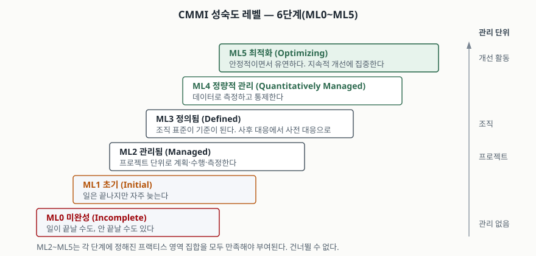

> **실행 검증 없음.** 이 글은 모델 소유 기관(ISACA·CMMI Institute)의 공개 자료와
> ISO 표준의 서지 정보를 정리한 개념 글이다. 실행 예제가 없고, 도입 효과나
> 인증 조직 수 같은 통계는 원 출처를 확인하지 못해 싣지 않았다.

## 들어가며

SI 사업 제안서에 "CMMI 레벨 3 인증"이 자격 요건으로 붙는 일이 흔하다. 발주처는 그 한 줄로
"이 회사는 조직 차원의 개발 표준이 있다"를 확인하려는 것이다. 그런데 정작 답안에
"CMMI는 1단계 초기부터 5단계 최적화까지 5단계다"라고 쓰면 현행 모델과 어긋난다.
**현행 모델의 성숙도 레벨은 0부터 5까지 6단계**고, 흔히 같이 묻는 능력도 레벨은
아예 다른 축의 4단계다. 이 두 축을 구분하지 못하면 배점의 절반이 날아간다.

## 정의

**CMMI(Capability Maturity Model Integration)는 조직의 성과와 프로세스를 단계적으로
개선하기 위한 모범사례 집합이며, 그 개선 정도를 성숙도 레벨과 능력도 레벨이라는 두 축으로
측정하는 모델이다.**

두 축의 정의를 갈라 두는 것이 답안의 첫 갈림길이다.

- **성숙도 레벨(Maturity Level)** — 미리 정해진 **프랙티스 영역 집합**을 기준으로 한
  조직 전체의 단계적 개선 경로. 각 레벨은 앞 레벨 위에 기능이나 엄밀성을 더해 쌓인다
- **능력도 레벨(Capability Level)** — **개별 프랙티스 영역 하나**에 대한 달성 수준

"우리 회사는 레벨 3이다"는 성숙도 쪽이고, "요구사항 개발은 3인데 형상관리는 2다"는 능력도 쪽이다.

## 등장 배경

SEI 기록에 따르면 **1986년** 미국 국방부와 방산업체는 "일관되게 동작하는 소프트웨어를
만들어 내는 개발 관행이 있는데 그것이 문서화돼 있지도, 널리 알려져 있지도 않다"는 문제를
인식했다. 완성된 산출물은 검사할 수 있지만, **아직 만들지 않은 것을 맡길 수 있는
조직인지는 볼 방법이 없었다.** 카네기멜런대 SEI가 정부·방산·산업계·학계의 합의를 모아
**1991년** Software CMM을 발표한 것이 출발점이다.

이후 개발·획득·서비스로 갈라졌던 모델들을 하나로 합친 것이 CMMI고, **2016년** CMMI
Institute가 ISACA로 넘어간 뒤 2018년 V2.0에서 구조가 크게 바뀌었다.
**답안에서 버전을 밝히지 않으면 어느 구조를 말하는지 채점자가 알 수 없다.**

## 구성요소 — 두 축 6단계와 4단계

### 성숙도 레벨 6단계 (ML0~ML5)

| 레벨 | 이름 | 상태 |
|---|---|---|
| ML0 | 미완성(Incomplete) | 임기응변. 일이 끝날 수도, 안 끝날 수도 있다 |
| ML1 | 초기(Initial) | 예측 불가·사후 대응. 일은 끝나지만 자주 늦는다 |
| ML2 | 관리됨(Managed) | 프로젝트 단위로 계획·수행·측정한다 |
| ML3 | 정의됨(Defined) | 조직 표준이 기준이 된다. 사후 대응에서 사전 대응으로 |
| ML4 | 정량적 관리(Quantitatively Managed) | 측정하고 통제한다. 조직이 데이터로 움직인다 |
| ML5 | 최적화(Optimizing) | 안정적이면서 유연하다. 지속적 개선에 집중한다 |

### 능력도 레벨 4단계 (CL0~CL3)

| 레벨 | 이름 | 상태 |
|---|---|---|
| CL0 | 미완성(Incomplete) | 해당 프랙티스 영역의 의도를 충족하지 못한다 |
| CL1 | 초기(Initial) | 의도를 충족하는 초기 접근이 있다 |
| CL2 | 관리됨(Managed) | CL1을 포함하며, 단순하지만 완결된 프랙티스 집합을 갖춘다 |
| CL3 | 정의됨(Defined) | CL2 위에 조직 표준과 테일러링을 쓴다 |

**능력도는 3에서 끝난다.** 5까지 있다고 쓰면 틀린다. ML4·ML5는 조직 전체의 정량적 관리와
개선을 묻는 것이라 개별 프랙티스 영역 단위로는 정의되지 않기 때문이다.

### 모델 구조 3계층

V2.0 이후 모델은 **프랙티스 → 프랙티스 영역(PA) → 능력 영역(Capability Area) → 범주(Category)**
로 묶인다. V1.3까지 쓰던 **프로세스 영역(Process Area)**이라는 이름이 **프랙티스 영역**으로
바뀐 것이 핵심 변경이다. "프로세스 문서가 있는가"에서 "실제 프랙티스가 성과를 내는가"로
평가의 초점을 옮긴 것이고, 이때 각 프로세스 영역마다 반복되던 일반 프랙티스
(Generic Practice)를 걷어내 중복을 없앴다.

V3.0은 기존 5개 도메인(개발·서비스·공급자 관리·보안·안전)에 데이터 관리·인력 관리·가상 업무
셋을 더해 **8개 도메인**으로 넓혔고, 데이터 관리(DM)·데이터 품질(DQ)·인력 역량강화(WE)
프랙티스 영역을 새로 넣었다.

## 도식

> **출처**: 레벨 번호·영문 명칭·각 단계의 설명 문구는
> [CMMI Institute — CMMI Levels of Capability and Performance](https://cmmiinstitute.com/learning/appraisals/levels)
> 의 Maturity Levels 표를 따랐다("Ad hoc and unknown. Work may or may not get completed",
> "Stable and flexible. Organization is focused on continuous improvement" 등).
> 오른쪽 축의 관리 단위(프로젝트 → 조직 → 개선 활동)는 같은 표의 ML2·ML3·ML5 설명문에서
> 직접 따온 것이다.

## 비교

### 성숙도 레벨 vs 능력도 레벨

| 구분 | 성숙도 레벨 | 능력도 레벨 |
|---|---|---|
| 대상 | 조직 전체 | 프랙티스 영역 1개 |
| 단계 수 | 6단계 (ML0~ML5) | 4단계 (CL0~CL3) |
| 범위 결정 | 레벨별로 **정해진** PA 집합 | 조직이 개선할 PA를 **선택** |
| 표현 방식 | 단계적(Staged) | 연속적(Continuous) |
| 쓰는 상황 | 대외 인증, 입찰 자격 | 특정 취약 영역만 집중 개선 |

### V1.3과 V2.0 이후

| 구분 | V1.3 (2010, SEI) | V2.0·V3.0 (2018·2023, ISACA) |
|---|---|---|
| 단위 명칭 | 프로세스 영역(Process Area) | 프랙티스 영역(Practice Area) |
| 성숙도 레벨 | ML1~ML5 | ML0~ML5 |
| 일반 프랙티스 | PA마다 반복 기술 | 제거, 프랙티스 그룹 레벨로 통합 |
| 모델 구분 | DEV / ACQ / SVC 별도 발행 | 단일 모델 + 도메인 선택 |
| 초점 | 프로세스 준수 | 성과 기반 지속 개선 |

## 적용 시 고려사항

1. **레벨을 목표로 삼으면 목적과 수단이 뒤집힌다.** 레벨은 개선의 결과로 따라오는 것이지
   먼저 잡는 과녁이 아니다. 인증만 겨냥하면 심사용 문서와 실제 개발이 따로 도는
   이중 프로세스가 생기고, 심사가 끝나면 앞의 것이 버려진다.
2. **단계를 건너뛸 수 없다.** 성숙도 레벨은 아래 단계의 프랙티스 영역 집합을 모두 만족해야
   부여된다. ML2의 프로젝트 단위 관리 없이 ML3의 조직 표준을 만들면, 표준을 지킬 프로젝트
   관리 기반이 없어 문서만 남는다.
3. **인증 단위와 조직 단위를 일치시킨다.** 심사 범위는 조직 전체가 아니라 지정한
   조직 단위에 걸린다. 전사 인증으로 홍보하는 경우 실제 심사 범위가 무엇이었는지를 확인한다.
4. **애자일과 충돌하지 않게 설계한다.** CMMI는 무엇을 달성할지를 정하고 어떻게 할지는
   정하지 않는다. 산출물 목록을 고정하면 충돌하고, 프랙티스의 의도를 스프린트 산출물로
   대응시키면 공존한다.
5. **버전을 명시한다.** V1.3과 V2.0 이후는 용어·레벨 체계가 다르다. 답안에서도 실무
   문서에서도 어느 버전 기준인지를 먼저 적는다.

## 정리

암기 단서는 **"성숙도 6 · 능력도 4 · 도메인 8"** 세 숫자다.

- 성숙도 레벨 **6단계** — 미완성·초기·관리됨·정의됨·정량적 관리·최적화(ML0~ML5)
- 능력도 레벨 **4단계** — 미완성·초기·관리됨·정의됨(CL0~CL3). 5까지 있다고 쓰면 틀린다
- V3.0 도메인 **8개** — 개발·서비스·공급자 관리·보안·안전·데이터 관리·인력 관리·가상 업무
- 성숙도는 **정해진** PA 집합에 대한 조직 단위 평가, 능력도는 **선택한** PA 하나의 평가
- V2.0부터 프로세스 영역이 프랙티스 영역으로 바뀌었고, 일반 프랙티스 반복이 제거됐다

## 참고 자료

- [CMMI Institute — CMMI Levels of Capability and Performance](https://cmmiinstitute.com/learning/appraisals/levels) — 성숙도·능력도 레벨의 공식 명칭과 설명
- [CMMI Institute — ISACA Updates CMMI Model with Three New Domains (2023-04-06)](https://cmmiinstitute.com/news/press-releases/april-2023/isaca-updates-cmmi-model-with-three-new-domains-th) — V3.0에서 더해진 3개 도메인과 기존 5개
- [ISACA Now Blog — CMMI Updates Take Performance Improvements to the Next Level (2023-04-10)](https://www.isaca.org/resources/news-and-trends/isaca-now-blog/2023/cmmi-updates-take-performance-improvements-to-the-next-level) — V3.0의 8개 도메인
- [SEI — Transforming Software Quality Assessment](https://www.sei.cmu.edu/history-of-innovation/transforming-software-quality-assessment/) — 1986년 문제 인식과 1991년 Software CMM 발표
- [CMMI Institute — Company](https://cmmiinstitute.com/company) — 2016년 ISACA 인수
- [CMMI Institute — The CMMI Institute Announces CMMI Development V2.0 (2018-03-28)](https://cmmiinstitute.com/news/press-releases/march-2018/annoucingv2) — V2.0 발표와 능력 영역 구분
- [ISACA Journal 2025 Volume 3 — CMMI in the AI Age (2025-05-01)](https://www.isaca.org/resources/isaca-journal/issues/2025/volume-3/cmmi-in-the-ai-age) — V3.0 신규 프랙티스 영역(DM·DQ·WE)과 일반 프랙티스 중복 제거
- [ISO/IEC 33001:2015 — Process assessment: Concepts and terminology](https://www.iso.org/standard/54175.html) — ISO/IEC 15504-1:2004를 대체한 프로세스 평가 용어 표준
- [ISO/IEC 33004:2015 — Requirements for process reference, process assessment and maturity models](https://www.iso.org/standard/54178.html) — 성숙도 모델이 갖춰야 할 요건
