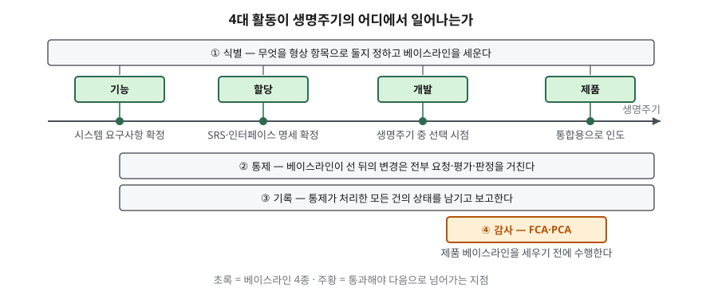

> **실행 검증 없음.** 이 글은 표준 문서의 정의와 분류를 정리한 개념 글이다.
> 실행 예제가 없고, 측정값이나 도입 효과 통계는 싣지 않았다.

## 들어가며

형상관리는 "버전 관리 도구를 쓰는 것"으로 넘어가기 쉬운 주제다. 그런데 시험은
도구를 묻지 않는다. **4대 활동을 순서대로 쓰고, 베이스라인이 무엇이며 몇 종류인지,
감사가 두 가지로 나뉘는 이유가 무엇인지**를 묻는다.

답안에서 점수가 갈리는 지점은 활동의 이름을 몇 개 적었느냐가 아니라, 각 활동이
**생명주기의 어느 시점에 일어나는지**를 붙여 썼느냐다. 네 활동은 나란히 놓인 목록이
아니라 서로를 전제하는 순서가 있고, 그 순서를 묶어 주는 것이 베이스라인이다.

## 정의

SWEBOK V3.0은 형상관리를 ISO/IEC/IEEE 24765의 정의로 인용한다. 그 정의는
**형상 항목에 기술적·관리적 지시와 감시를 적용하는 분야**라고 한 뒤, 무엇을 위해
적용하는지를 네 가지로 끊어 나열한다.

1. 형상 항목의 기능적·물리적 특성을 **식별하고 문서화**한다
2. 그 특성에 대한 **변경을 통제**한다
3. 변경의 처리와 구현 **상태를 기록하고 보고**한다
4. 명시된 요구사항에 대한 **준수 여부를 검증**한다

답안 첫 줄은 앞의 한 문장으로 끊고, 둘째 줄부터 이 네 가지를 번호로 붙이면 된다.
외울 것이 둘이 아니다. **정의문이 곧 4대 활동 목록이고**, 네 항목이 차례로
식별 · 통제 · 기록 · 감사다.

## 등장 배경

소프트웨어는 개발 중에도 유지보수 중에도 계속 바뀐다. 변경 자체를 막을 수는 없으므로
문제는 "바뀌는가"가 아니라 **"지금 무엇이 승인된 상태인가"를 아무도 말할 수 없게 되는 것**이다.

- 같은 이름의 문서가 여러 판본으로 돌아다녀 어느 것이 최신인지 알 수 없다
- 고친 사람은 아는데 그 변경이 무엇에 영향을 주는지 아무도 평가하지 않았다
- 납품한 산출물이 설계 문서와 맞는지 확인할 근거가 없다

형상관리는 이 셋을 각각 식별 · 통제 · 감사로 대응시키고, 그 모든 처리 과정을
기록으로 남기는 체계다. 기준점을 세워 두고 "기준점 이후의 변경만 통제하면 된다"로
문제를 좁히는데, 그 기준점이 베이스라인이다.

## 구성요소 — 4대 활동

| 활동 | 하는 일 | 산출물·주체 |
|---|---|---|
| ① 식별 | 형상 항목을 정하고 베이스라인을 설정 | 형상 항목 목록, 베이스라인 |
| ② 통제 | 베이스라인 이후의 변경을 요청·평가·판정 | 변경 요청서(SCR), CCB |
| ③ 기록 | 변경의 처리·구현 상태를 기록하고 보고 | 형상 상태 보고서 |
| ④ 감사 | 명세와 실제가 일치하는지 검증 | FCA·PCA 결과 |

SWEBOK V3.0은 여기에 **관리·계획**과 **릴리스 관리·인도**를 더해 **6개 항목**으로 나눈다.
답안에서 6개를 요구하면 이 둘을 앞뒤에 붙인다.

### 베이스라인 — 4종

베이스라인은 형상 항목의 **공식 승인된 버전**으로, 생명주기의 특정 시점에 지정·고정되며
**공식 변경 통제 절차를 통해서만** 바꿀 수 있다. 베이스라인과 그에 대한 승인된 변경을
모두 합한 것이 현재 승인된 형상이다.

| 베이스라인 | 무엇에 대응하는가 |
|---|---|
| 기능(Functional) | 검토를 마친 시스템 요구사항 |
| 할당(Allocated) | 검토를 마친 SRS와 인터페이스 요구사항 명세 |
| 개발(Developmental) | 생명주기 중 선택된 시점의 진화 중인 형상 |
| 제품(Product) | 시스템 통합을 위해 인도된 완성 제품 |

### 변경 통제 — 4단계

1. **요청** — 누구나 생명주기의 어느 시점에서든 변경 요청(SCR)을 낼 수 있다
2. **기술 평가** — 영향 분석. 받아들일 경우 필요한 수정 범위를 판단한다
3. **판정** — 권한을 가진 주체가 **수용 · 수정 · 기각 · 보류 4가지 중 하나**를 결정한다
4. **구현** — 승인된 변경을 반영한다

3단계의 주체가 형상통제위원회(CCB)다. 소규모 프로젝트에서는 위원회 대신 개인일 수 있고,
항목의 중요도나 변경의 성격에 따라 **권한 단계를 여럿 둘 수 있다.** 대상이 소프트웨어로
한정되면 SCCB다.

## 도식

> **출처**: [SWEBOK V3.0 Chapter 6 — Software Configuration Management](https://ieeecs-media.computer.org/media/education/swebok/swebok-v3.pdf)
> §2.1.5 Baseline(베이스라인 4종과 각각이 대응하는 산출물), §3.1(변경 통제의 요청–평가–판정
> 순서), §4(상태 기록·보고), §5(감사와 FCA·PCA, "이 감사의 성공적 완료가 제품 베이스라인
> 설정의 전제가 될 수 있다")를 합쳐 그렸다.

## 비교 — FCA와 PCA

감사가 두 가지로 나뉘는 이유는 **검증 대상이 다르기 때문**이다. 이 구분은 단답형으로
그대로 나온다.

| | 기능 형상 감사 (FCA) | 물리 형상 감사 (PCA) |
|---|---|---|
| 무엇을 맞춰 보는가 | 소프트웨어 항목 ↔ 지배 명세 | 설계·참조 문서 ↔ 실제 만들어진 산출물 |
| 묻는 것 | "요구한 대로 동작하는가" | "문서와 결과물이 같은가" |
| 주요 입력 | 검증·확인(V&V) 활동의 산출물 | 설계 문서, as-built 산출물 |

두 감사 외에 개발 과정 중 수행하는 **중간 감사(in-process audit)**가 있다. 베이스라인
항목을 표본으로 뽑아 성능이 명세와 맞는지, 진화 중인 문서가 대상 항목과 계속 일치하는지를
확인한다. 정식 감사 두 가지와 구분해 적으면 항목이 하나 는다.

## 적용 시 고려사항

- **베이스라인의 수와 승인 권한 단계를 먼저 정한다.** 표준이 정해 주지 않는다.
  프로젝트마다 쓸 베이스라인과 각 변경 승인에 필요한 권한 수준을 형상관리계획서(SCMP)에
  적는다. 베이스라인을 촘촘히 두면 통제는 정확해지지만 승인 대기가 늘어난다.
- **형상 항목으로 무엇을 둘지가 범위를 결정한다.** 소스만 넣으면 설계 문서가 따로 놀고,
  전부 넣으면 변경 한 건에 통제 절차가 여러 번 걸린다. 항목 간 관계를 파악해 두어야
  2단계 영향 분석이 가능하다.
- **기록은 측정의 기반이 된다.** 상태 기록 활동이 모은 정보로 형상 항목당 변경 요청 수,
  변경 요청 구현에 걸린 평균 시간 같은 지표를 뽑을 수 있다. 기록을 통제의 부산물로만
  보면 이 값을 놓친다.
- **감사 시점을 제품 베이스라인 앞에 배치한다.** FCA·PCA의 성공적 완료가 제품 베이스라인
  설정의 전제가 될 수 있으므로, 일정에서 감사를 뒤로 밀면 인도 시점이 함께 밀린다.
- **하드웨어를 포함한 시스템이면 시스템 수준 형상관리와 맞춘다.** 소프트웨어 형상관리
  활동이 하드웨어·펌웨어 형상관리와 나란히 진행되며 서로 어긋나지 않아야 한다.

## 정리

- 암기 단서는 **"식·통·기·감"** 네 글자다. 표준 정의문을 그대로 풀면 이 순서로 나온다.
- 베이스라인은 **4종**: 기능 · 할당 · 개발 · 제품. 앞의 둘은 요구사항, 셋째는 개발 중,
  넷째는 인도 시점이다.
- 변경 통제는 **4단계**(요청 → 평가 → 판정 → 구현)이고, 판정 결과도 **4가지**
  (수용 · 수정 · 기각 · 보류)다.
- 감사는 **2종**: FCA는 명세 대비, PCA는 문서 대비 산출물이다. 중간 감사를 더하면 3종.
- SWEBOK 기준 활동 수를 물으면 **6개**(관리·계획 + 4대 활동 + 릴리스 관리·인도)로 답한다.

## 참고 자료

- [SWEBOK Guide V3.0 — Chapter 6. Software Configuration Management (IEEE Computer Society)](https://ieeecs-media.computer.org/media/education/swebok/swebok-v3.pdf)
- [ISO/IEC TR 19759:2016 — Software Engineering Body of Knowledge (SWEBOK)](https://www.iso.org/standard/67604.html)
- [ISO/IEC/IEEE 24765:2017 — Systems and software engineering — Vocabulary](https://www.iso.org/standard/71952.html)
- [IEEE 828-2012 — Standard for Configuration Management in Systems and Software Engineering](https://ieeexplore.ieee.org/document/6170935)
- [ISO 10007 — Quality management: Guidelines for configuration management](https://www.iso.org/standard/70400.html)
