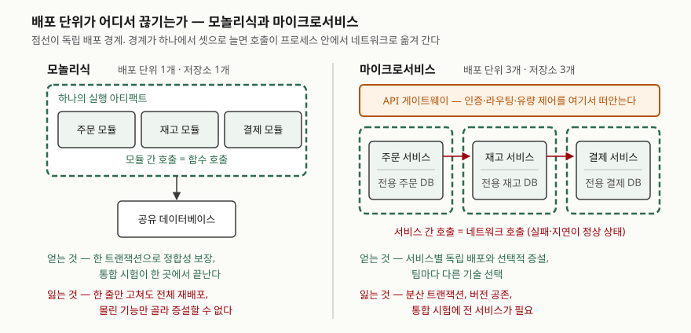

> 이 글은 **실행 검증 없음**이다. 아키텍처 개념을 다루므로 실행 예제가 없고,
> 모든 항목은 아래 참고 자료의 공식 문서 근거로만 적었다. 성능 수치나 도입 통계는 싣지 않는다.

## 들어가며

시험에서 MSA는 "장점을 나열하라"로 나오지 않는다. **"어떤 기준으로 분해할 것인가",
"도입 시 고려사항을 논하라"**로 나온다. 장점만 적은 답안은 어디서나 볼 수 있는 내용이라
변별이 되지 않는다.

실무에서도 같다. 모놀리스를 쪼개자는 결정은 대개 "배포가 느리다"에서 출발하는데,
쪼갠 뒤에 생기는 비용 — 분산 트랜잭션, 버전 공존, 통합 시험 환경 — 을 미리 세어 두지 않으면
배포는 빨라지고 장애는 늘어난다. **분해 기준과 그 대가를 짝으로 외우는 것**이 이 주제의 핵심이다.

## 정의

> **마이크로서비스 기반 응용 시스템**은 다수의 구성요소(마이크로서비스)로 이루어지며, 각
> 구성요소는 동기식 원격 프로시저 호출 또는 비동기 메시징 시스템으로 서로 통신한다.
> 각 마이크로서비스는 대개 하나의 구별되는 업무 프로세스 또는 기능을 구현하며, 자체
> 업무 로직과 데이터베이스 접근·메시징을 위한 어댑터를 갖는 소형 응용이다.
> — NIST SP 800-204 §2.1

답안 첫 줄에 쓸 때는 **"독립 배포 가능한 소규모 서비스들이 경량 통신으로 협력해 하나의
응용을 이루는 아키텍처 스타일"**로 줄인다. 줄일 때도 *독립 배포*와 *경량 통신* 두 낱말은
남긴다. 이 둘이 SOA·모듈형 모놀리스와 가르는 지점이다.

## 등장 배경

NIST SP 800-204는 업무 측면의 동인(business drivers)을 **3가지**로 든다(§2.3).

1. **어디서나 접근** — 브라우저·모바일 등 여러 클라이언트에서 쓰려는 요구
2. **확장성** — 사용자 수와 사용 빈도가 늘어도 가용성을 유지해야 하는 요구
3. **애자일 개발** — 조직 변화와 시장 요구에 맞춰 잦은 갱신을 내보내려는 요구

모놀리식에서 이 셋이 막히는 이유는 **배포 단위가 하나**이기 때문이다. 기능 한 곳을 고쳐도
전체를 재컴파일·재시험·재배포해야 하고, 부하가 특정 기능에 몰려도 자원은 응용 전체에
할당해야 한다(부록 A.1). 배포 단위를 기능 단위로 끊는 것이 해법의 출발점이다.

## 구성요소 — 설계 드라이버 4가지와 설계 원칙 7가지

**분해 기준은 설계 드라이버에 들어 있다.** NIST SP 800-204 §2.2는 드라이버를 **4가지**로 든다.

1. 각 마이크로서비스는 다른 서비스와 **독립적으로** 관리·복제·확장·업그레이드·배포된다
2. 각 마이크로서비스는 **단일 기능**을 가지며 **경계 컨텍스트(bounded context)** 안에서
   동작한다 — 책임과 타 서비스 의존을 제한한다
3. 모든 마이크로서비스는 **상시 장애와 복구를 전제로** 설계하며 가능한 한 **무상태**여야 한다
4. 상태 관리는 이미 검증된 기존 서비스(DB·캐시·디렉터리)를 **재사용**한다

여기서 **2번이 분해 기준의 본문**이다. "단일 기능 + 경계 컨텍스트". 여기에 §2.10이 덧붙이는
기준이 하나 더 있다 — **서비스 정의를 업무 능력(business capability)에 맞추면** 전체 구조가
조직 구조와 정렬되어, 업무 프로세스가 바뀔 때 해당 서비스만 고쳐 배포할 수 있다.

이 드라이버들이 낳는 설계 원칙은 **7가지**다(§2.2).

| # | 원칙 | 답안에서 붙일 한 줄 |
|---|---|---|
| 1 | 자율성 (Autonomy) | 스스로 결정하고 스스로 배포된다 |
| 2 | 느슨한 결합 (Loose coupling) | 한쪽 변경이 다른 쪽 변경을 부르지 않는다 |
| 3 | 재사용 (Re-use) | 독립 기능이라 응용을 넘어 쓰인다 |
| 4 | 조합 가능성 (Composability) | 서비스를 엮어 상위 업무를 구성한다 |
| 5 | 장애 허용 (Fault tolerance) | 장애를 예외가 아니라 상시 조건으로 본다 |
| 6 | 발견 가능성 (Discoverability) | 위치가 바뀌어도 찾을 수 있어야 한다 |
| 7 | API와 업무 프로세스의 정렬 | 인터페이스 경계가 업무 경계와 맞는다 |

분해가 끝나면 **핵심 기능(core features)**을 인프라로 갖춰야 한다. NIST는 인증·접근 관리,
서비스 탐색, 보안 통신 프로토콜, 보안 모니터링, 가용성·복원력 개선 기법(예: 회로 차단기),
부하 분산과 유량 제어, 신규 서비스 편입 시 무결성 보증, 세션 지속성 처리의 **8가지**를 들고,
이것들이 API 게이트웨이나 서비스 메시 같은 아키텍처 프레임워크로 묶여 제공된다고 적는다(초록·§2.6).

## 도식

> **출처**: 배포·확장·변경 반영의 차이는 [NIST SP 800-204 부록 A.1, Table 3](https://csrc.nist.gov/pubs/sp/800/204/final)
> (Logical Differences between Monolithic and Microservices-based Application)을 따랐다.
> 모놀리식은 전체를 한 번에 배포하고 자원을 응용 전체에 할당하며 API 호출이 지역 호출인 반면,
> 마이크로서비스는 서비스를 선택적으로 배포·증설하고 API가 네트워크에 노출된다고 적는다.
> API 게이트웨이가 인증·라우팅·유량 제어를 묶어 제공한다는 것은 같은 문서 §2.6~§2.7.1이다.

답안지에는 **점선 상자 개수만 옮겨 그려도 된다.** 왼쪽은 점선 하나, 오른쪽은 셋.
"배포 단위가 1개에서 3개로 늘고, 그 경계를 넘는 호출이 함수 호출에서 네트워크 호출로
바뀐다"는 한 문장이 이 그림의 전부다.

## 비교 — 모놀리식과의 대비

| 비교축 | 모놀리식 | 마이크로서비스 |
|---|---|---|
| 배포 | 전체를 한 덩어리로 배포 | 서비스별 독립·선택 배포 |
| 변경 반영 | 일부만 고쳐도 전체 재배포 | 고친 서비스만 재배포 |
| 확장 | 응용 전체에 자원 할당 | 서비스별로 골라 증설 |
| API 호출 | 지역(프로세스 내) 호출 | 네트워크에 노출된 호출 |
| 데이터 | 공유 저장소에서 한 트랜잭션 | 서비스별 저장소, 분산 처리 필요 |
| 모니터링 | 응용 하나를 본다 | 다수 구성요소를 보고 한 곳에서 모아 본다 |

앞의 네 줄은 NIST SP 800-204 Table 3의 내용이고, 뒤의 두 줄은 §2.4와 §2.11에서 온다.

**SOA와의 관계도 자주 묻는다.** 같은 문서 §2.9는 서비스·상호운용성·느슨한 결합이라는
**3가지 공통 개념**을 들고, 둘의 관계에 대한 견해가 ① 별개 아키텍처 스타일 ② SOA의 한 패턴
③ 정제된 SOA의 **3갈래**로 갈린다고 적는다. 가장 널리 받아들여지는 견해는 **아키텍처 스타일
자체가 아니라 개발·배포 방식과 기술 같은 구체적 실현에서 차이가 난다**는 쪽이다.
답안에서는 "ESB 중심의 중앙 집중 통합이냐, 경량 통신 기반 분산이냐"로 대비하되
**둘을 대립 관계로 단정하지 않는다.**

## 적용 시 고려사항

NIST SP 800-204 §2.11이 드는 단점 **6가지**가 그대로 고려사항이 된다.

1. **모니터링 체계를 먼저 만든다.** 응용 하나가 아니라 구성요소 여럿을 봐야 하므로,
   분산 수집과 중앙 조회를 갖춘 인프라가 **분해보다 먼저** 있어야 한다.
2. **가용성 문제가 상시화된다.** 구성요소가 여럿이면 언제든 하나가 멈출 수 있다.
   회로 차단기·유량 제어를 설계에 포함한다(§4.5).
3. **버전 공존을 전제한다.** 한 서비스가 어떤 클라이언트에는 최신 버전을, 다른 클라이언트에는
   이전 버전을 호출해야 하는 상황이 생긴다. 버전 관리 규약을 미리 정한다.
4. **통합 시험 환경을 확보한다.** 모든 구성요소가 떠 있고 서로 통신하는 환경이 있어야
   통합 시험이 성립한다. 분해 편수만큼 시험 비용이 는다.
5. **API 보안 관리를 갖춘다.** 상호작용이 전부 API 호출로 설계되므로 안전한 API 관리에
   필요한 절차가 모두 구현돼야 한다.
6. **심층 방어가 무너질 수 있다.** 기존에는 DMZ의 웹 서버 → 백엔드 → DB로 층이 쌓여
   백엔드가 완충 역할을 했는데, 분해하면 이 층이 납작해져 **호출자와 민감 데이터 사이의
   방어 층이 줄어든다.** 서비스 메시나 API 게이트웨이의 배치 모델을 안전하게 설계해야 한다.

6번은 답안에서 가장 변별이 되는 항목이다. 나머지 다섯이 운영 비용이라면 **이것은 보안
구조의 변화**이고, 보통의 답안에는 잘 안 나온다.

## 정리

- **정의**: 독립 배포 가능한 소규모 서비스들이 경량 통신으로 협력하는 아키텍처 스타일.
  두 낱말 — *독립 배포*, *경량 통신*.
- **숫자로 묶는다**: 업무 동인 **3**, 설계 드라이버 **4**, 설계 원칙 **7**, 핵심 기능 **8**,
  단점 **6**, SOA 공통 개념 **3**.
- **분해 기준 3개**: 단일 기능 · 경계 컨텍스트 · 업무 능력과의 정렬.
  앞의 둘은 §2.2 드라이버, 마지막은 §2.10에서 온다.
- **설계 원칙 7개 두문자**: 자·느·재·조·장·발·정 (자율성, 느슨한 결합, 재사용,
  조합 가능성, 장애 허용, 발견 가능성, API-업무 정렬).
- **비용은 배포 경계에서 나온다**: 경계가 늘어난 만큼 네트워크 호출·분산 트랜잭션·버전 공존·
  통합 시험·API 보안이 늘고, 심층 방어 층은 줄어든다.

## 참고 자료

- [NIST SP 800-204, Security Strategies for Microservices-based Application Systems (2019-08)](https://csrc.nist.gov/pubs/sp/800/204/final) — §2.1 개념 정의, §2.2 설계 드라이버 4가지와 설계 원칙 7가지, §2.3 업무 동인 3가지, §2.6 핵심 기능, §2.9 SOA와의 공통 개념 3가지와 견해 3갈래, §2.10 장점, §2.11 단점 6가지, 부록 A.1 Table 3 모놀리식 대비표. 본문 PDF는 `https://doi.org/10.6028/NIST.SP.800-204`
- [NIST SP 800-190, Application Container Security Guide (2017-09)](https://csrc.nist.gov/pubs/sp/800/190/final) — SP 800-204 §1.3이 마이크로서비스를 컨테이너로 구현할 때 함께 볼 문서로 지목한 지침
