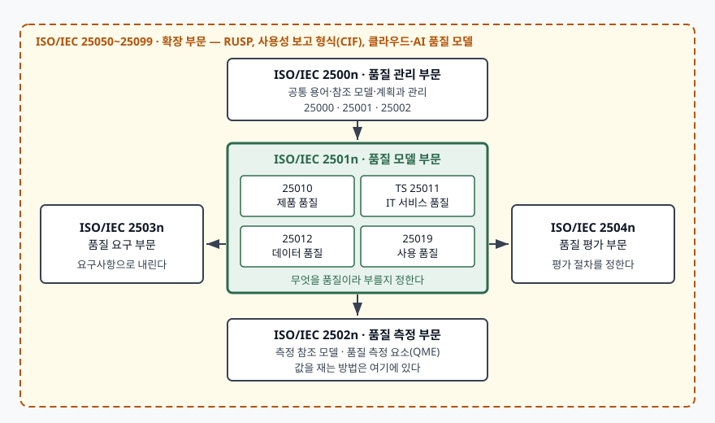

> **실행 검증 없음.** 표준 본문의 공개 미리보기(머리말·서문·1절 적용 범위)와 발행 기관의
> 서지 정보만으로 정리한 개념 글이다. 부문 구분과 소속 표준 목록은 ISO/IEC 25002:2024와
> ISO/IEC 25010:2023의 서문에 실린 목록을 그대로 따랐고, 유료 본문에만 있는 부특성
> 이름은 근거가 닿는 범위까지만 적었다.

## 들어가며

답안에 "ISO/IEC 25010 품질 모델"이라고 쓰면 그 한 줄은 표준 번호 하나를 가리키는 것처럼
보인다. 그런데 2023년 11월에 이 문서가 셋으로 갈라졌다. 제품 품질 모델만 25010에 남고,
사용 품질 모델은 25019로, 모델 자체를 설명하는 총론은 25002로 옮겨 갔다. 하나를 인용하던
답안이 이제 세 번호를 구분해 써야 한다는 뜻이다. 어느 번호를 인용할지는 **표준군이 애초에
왜 부문으로 나뉘어 있는지**를 알아야 고를 수 있다.

## 정의

**SQuaRE(Systems and software Quality Requirements and Evaluation)는 ISO/IEC 25000부터
25099까지의 번호대를 품질 관리·품질 모델·품질 측정·품질 요구·품질 평가 5개 부문과 확장
부문으로 나눠, 정보시스템과 IT 서비스의 품질을 규정·측정·요구·평가하는 문서들을 하나로
묶은 표준군이다.**

개수를 쓸 때 주의할 곳이 있다. ISO/IEC 25000:2014 서문은 "SQuaRE consists of the following
five divisions"라고 적어 놓고 **확장 부문을 포함한 여섯 항목을 나열한다.** 2024년에 나온
ISO/IEC 25002는 개수를 빼고 여섯 개를 그대로 나열한다. 답안에는 **"핵심 5개 부문 + 확장
부문"**으로 쓰는 것이 두 원문 어느 쪽과도 어긋나지 않는다.

## 등장 배경

SQuaRE 이전에는 두 계열이 따로 돌았다. 품질 모델을 정하는 **ISO/IEC 9126** 계열과 평가
절차를 정하는 **ISO/IEC 14598** 계열이다. 둘은 원래 ISO/IEC 9126:1991 하나에서 갈라져
나왔으므로 뿌리가 같고 서로를 보완하는 관계였다. ISO/IEC 25000:2014 서문은 그런데도
**두 계열이 각자의 생명주기로 개정되면서 서로 어긋나게 되었다**는 점을 SQuaRE를 만든
이유로 든다.

어떤 불일치였는지까지는 표준이 적지 않는다. 다만 같은 서문이 이어서 나열하는 SQuaRE의
변경점을 보면 처방이 읽힌다 — **새 일반 참조 모델을 도입하고, 부문마다 전용 안내서를 두고,
공통 용어와 정의를 품질 관리 부문(2500n) 한 곳으로 모았다.** 나머지 부문이 그 정의를
참조하게 만든 것이 설계의 뼈대다. 그래서 SQuaRE는 9126 계열과 14598 계열을 **대체한다.**

## 구성요소 — 6개 부문

| 부문 | 번호대 | 맡는 일 |
|---|---|---|
| 품질 관리 | 25000~25009 | 표준군 전체가 참조하는 공통 모델·용어·정의. 계획과 관리 |
| 품질 모델 | 25010~25019 | 시스템·소프트웨어 제품, 데이터, IT 서비스, 사용 품질의 상세 모델 |
| 품질 측정 | 25020~25029 | 측정 프레임워크, 품질 측정값의 수학적 정의, 품질 측정 요소(QME) |
| 품질 요구 | 25030~25039 | 모델과 측정값을 근거로 품질 요구사항을 명세 |
| 품질 평가 | 25040~25049 | 평가자·획득자·개발자가 쓰는 평가 요구사항과 지침 |
| 확장 | 25050~25099 | RUSP 품질 요구, 사용성 보고서 공통 산업 형식(CIF), 클라우드·AI 품질 모델 |

### 품질 모델 부문의 모델 4종

부문 중에서 시험에 가장 자주 나오는 곳이다. 2501n에는 **모델 4개**가 들어 있다.

| 표준 | 모델 | 대상 |
|---|---|---|
| ISO/IEC 25010:2023 | 제품 품질 모델 | ICT 제품·정보시스템이 **가진 성질**. 주특성 9개 |
| ISO/IEC TS 25011 | IT 서비스 품질 모델 | IT 서비스. 기술 시방서(TS) 등급 |
| ISO/IEC 25012:2008 | 데이터 품질 모델 | 데이터. **고유·시스템 의존** 두 관점의 특성 15개 |
| ISO/IEC 25019:2023 | 사용 품질 모델 | 써 본 **결과로 나타나는** 효과와 영향. 주특성 3개 |

25019의 주특성이 3개라는 것은 표준 1절 적용 범위에 "three characteristics"로 적혀 있다.
**이름 세 개는 이 글에서 적지 않는다.** 유료 본문에만 있어 공개 미리보기로 확인되지 않고,
공개 자료에서 교차 확인되는 독립 출처가 하나뿐이어서 근거가 모자란다. 답안에서도 개수와
"사용 맥락이 전제"라는 성질까지만 쓰는 편이 안전하다.

## 도식

> **출처**: [ISO/IEC 25002:2024, SQuaRE — Quality model overview and usage, Introduction "The divisions within the SQuaRE family are" 및 Figure 1](https://www.iso.org/standard/78175.html) — 부문 이름·번호대·소속 표준 목록과 부문 간 배치는 이 서문과 그림을 따랐다. 같은 목록이 [ISO/IEC 25010:2023 서문](https://www.iso.org/standard/78176.html)에도 실려 있다.

가운데에 품질 모델 부문을 두는 배치가 이 그림의 핵심이다. 모델이 **무엇을 품질이라 부를지**
정하고, 왼쪽 요구 부문이 그것을 요구사항으로 내리고, 오른쪽 평가 부문이 그것으로 판정하고,
아래 측정 부문이 값을 재는 방법을 댄다. 위에 있는 관리 부문은 이 넷이 같은 용어를 쓰도록
정의를 공급한다. 답안에 이 배치를 그리면 "부문이 다섯이다"보다 훨씬 많은 것을 말한다.

## 비교

### 25010:2011 체제와 2023~2024년 체제

| 구분 | 1판 체제 (2011~2023) | 현행 체제 (2023~) |
|---|---|---|
| 문서 수 | 25010:2011 하나 | 25002 · 25010 · 25019 셋 |
| 총론(모델이란 무엇인가) | 25010:2011 안에 | **ISO/IEC 25002:2024**, 품질 관리 부문 |
| 제품 품질 모델 | 25010:2011 안에, 주특성 8개 | **ISO/IEC 25010:2023**, 주특성 9개 |
| 사용 품질 모델 | 25010:2011 안에, 주특성 5개 | **ISO/IEC 25019:2023**, 주특성 3개 |
| 폐지 관계 | — | 세 문서가 함께 25010:2011을 폐지·대체 |

셋이 각각 25010:2011을 일부씩 가져간 것이 아니라, **세 문서가 묶여서** 25010:2011을
폐지·대체한다. 25010과 25019의 머리말이 나란히 그렇게 적는다. 다만 25002의 머리말에는
이 문장이 없다 — 25002는 품질 관리 부문 소속이라 2501n 쪽 폐지 관계를 스스로 선언하지
않는다. **폐지 관계를 인용할 때는 25010이나 25019를 근거로 든다.**

### 제품 품질과 사용 품질

| 구분 | 제품 품질 (25010) | 사용 품질 (25019) |
|---|---|---|
| 보는 것 | 제품이 가진 능력 | 써 본 결과로 나타나는 효과·영향 |
| 측정 시점 | 사용 맥락 없이도 잰다 | 특정 사용 맥락이 **전제**다 |
| 주특성 | 9개 | 3개 |
| 답안에서 섞이는 곳 | 상호작용 능력 | 사용성 |

섞이기 가장 쉬운 곳이 마지막 줄이다. 2판이 **사용성(usability)을 상호작용 능력(interaction
capability)으로 바꾼 것**은 단순한 개명이 아니다. 25010:2023의 용어 정의는 상호작용 능력을
사용자 인터페이스를 통해 사용자와 정보를 주고받아 의도한 과업을 마치게 하는 제품의
능력으로 규정하고, 주석에 **상호작용 능력이 사용성의 전제**라고 적는다. 사용성 쪽, 곧 사용자가
실제로 목표를 달성했는지는 25019가 맡는다. 제품이 가진 성질과 써 본 결과를 한 모델에
섞지 않겠다는 정리다.

## 적용 시 고려사항

1. **번호와 판을 함께 적는다.** "ISO/IEC 25010 기준"만으로는 주특성이 8개인지 9개인지
   정해지지 않는다. 조달 문서에서 이 한 줄이 비면 안전성과 확장성이 요구에 들어가는지가
   갈린다. 답안도 같다 — 판을 먼저 박고 목록을 적는다.
2. **모델만으로는 아무것도 재지 못한다.** 2501n은 이름과 분류까지다. "신뢰성 99%"를
   계약에 쓰려면 2502n으로 내려가 측정 요소를 정의하고, 무엇을 세어 무엇으로 나눌지를
   따로 정해야 한다. 부문이 나뉜 이유가 여기 있고, 모델 번호만 인용한 요구사항이
   검수 단계에서 다투게 되는 이유도 같다.
3. **확장 부문의 모델은 기반 모델의 판을 확인한다.** AI 시스템 품질 모델(ISO/IEC 25059)처럼
   확장 부문 문서는 25010을 고쳐 쓰는 방식으로 만들어진다. 기반이 되는 25010이 몇 판인지에
   따라 그 확장이 안전성 주특성을 포함하는지가 달라지므로, 확장 표준을 인용할 때는
   **그것이 어느 판 위에 서 있는지**를 함께 본다.
4. **아홉 개를 전부 요구하지 않는다.** 표준은 대상의 성격에 따라 필요한 특성만 고르는 것을
   전제한다. 고르는 일의 절반은 **무엇을 뺐고 왜 뺐는지를 남기는 것**이다.

## 정리

암기 단서는 **"부문 5 + 확장 1 · 모델 4 · 하나가 셋으로"** 세 덩어리다.

- 핵심 **5개 부문** — 관리(2500n)·모델(2501n)·측정(2502n)·요구(2503n)·평가(2504n).
  여기에 **확장 부문**(25050~25099)이 붙는다
- 품질 모델 부문의 모델 **4개** — 제품(25010)·IT 서비스(TS 25011)·데이터(25012)·사용(25019)
- **25010:2011 하나가 셋으로** — 총론은 25002, 제품 품질은 25010 2판, 사용 품질은 25019.
  세 문서가 함께 1판을 폐지·대체한다
- SQuaRE는 **9126 계열(모델)과 14598 계열(평가)을 대체**한다. 두 계열이 따로 개정되며
  어긋난 것이 통합의 이유다
- 배치로 외운다 — 모델이 가운데, 요구가 왼쪽, 평가가 오른쪽, 측정이 아래, 관리가 위

> 기출 답안: [기출문제 — ISO/IEC 25010 제품 품질 모델의 주특성과 부특성](../../exam/2026-09-22-iso-iec-25010-product-quality-model/index.md)

## 참고 자료

- [ISO/IEC 25000:2014, Systems and software engineering — SQuaRE — Guide to SQuaRE, 2판](https://www.iso.org/standard/64764.html) — 부문 구분, 9126·14598 계열 대체, SQuaRE를 만든 이유
- [ISO/IEC 25000:2014 공개 미리보기 — 서문의 SQuaRE 구성 목록과 배경](https://cdn.standards.iteh.ai/samples/64764/dd46ea78277d4cd8ab77c6c01fda6de1/ISO-IEC-25000-2014.pdf)
- [ISO/IEC 25002:2024, SQuaRE — Quality model overview and usage, 1판](https://www.iso.org/standard/78175.html) — 6개 부문과 각 부문 소속 표준 목록, 품질 모델의 구조와 의미
- [ISO/IEC 25002:2024 공개 미리보기 — Introduction, 1절 Scope](https://cdn.standards.iteh.ai/samples/78175/84ec8fc1c928435cb05e55ae606ed28f/ISO-IEC-25002-2024.pdf)
- [ISO/IEC 25010:2023, SQuaRE — Product quality model, 2판](https://www.iso.org/standard/78176.html) — 1판 대비 변경 목록, 상호작용 능력의 정의와 "사용성의 전제" 주석
- [ISO/IEC 25010:2023 공개 미리보기 — 머리말·서문·3절 용어와 정의](https://cdn.standards.iteh.ai/samples/78176/13ff8ea97048443f99318920757df124/ISO-IEC-25010-2023.pdf)
- [ISO/IEC 25019:2023, SQuaRE — Quality-in-use model, 1판](https://www.iso.org/standard/78177.html) — 주특성 3개, 사용 맥락이 전제라는 규정
- [ISO/IEC 25019:2023 공개 미리보기 — 머리말·1절 Scope](https://cdn.standards.iteh.ai/samples/78177/7c8fe3ed9fdc4c06a8c9a14a8cdae2ec/ISO-IEC-25019-2023.pdf)
- [ISO/IEC 25012:2008, SQuaRE — Data quality model](https://www.iso.org/standard/35736.html) — 데이터 품질 특성 15개를 고유·시스템 의존 두 관점으로 나눈다는 적용 범위
- [ISO/IEC 25059:2023, SQuaRE — Quality model for AI systems](https://www.iso.org/standard/80655.html) — 확장 부문에서 25010을 고쳐 쓰는 방식의 예
