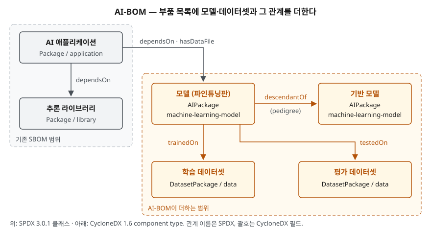

> **실행 검증 없음.** SPDX 3.0.1 명세, CycloneDX 1.6 스키마, NTIA 보고서를 근거로 정리한 개념 글이다. 실행 예제와 측정값은 없다.
> "AI-BOM"이라는 이름을 정의한 단일 표준은 아직 없다. SPDX는 **AI 프로필·Dataset 프로필**, CycloneDX는 **ML-BOM**이라 부른다. 이 글은 두 명세가 공통으로 기록하는 범위를 AI-BOM으로 묶어 설명한다.

## 들어가며

SBOM은 소프트웨어 공급망 보안과 라이선스 관리의 기본 산출물이고, AI 컴플라이언스를 묻는 기출에서도 점검항목의 하나로 등장한다.
AI 시스템이 들어오면서 질문이 한 단계 넓어졌다. 제품 안에 들어간 것이 라이브러리만이 아니라 **가중치 파일과 그 가중치를 만든 데이터**이기 때문이다.
어느 모델을 어떤 데이터로 파인튜닝했는지 기록이 없으면, 기반 모델의 라이선스가 바뀌거나 학습 데이터에 개인정보가 섞였다는 사실이 드러났을 때
영향 범위를 셀 수 없다. AI-BOM은 이 기록을 SBOM과 같은 형식, 같은 파이프라인으로 남기려는 시도다.

## 정의

- **AI-BOM**: AI 시스템을 이루는 소프트웨어 부품에 더해 **모델과 데이터셋, 그리고 모델이 어떤 데이터로 학습·평가됐고 어떤 모델에서 파생됐는지**를
  기계가 읽을 수 있는 형식으로 기록한 부품 명세서다.
- **SPDX 3.0 AI 프로필**: SPDX 명세는 이 프로필을 AI 소프트웨어 패키지(시스템)에 관한 정보를 표준화된 방식으로 문서화·공유하는 수단으로 정의한다.
  모델은 `AIPackage`, 데이터셋은 Dataset 프로필의 `DatasetPackage`로 적는다.
- **CycloneDX ML-BOM**: CycloneDX가 머신러닝 모델과 데이터셋, 그 구성을 기술하려고 둔 기능이다. 모델은 `machine-learning-model`,
  데이터셋은 `data` 타입의 component로 적고, 모델 설명은 `modelCard`에 담는다. 1.5에서 들어왔고 1.6이 ECMA-424 1판으로 채택됐다.

## 등장 배경

NTIA가 2021년 7월 정한 SBOM 최소 요소는 **7가지 데이터 필드**다 — 공급자 이름, 부품 이름, 부품 버전, 기타 고유 식별자, 의존 관계,
SBOM 작성자, 작성 시각. 이 필드는 **코드 부품을 식별하는 데** 맞춰져 있다. 모델에 그대로 적용하면 두 가지가 빠진다.

1. **모델의 성질을 적을 칸이 없다** — 같은 이름·버전의 가중치라도 무엇을 위해 만들었고 어디서 성능이 떨어지는지는 식별자로 드러나지 않는다
2. **데이터와의 관계를 적을 칸이 없다** — 코드 부품 사이의 관계는 "포함한다·의존한다"로 충분하지만, 모델과 데이터 사이의 관계는 "이 데이터로 학습했다"다.
   이 관계가 없으면 데이터 쪽 문제를 모델까지 따라갈 수 없다

두 명세는 기존 부품 모델을 버리지 않고 **패키지를 상속한 새 타입과 새 관계**를 더하는 방식으로 이 빈칸을 메웠다.
SPDX의 `AIPackage`와 `DatasetPackage`는 모두 소프트웨어 `Package`를 상위 클래스로 두므로, 이름·버전·공급자 같은 SBOM 필드를 그대로 물려받는다.

## 구성요소 / 절차

### 기록 대상 — 4가지

| 대상 | 무엇을 적는가 | SPDX 3.0.1 | CycloneDX 1.6 |
|---|---|---|---|
| ① 소프트웨어 부품 | 기존 SBOM 필드 | `Package` | `application`, `library` 등 |
| ② 모델 | 모델 종류·학습 정보·성능·한계·위험 | `AIPackage` | `machine-learning-model` + `modelCard` |
| ③ 데이터셋 | 종류·수집 방법·전처리·편향·민감정보 | `DatasetPackage` | `data` + `data` 구조 |
| ④ 관계와 계보 | 학습·평가 데이터, 파생 원본 | `trainedOn`, `testedOn`, `descendantOf` | `modelParameters.datasets`, `pedigree.ancestors` |

①은 이미 있던 것이고 ②③④가 AI-BOM이 더한 부분이다. 점수는 **④를 쓰는지**에서 갈린다. 모델과 데이터셋을 목록에 올리기만 하고 관계를 적지 않으면,
목록은 길어져도 "이 데이터셋을 빼면 어느 모델을 다시 만들어야 하는가"에 답하지 못한다.

### SPDX `AIPackage` 고유 속성 — 5갈래 15가지

| 갈래 | 속성 |
|---|---|
| 모델과 학습 (5) | `typeOfModel`, `domain`, `hyperparameter`, `modelDataPreprocessing`, `informationAboutTraining` |
| 성능과 설명 (4) | `metric`, `metricDecisionThreshold`, `modelExplainability`, `limitation` |
| 용도와 자율성 (2) | `informationAboutApplication`, `autonomyType` |
| 위험과 규제 (3) | `safetyRiskAssessment`, `standardCompliance`, `useSensitivePersonalInformation` |
| 에너지 (1) | `energyConsumption` (학습·파인튜닝·추론별) |

갈래 구분은 글쓴이가 묶은 것이고, 속성 목록은 명세 그대로다. 15가지는 **모두 선택 항목**이다. 대신 프로필 적합성 규칙은
모든 `AIPackage`가 **선언 라이선스(`hasDeclaredLicense`)와 판정 라이선스(`hasConcludedLicense`)를 정확히 하나씩** 가지도록 강제한다.
`DatasetPackage`도 같은 규칙을 따르고, 고유 속성 13가지 중 **`datasetType`만 필수**다.

### CycloneDX `modelCard` — 3블록

| 블록 | 하위 항목 |
|---|---|
| `modelParameters` | `approach`, `task`, `architectureFamily`, `modelArchitecture`, `datasets`, `inputs`, `outputs` |
| `quantitativeAnalysis` | `performanceMetrics`, `graphics` |
| `considerations` | `users`, `useCases`, `technicalLimitations`, `performanceTradeoffs`, `ethicalConsiderations`, `fairnessAssessments`, `environmentalConsiderations` |

스키마는 모델 카드를 의도한 용도, 한계, 편향, 윤리적 고려, 학습 파라미터, 학습 데이터셋, 성능 지표를 기술하는 것으로 설명한다.
SPDX가 속성을 한 층에 나열한다면 CycloneDX는 **만든 방법 → 측정 결과 → 사용 시 고려**의 3블록으로 묶는다.

## 도식

> **출처**: [SPDX 3.0.1 AI Profile — AIPackage](https://spdx.github.io/spdx-spec/v3.0.1/model/AI/Classes/AIPackage/) · [SPDX 3.0.1 Dataset Profile — DatasetPackage](https://spdx.github.io/spdx-spec/v3.0.1/model/Dataset/Classes/DatasetPackage/) · [SPDX 3.0.1 RelationshipType (trainedOn·testedOn·descendantOf·hasDataFile)](https://spdx.github.io/spdx-spec/v3.0.1/model/Core/Vocabularies/RelationshipType/) · [CycloneDX 1.6 JSON Reference — component type, modelCard, pedigree](https://cyclonedx.org/docs/1.6/json/)

답안지에는 왼쪽 위 2칸(기존 SBOM)과 오른쪽 아래 4칸(모델 2, 데이터셋 2)을 점선으로 나누고, 화살표 이름 3개(`trainedOn`·`testedOn`·`descendantOf`)만 적으면 된다.

## 비교

### 두 형식의 대비

| 구분 | SPDX 3.0.1 | CycloneDX 1.6 |
|---|---|---|
| 모델 표현 | `Package`를 상속한 `AIPackage` 클래스 | component `type: machine-learning-model` |
| 모델 설명 방식 | 속성 15가지를 한 층에 나열 | `modelCard` 3블록으로 묶음 |
| 데이터셋 | `DatasetPackage`, `datasetType` 필수 | component `type: data`와 `data` 구조(분류·민감정보·거버넌스) |
| 학습·평가 관계 | 독립된 관계 요소 `trainedOn`, `testedOn` | 모델 카드 안 `modelParameters.datasets`로 참조 |
| 파생 계보 | `descendantOf` / `ancestorOf` 관계 | `pedigree.ancestors` |
| 라이선스 | 선언·판정 라이선스 각 1개가 적합성 규칙 | component의 `licenses` 필드 |
| 데이터 모델·직렬화 | RDF 기반, JSON-LD 등 | JSON·XML·Protobuf 스키마 |
| 표준화 | SPDX 2.2.1이 ISO/IEC 5962:2021, 3.0은 2024-04 발표 | 1.6이 ECMA-424 1판(2024-06), 1.7은 2025-10 발표 |

가장 큰 설계 차이는 **관계를 어디에 두는가**다. SPDX는 관계를 요소와 같은 급의 독립 객체로 두므로 "이 데이터셋으로 학습한 모든 모델"을
그래프 질의로 뽑기 좋다. CycloneDX는 모델 카드 안에 데이터셋 참조를 넣으므로 모델 하나의 설명을 한 덩어리로 읽기 좋다.
어느 쪽이 낫다기보다 설계 선택이 다르다. 계보를 가로질러 묻는 일이 많으면 관계가 독립된 쪽이, 모델 단위로 넘겨주고 받는 일이 많으면 한 덩어리로 묶인 쪽이 맞다.

### SBOM · AI-BOM · 모델 카드

| 구분 | SBOM | AI-BOM | 모델 카드 |
|---|---|---|---|
| 대상 | 소프트웨어 부품 | 부품 + 모델 + 데이터셋 + 관계 | 모델 하나 |
| 형식 | 기계 판독 | 기계 판독 | 사람이 읽는 문서 |
| 목적 | 식별·의존 추적 | 식별 + 계보 추적 + 위험 기록 | 용도·한계·평가 결과 공개 |
| 근거 | NTIA 최소 요소 7가지 | SPDX 3.0, CycloneDX 1.6 | Mitchell 외(2019) |

모델 카드는 AI-BOM과 경쟁하지 않는다. CycloneDX는 모델 카드에 적던 내용을 **기계가 읽는 필드**로 옮겨 BOM 안에 넣은 것이다.

## 적용 시 고려사항

- **조직 정책으로 필수 항목을 정한다.** SPDX `AIPackage`의 고유 속성 15가지는 모두 선택이라 거의 비워 둔 문서도 적합하다.
  최소한 학습 데이터 관계(`trainedOn`), 파생 원본, 선언·판정 라이선스, 민감정보 사용 여부는 내부 규칙으로 필수화해야 AI-BOM이 쓸모를 가진다.
- **선언 라이선스와 판정 라이선스를 구분해 채운다.** 모델 저장소에 적힌 라이선스(선언)와 실제로 적용된다고 담당자가 판단한 라이선스(판정)가 다를 수 있다.
  기반 모델의 고유 라이선스가 파생 모델로 이어지는 경우가 그 예다. 명세가 둘을 따로 요구하는 이유다.
- **모델이 바뀔 때마다 새 판을 만든다.** 코드 SBOM은 빌드마다 만들지만, 모델은 재학습·파인튜닝·양자화가 빌드와 따로 일어난다.
  학습 파이프라인의 산출 단계에서 AI-BOM을 생성해야 배포된 가중치와 기록이 어긋나지 않는다.
- **공개 범위를 먼저 정한다.** 데이터셋의 수집 방법, 알려진 편향, 민감정보 포함 여부는 외부에 넘기기 곤란한 정보일 수 있다.
  내부용 전체판과 고객 제공판을 나눠 두고, 어느 필드를 가릴지 정책으로 둔다.
- **형식을 섞어 받을 준비를 한다.** 공급자마다 SPDX와 CycloneDX를 달리 준다. 두 형식은 관계 표현 위치가 달라서
  변환하면 `trainedOn` 같은 관계가 빠지기 쉽다. 변환 후 관계 수가 유지되는지 확인하는 단계를 둔다.

> 기출 답안: [기출문제 — AI 생성 코드와 오픈웨이트 모델의 오픈소스 라이선스 컴플라이언스](../../exam/2026-09-29-ai-code-open-weight-license-compliance/index.md)

## 정리

- AI-BOM 기록 대상 **4가지**: 부품 · 모델 · 데이터셋 · **관계와 계보** → "부·모·데·관". 점수는 **관계**에서 갈린다.
- SPDX 3.0: 모델은 `AIPackage`(고유 속성 **15가지, 전부 선택**), 데이터셋은 `DatasetPackage`(**13가지 중 `datasetType`만 필수**). 둘 다 **선언·판정 라이선스 1개씩 필수**.
- CycloneDX 1.6(ECMA-424 1판): `machine-learning-model` + `modelCard` **3블록**(파라미터 · 정량 분석 · 고려사항).
- 관계 표현: SPDX는 **독립 관계** `trainedOn`·`testedOn`, CycloneDX는 **모델 카드 안 참조**.
- 출발점은 NTIA SBOM 최소 요소 **7가지** — 코드 식별용이라 모델 성질과 데이터 관계가 빠진다.

## 참고 자료

- [SPDX Specification 3.0.1 — AI Profile](https://spdx.github.io/spdx-spec/v3.0.1/model/AI/AI/) · [AIPackage](https://spdx.github.io/spdx-spec/v3.0.1/model/AI/Classes/AIPackage/) — 고유 속성과 프로필 적합성(선언·판정 라이선스)
- [SPDX Specification 3.0.1 — Dataset Profile / DatasetPackage](https://spdx.github.io/spdx-spec/v3.0.1/model/Dataset/Classes/DatasetPackage/)
- [SPDX Specification 3.0.1 — RelationshipType](https://spdx.github.io/spdx-spec/v3.0.1/model/Core/Vocabularies/RelationshipType/) — `trainedOn`, `testedOn`, `descendantOf`, `hasDataFile`
- [Linux Foundation, SPDX 3.0 발표 (2024-04-16)](https://www.linuxfoundation.org/press/spdx-3-revolutionizes-software-management-in-systems-with-enhanced-functionality-and-streamlined-use-cases)
- [ISO/IEC 5962:2021 — SPDX Specification V2.2.1](https://www.iso.org/standard/81870.html)
- [CycloneDX 1.6 JSON Reference](https://cyclonedx.org/docs/1.6/json/) — component type, `modelCard`, `data`, `pedigree`
- [CycloneDX — Machine Learning Bill of Materials (ML-BOM)](https://cyclonedx.org/capabilities/mlbom/)
- [ECMA-424 1st edition (2024-06)](https://ecma-international.org/wp-content/uploads/ECMA-424_1st_edition_june_2024.pdf) · [CycloneDX v1.6: Now an Ecma International Standard](https://cyclonedx.org/news/cyclonedx-v1.6-now-an-ecma-international-standard/)
- [CycloneDX v1.7 발표 (2025-10-21)](https://cyclonedx.org/news/cyclonedx-v1.7-released/)
- [NTIA, The Minimum Elements For a Software Bill of Materials (2021-07-12)](https://www.ntia.gov/report/2021/minimum-elements-software-bill-materials-sbom) — 기본 데이터 필드 7가지
- [Mitchell 외, Model Cards for Model Reporting, FAT* 2019 (arXiv:1810.03993)](https://arxiv.org/abs/1810.03993)
