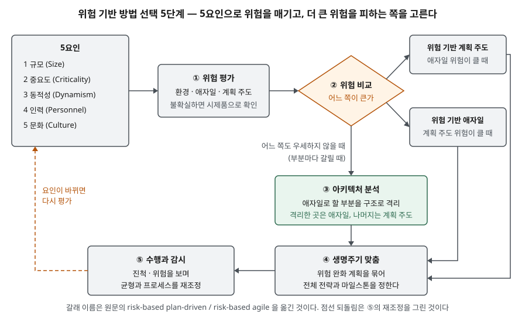

> **실행 검증 없음.** 표준 용어집, 원 논문, 저자 강의 자료, 법령의 공개 본문을 근거로 정리한 개념 글이다.
> 방법론별 성공률·비용 절감률 같은 수치는 1차 출처를 찾지 못해 싣지 않았다.

## 들어가며

"애자일과 폭포수를 비교하라"는 문제에 장단점 표만 쓰면 점수가 잘 나오지 않는다. 시험이 묻는 것은 **어떤 사업에 무엇을 고르고, 그 판단 근거가 무엇인가**다.
실무에서도 같은 질문이 사업 계획 단계마다 나온다. 요구가 자주 바뀌는 대국민 서비스와 인명이 걸린 제어 시스템을 같은 방식으로 만들 수는 없다.
이 글은 선택 기준을 Boehm·Turner의 **5요인**과 **위험 기반 5단계**로 정리하고, 국내 공공사업의 **계약 형태**를 제약 조건으로 덧붙인다.

## 정의

- **폭포수 모델(waterfall model)** — IEEE 용어집(IEEE Std 610.12-1990)은 "구상·요구·설계·구현·시험·설치와 점검의
  **6단계** 활동을 그 순서대로, 겹칠 수는 있으나 **반복이 거의 없이** 수행하는 소프트웨어 개발 과정 모델"로 정의한다.
  반대 개념으로 점진적 개발, 신속 시제품, 나선형 모델을 든다.
- **애자일(agile)** — 2001년 애자일 선언문의 **4개 가치·12개 원칙**을 따르는 개발 방식의 총칭이다. 표준 정의가 아니라 가치 선언이다
  (선언문 자체는 [애자일과 DevOps](../2026-09-22-agile-and-devops-scope/index.md) 글에 정리했다).
- **계획 주도(plan-driven)** — Boehm·Turner가 폭포수를 포함해 계획과 문서를 먼저 세우는 방식을 묶어 부르는 이름이다.
  답안에서는 "폭포수 = 계획 주도 방식의 대표형"으로 놓으면 둘을 같은 축 위에서 비교할 수 있다.

## 등장 배경

폭포수의 출처로 인용되는 Royce(1970)는 순차 모델을 권하지 않았다. 논문은 시스템 요구 → 소프트웨어 요구 → 분석 → 프로그램 설계 → 코딩 → 시험 → 운영의
**7단계** 그림을 보인 직후, 이 구현은 위험하고 실패를 부른다고 적는다. 시험 단계에서 처음으로 시간·저장공간 문제가 드러나면 설계와 요구까지 되돌아가야 하기 때문이다.
대안으로 **5가지 보완책**(설계 먼저, 설계 문서화, 두 번 만들기, 시험 계획·통제·감시, 고객 참여)을 붙였다. 본문 검색으로는 "waterfall"이라는 단어도 나오지 않는다.

같은 논문은 **작고 만든 사람이 직접 운영하는 프로그램**이면 분석과 코딩 두 단계로 충분하다고 적는다. 방법 선택을 규모로 가르는 생각이 이미 여기 있다.

2001년 애자일 선언문은 요구 변화를 흡수하지 못하는 중량 프로세스에 대한 반작용이었다. 그 뒤 "둘 중 무엇이 옳은가"라는 논쟁이 이어지자
Boehm·Turner(2003)는 질문을 **"이 사업에서 어느 쪽의 위험이 더 큰가"**로 바꿨다. 두 방식 모두 잘 맞는 조건, 즉 **홈그라운드**가 있고
사업 조건이 그 홈그라운드에서 멀어질수록 순수한 형태로 쓰는 위험이 커진다는 것이다.

## 구성요소

### 선택 기준 — Boehm·Turner 5요인

| 요인 | 애자일 쪽 판단 근거 | 계획 주도 쪽 판단 근거 |
|---|---|---|
| ① 규모 | 작은 제품·팀에 맞는다. 암묵지에 기대므로 확장에 한계 | 큰 제품·팀을 다루며 발전했다. 작은 사업으로 줄이기 어렵다 |
| ② 중요도 | 안전 필수 제품에서 검증되지 않았다. 단순 설계·문서 부족이 문제 될 수 있다 | 고중요도 제품을 다루며 발전했다. 저중요도에 맞춰 줄이기 어렵다 |
| ③ 동적성 | 단순 설계·지속적 리팩터링이 요구 변동이 큰 환경에 맞는다. 안정 환경에서는 재작업 비용 | 상세 계획·선행 설계가 안정 환경에 맞는다. 변동이 크면 재작업 비용 |
| ④ 인력 | 숙련 전문가가 상시 일정 비율 이상 있어야 한다 | 정의 단계에 전문가가 집중되면 이후에는 적어도 된다 |
| ⑤ 문화 | 자유도가 클 때 편안함을 느끼는 조직(혼돈 속 번성) | 역할이 정책·절차로 정해질 때 편안함을 느끼는 조직(질서 속 번성) |

인력 항목에서 저자 자료는 애자일에 **숙련 2·3등급 전문가 30% 이상 상주**, 계획 주도에 **초기 3등급 50%·이후 10%**를 예로 들되,
이 비율은 응용의 복잡도에 따라 달라진다고 단서를 단다. 등급은 Cockburn의 숙련도 구분이다.

### 선택 절차 — 위험 기반 5단계

1. **위험 평가** — 환경 위험, 애자일 위험, 계획 주도 위험을 매긴다. 판단이 서지 않으면 시제품·자료 수집으로 정보를 산다
2. **위험 비교** — 애자일 위험이 크면 위험 기반 계획 주도, 계획 주도 위험이 크면 위험 기반 애자일
3. **아키텍처 분석** — 부분마다 결론이 갈리면 애자일로 할 부분을 구조로 격리하고 그 안에서만 애자일, 나머지는 계획 주도
4. **생명주기 맞춤** — 개별 위험 완화 계획을 묶어 전체 전략과 마일스톤을 정한다
5. **수행과 감시** — 진척과 위험을 보며 균형과 프로세스를 다시 맞춘다

### 국내 공공사업의 제약 — 계약 형태

선언문의 세 번째 가치는 "계약 협상보다 고객과의 협력"이다. 그런데 공공 소프트웨어 사업은 계약으로 범위를 묶는다.
소프트웨어 진흥법의 과업심의위원회 조항(제50조, 2020-12-10 시행)은 국가기관등이 **과업 내용의 확정**과 **과업 변경의 확정 및 그에 따른 계약금액·기간 조정**을
위원회에서 심의하도록 한다. 범위가 바뀌면 이 심의를 거쳐 계약이 바뀐다는 뜻이다. 스프린트마다 백로그 우선순위를 바꾸는 운영은
**이 변경 절차와 어떻게 맞물릴지**를 사업 초기에 정해 두지 않으면 계약과 실제 산출물이 갈라진다.

## 도식

> **출처**: [Boehm·Turner, Balancing Agility and Discipline 강의 자료 — The Five Critical Agility/Plan-Driven Factors(39~40쪽), A Tailorable Method(45~46쪽)](https://pdfs.semanticscholar.org/5c0f/2b8c2a3167879644ccdea90b8054f660fb1f.pdf).
> 원 논문은 [Boehm·Turner, Using Risk to Balance Agile and Plan-Driven Methods, IEEE Computer 36(6), 2003](https://ieeexplore.ieee.org/document/1204376/)이다.

답안에는 5요인 상자 하나와 ①→②→세 갈래→④→⑤ 흐름만 옮기면 된다. 상자 8개다.

## 비교

| 구분 | 폭포수(계획 주도) | 애자일 | 위험 기반 혼합 |
|---|---|---|---|
| 근거 | IEEE 610.12 정의, Royce(1970) | 애자일 선언문(2001) | Boehm·Turner(2003) |
| 진행 | 단계 순서대로, 반복 거의 없음 | 짧은 반복으로 작동하는 증분 인도 | 부분마다 다르게, 구조로 경계를 나눔 |
| 요구 변화 | 변경 통제로 막는다 | 다음 반복에 받아들인다 | 변동이 큰 부분만 애자일로 격리 |
| 맞는 규모 | 대형 제품·팀 | 소형 제품·팀 | 대형이면서 일부가 동적인 사업 |
| 맞는 중요도 | 안전·고신뢰 | 저~중 중요도 | 핵심부는 계획 주도, 주변부는 애자일 |
| 문서 | 단계 산출물이 곧 기준선 | 최소화, 작동하는 소프트웨어 중시 | 위험이 큰 곳에 문서를 집중 |
| 계약과의 궁합 | 범위 고정 계약과 맞는다 | 범위 변경 절차가 필요하다 | 격리한 부분에만 변경 여지를 둔다 |

## 적용 시 고려사항

1. **한 요인으로 고르지 않는다.** 요구 변동이 크다는 이유만으로 애자일을 택하면 안전 필수 시스템의 문서·검증 요구를 놓친다.
   5요인을 같이 매기고, 갈리면 3단계의 아키텍처 분리를 쓴다.
2. **"작게 키운다"가 "크게 줄인다"보다 쉽다.** 저자들은 결론에서 방법을 맞춰 줄이지 말고 필요한 만큼 쌓아 올리라고 한다.
   계획 주도 산출물 목록 전체에서 빼 나가면 필요 없는 문서가 남는다.
3. **인력 구성을 먼저 본다.** 애자일은 숙련자가 상시 일정 비율 있어야 성립한다. 외주 인력 위주로 짧게 투입되는 사업이라면
   그 사실 자체가 애자일 위험으로 계산된다.
4. **계약 변경 절차를 설계에 넣는다.** 공공사업에서 애자일을 쓰려면 과업 변경을 언제, 어떤 단위로 심의에 올릴지를
   착수 전에 정한다. 정하지 않으면 산출물은 반복으로 바뀌는데 계약서는 처음 범위에 머문다.
5. **선택은 한 번으로 끝나지 않는다.** 5단계가 감시와 재조정이다. 사업 중 규모나 요구 변동이 바뀌면 1단계로 돌아간다.

## 정리

암기 단서는 **"6단계 정의 · 7단계 그림 · 5보완 · 5요인 · 5절차"**다.

- 폭포수는 IEEE 610.12의 정의대로 **6단계를 순서대로, 반복 거의 없이** 수행하는 모델이다
- Royce(1970)는 **7단계** 순차 그림을 위험하다고 하고 **5가지 보완책**을 붙였다. 순차 모델을 권한 논문이 아니다
- 선택 기준은 **규모·중요도·동적성·인력·문화** 5요인(규중동인문)이다
- 선택 절차는 **위험 평가 → 비교 → 아키텍처 분리 → 생명주기 맞춤 → 감시** 5단계다
- 국내 공공사업은 **과업심의위원회(소프트웨어 진흥법 제50조)**의 범위 확정·변경 절차를 제약 조건으로 함께 본다

## 참고 자료

- [IEEE Std 610.12-1990 — IEEE Standard Glossary of Software Engineering Terminology (NIST 소장본)](https://www.nist.gov/system/files/documents/2025/04/29/61012-1990.pdf) — waterfall model, spiral model, rapid prototyping 정의
- [Royce, W. W. — Managing the Development of Large Software Systems, IEEE WESCON, 1970](https://holub.com/goodies/royce.waterfall.pdf) — 7단계 그림(Figure 2)과 5가지 보완책 (제3자 전재)
- [Boehm, B., Turner, R. — Using Risk to Balance Agile and Plan-Driven Methods, IEEE Computer 36(6), 2003](https://ieeexplore.ieee.org/document/1204376/) — 5요인과 위험 기반 방법
- [Boehm·Turner — Balancing Agility and Discipline 강의 자료](https://pdfs.semanticscholar.org/5c0f/2b8c2a3167879644ccdea90b8054f660fb1f.pdf) — 5요인 판단 근거 표, 인력 구성 비율, 위험 기반 5단계, 결론 6가지
- [애자일 선언문 (2001)](https://agilemanifesto.org/iso/ko/manifesto.html) — 4개 가치
- [소프트웨어 진흥법 제50조 (국가법령정보센터)](https://www.law.go.kr/%EB%B2%95%EB%A0%B9/%EC%86%8C%ED%94%84%ED%8A%B8%EC%9B%A8%EC%96%B4%EC%A7%84%ED%9D%A5%EB%B2%95/%EC%A0%9C50%EC%A1%B0) — 과업심의위원회의 심의 사항
