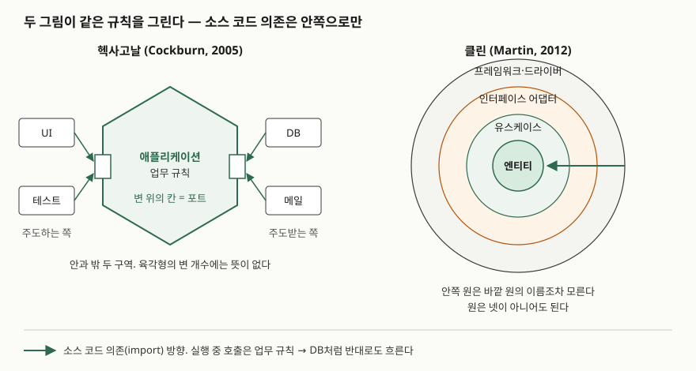

> 정의와 구성요소는 각 아키텍처를 제안한 사람의 원문(Cockburn 2005, Martin 2012, Palermo 2008)을 근거로 했다.
> 표준 문서(ISO/IEC 등)에는 두 아키텍처의 정의가 없다. 의존 방향은 예제 코드의 import 문을 실제로 분석해 확인했다.

## 들어가며

소프트웨어 아키텍처 문제에서 "계층형 아키텍처의 한계와 클린 아키텍처를 설명하라", "헥사고날 아키텍처의 포트와
어댑터를 설명하라" 형태로 나온다. 두 개념은 자주 같은 것으로 뭉뚱그려지는데, 답안에서 점수가 갈리는 지점은
**"의존성 방향을 뒤집는다"는 말을 구체적으로 쓸 수 있는가**다. 실무에서는 DB나 프레임워크를 바꿀 때 업무 규칙
코드까지 고쳐야 하는 문제, UI 없이는 업무 규칙을 자동 테스트할 수 없는 문제를 푸는 설계로 쓰인다.

## 정의

- **헥사고날 아키텍처(포트와 어댑터)** — Alistair Cockburn(2005)이 제안했다. 의도는 애플리케이션이 사용자·프로그램·
  자동 테스트·배치 스크립트 어느 쪽에서든 똑같이 구동되고, 실제 장치와 DB 없이 격리된 채 개발·시험될 수 있게 하는 것이다.
  애플리케이션과 바깥 세계 사이를 **포트**(목적별 대화 창구)로 나누고, 기술별 변환은 **어댑터**가 맡는다.
- **클린 아키텍처** — Robert C. Martin(2012)이 헥사고날·어니언 등 기존 아키텍처들의 공통점을 하나로 묶은 것이다.
  동심원으로 계층을 그리고 **의존성 규칙**(Dependency Rule) 하나를 둔다. "소스 코드 의존은 안쪽으로만 향할 수 있다."
- **의존성 역전 원칙(DIP)** — Martin이 정리한 두 조항이다. ① 상위 모듈은 하위 모듈에 의존하지 않고 둘 다 추상에 의존한다.
  ② 추상은 세부에 의존하지 않고 세부가 추상에 의존한다. 두 아키텍처가 경계를 넘는 방법이 이것이다.

## 등장 배경

전통적인 계층형 구조는 표현 → 업무 → 데이터 접근 순서로 위가 아래를 호출하고 import 한다. 호출 방향과 의존 방향이
같으니 **업무 규칙이 DB 기술을 안다.** Cockburn은 두 문제를 들었다. 업무 로직이 UI 코드로 새어 들어가 UI 없이는
자동 테스트를 못 하고, 애플리케이션이 외부 DB와 얽혀 DB가 바뀌거나 없으면 개발이 멈춘다는 것이다.
Palermo(2008)의 어니언 아키텍처도 같은 문제를 "각 계층이 아래 계층과 인프라에 결합된다"로 짚고, DB는 중심이 아니라 바깥이라고 적었다.

Martin(2012)은 이런 아키텍처들이 세부는 달라도 목표가 같다고 보고, 공통 특성 **5가지**를 뽑았다.

| ① 프레임워크 독립 | ② 테스트 가능 | ③ UI 독립 | ④ DB 독립 | ⑤ 외부 기관 독립 |
|---|---|---|---|---|
| 프레임워크를 도구로만 쓴다 | UI·DB·웹 서버 없이 업무 규칙을 시험한다 | 업무 규칙을 안 고치고 UI를 바꾼다 | DB를 바꿔도 업무 규칙이 그대로다 | 업무 규칙이 바깥 세계를 모른다 |

## 구성요소

### 헥사고날 — 4요소, 포트 2종

| 요소 | 역할 |
|---|---|
| ① 애플리케이션 | 안쪽. 업무 규칙. 바깥 기술을 모른다 |
| ② 포트 | 목적별 대화 창구. API로 정의한다 |
| ③ 어댑터 | 바깥 신호를 포트 호출로, 포트 호출을 바깥 기술로 바꾼다 |
| ④ 액터 | 바깥의 사람·프로그램·장치 |

포트와 어댑터는 방향에 따라 **2종**이다. **주도하는 쪽**(primary, driving)은 애플리케이션을 구동하는 액터 — 사용자,
테스트 하네스. **주도받는 쪽**(secondary, driven)은 애플리케이션이 조회하거나 통지하는 대상 — DB, 메일 서버.
Cockburn은 육각형의 변 **개수 6에는 뜻이 없고** 포트 여러 개를 그릴 공간을 주려는 모양일 뿐이라고 적는다.

### 클린 — 동심원 4개, 규칙 1개

| 원 (안 → 밖) | 담는 것 |
|---|---|
| ① 엔티티 | 기업 전체에 걸친 업무 규칙. 가장 덜 바뀐다 |
| ② 유스케이스 | 이 애플리케이션 고유의 업무 규칙. 엔티티를 오가는 데이터 흐름을 지휘한다 |
| ③ 인터페이스 어댑터 | 유스케이스용 형식과 바깥(DB·웹)용 형식을 서로 바꾼다. SQL은 이 원 안에만 둔다 |
| ④ 프레임워크·드라이버 | 웹 프레임워크, DB 같은 세부. 안쪽과 잇는 접착 코드 정도만 쓴다 |

Martin은 원이 꼭 넷일 필요는 없고, 지켜야 할 것은 의존성 규칙뿐이라고 적는다. 경계를 넘는 데이터는 단순한 자료 구조
(DTO, 함수 인자)로 넘기고, 엔티티나 DB 행을 그대로 넘기지 않는다.

## 도식



> **출처**: 왼쪽은 [Cockburn, Hexagonal Architecture (2005) — Structure·Nature of Solution](https://alistair.cockburn.us/hexagonal-architecture/),
> 오른쪽은 [Martin, The Clean Architecture (2012) — The Dependency Rule](https://blog.cleancoder.com/uncle-bob/2012/08/13/the-clean-architecture.html)을 따랐다.

답안에는 육각형 하나와 양옆 어댑터 2개씩, 그리고 원 4개와 안쪽을 향한 화살표 하나만 그린다. 화살표 옆에
"소스 코드 의존 방향"이라고 적어 호출 방향과 구분하는 것이 핵심이다.

## 의존성이 뒤집힌다는 것 — 코드로 확인

같은 주문 기능을 계층형(`before/`)과 포트·어댑터(`after/`)로 짜고, import 문을 `ast`로 뽑아 방향을 찍었다.
전체 소스: [`code/`](code/), 실행 기록: [`code/output.txt`](code/output.txt)

```python
class OrderRepository(Protocol):      # domain.py — 포트를 쓰는 쪽(안쪽)이 정의한다
    def next_id(self) -> int: ...
    def save(self, order: Order) -> None: ...

class SqliteOrderRepository:          # adapters.py — 바깥이 포트에 맞춘다
    def save(self, order: Order) -> None:
        self._conn.execute("INSERT INTO shop_order (id, amount) VALUES (?, ?)", ...)
```

```text
[1-A 계층형 (before)]
  order_service  -> sqlite3    바깥으로 (규칙 위반)
  바깥을 향한 의존: 1개

[1-B 포트와 어댑터 (after)]
  adapters       -> sqlite3    같은 층
  adapters       -> domain     안쪽으로
  main           -> adapters   안쪽으로
  main           -> domain     안쪽으로
  바깥을 향한 의존: 0개

[2 실행 중 호출 방향]
  domain -> __main__.RecordingRepository.next_id
  domain -> __main__.RecordingRepository.save
```

1-B와 2를 겹쳐 보면 "역전"의 뜻이 드러난다. 실행 중에는 여전히 업무 규칙(`domain`)이 저장소 어댑터를 **부른다**(2).
그런데 import는 어댑터가 `domain`을 향한다(1-B). 계층형에서는 호출과 의존이 같은 방향이었는데, 포트를 업무 규칙 쪽에
두자 **의존 방향만** 반대로 돌았다. 인터페이스의 주인이 구현하는 쪽에서 쓰는 쪽으로 옮겨 간 것이다.
마지막 단계에서는 `PlaceOrder`를 한 줄도 고치지 않고 메모리 저장소와 SQLite 저장소를 바꿔 끼워 같은 결과를 얻었다.

## 비교

| 구분 | 계층형 | 헥사고날 | 어니언 | 클린 |
|---|---|---|---|---|
| 제안 | (관행) | Cockburn, 2005 | Palermo, 2008 | Martin, 2012 |
| 그림 | 위아래 층 | 육각형, 안·밖 2구역 | 양파 모양 동심원 | 동심원 4개(고정 아님) |
| 중심 | 데이터 접근이 맨 아래 토대 | 애플리케이션 | 도메인 모델 | 엔티티 |
| 핵심 규칙 | 위가 아래에 의존 | 바깥과는 포트로만 대화 | 모든 결합은 중심을 향한다 | 소스 코드 의존은 안쪽으로만 |
| 바깥 구분 | 없음 | 주도하는 쪽·주도받는 쪽 | 인프라·UI·테스트를 가장자리에 | 어댑터와 프레임워크를 두 원으로 |
| 강조점 | 단순함 | 테스트·교체를 위한 대칭 | 도메인 중심 | 여러 아키텍처의 공통 규칙 |

헥사고날은 **안과 밖 두 구역**만 나누고 안쪽 구조는 정하지 않는다. 클린은 안쪽을 엔티티·유스케이스로 다시 나눠
**기업 규칙과 애플리케이션 규칙**을 구분한다. 거꾸로 클린의 동심원에는 주도하는 쪽·주도받는 쪽의 구분이 그려지지 않는다.
둘은 경쟁 관계가 아니라 같은 규칙을 다른 해상도로 그린 것이다. Martin도 2012년 글에서 헥사고날을 묶은 대상의 첫 번째로 든다.

## 적용 시 고려사항

1. **포트의 모양은 쓰는 쪽이 정한다.** DB 테이블이나 외부 API 모양을 그대로 옮긴 인터페이스는 이름만 포트다.
   유스케이스가 필요한 연산(`next_id`, `save`)으로 정의해야 어댑터를 바꿔 끼울 수 있다.
2. **간접 계층 비용을 따진다.** 포트·어댑터·DTO 변환 코드가 늘어난다. 저장소가 하나뿐이고 바뀔 일이 없는 단순 CRUD는
   계층형이 더 싸다. 업무 규칙이 복잡하거나, 테스트 자동화가 필요하거나, 외부 시스템 연계가 여럿일 때 이득이 크다.
3. **경계를 넘는 데이터의 형태를 정한다.** ORM 엔티티나 DB 행 객체를 안쪽까지 넘기면 import가 없어도 바깥 형식에 묶인다.
   Martin은 경계를 넘는 데이터를 단순 자료 구조로 제한한다.
4. **의존 규칙은 기계로 검사한다.** 사람이 지키는 규칙은 시간이 지나면 깨진다. 예제처럼 import 그래프를 검사하거나
   패키지 의존 검사 도구를 빌드에 넣어 안쪽 모듈이 바깥을 import 하면 실패하게 한다.
5. **조립 지점을 한 곳에 둔다.** 어떤 어댑터를 꽂을지는 가장 바깥(`main`)에서 정한다. 유스케이스 안에서 구현 클래스를
   생성하면 import가 다시 바깥을 향한다.

설계 원칙 쪽 배경은 [결합도와 응집도](../2026-09-21-coupling-and-cohesion-levels/index.md),
어댑터라는 이름의 출처인 구조 패턴은 [GoF 디자인 패턴 23개의 3분류](../2026-10-02-gof-design-patterns-three-purposes/index.md)에서 다뤘다.

## 정리

암기 단서는 **"헥사 4요소·2종 / 클린 4원·1규칙·5독립 / DIP 2조항"**이다.

- 헥사고날 **4요소**: 애플리케이션·포트·어댑터·액터, 포트 **2종**: 주도하는 쪽·주도받는 쪽. 변 6개에는 뜻이 없다
- 클린 **4원**: 엔티티·유스케이스·인터페이스 어댑터·프레임워크·드라이버(넷이 고정은 아님)
- **1규칙**: 소스 코드 의존은 안쪽으로만. 실행 중 호출은 반대로도 흐른다
- **5독립**: 프레임워크·테스트 가능·UI·DB·외부 기관
- 역전의 실체: 인터페이스를 쓰는 쪽(안쪽)이 정의하고 바깥이 구현해, 호출 방향은 그대로 두고 의존 방향만 뒤집는다

## 참고 자료

- [Alistair Cockburn — Hexagonal Architecture (2005-09-04)](https://alistair.cockburn.us/hexagonal-architecture/) — 원 제안. 의도, 포트·어댑터, 주도하는 쪽·주도받는 쪽, 육각형 모양의 이유
- [Robert C. Martin — The Clean Architecture (2012-08-13)](https://blog.cleancoder.com/uncle-bob/2012/08/13/the-clean-architecture.html) — 공통 특성 5가지, 의존성 규칙, 동심원 4개, 경계를 넘는 데이터
- [Jeffrey Palermo — The Onion Architecture: part 1 (2008-07-29)](https://jeffreypalermo.com/2008/07/the-onion-architecture-part-1/) — 계층형의 결합 문제, 중심을 향한 결합
- [TU Darmstadt, Software Engineering Design & Construction — Dependency-Inversion Principle 강의 자료](http://stg-tud.github.io/sedc/Lecture/ws17-18/3.3-DIP.pdf) — Martin, *Agile Software Development* (Prentice Hall, 2003)의 DIP 두 조항 인용, 인터페이스 소유권의 역전
- [Python — ast 모듈](https://docs.python.org/3.13/library/ast.html) — 예제의 import 분석
