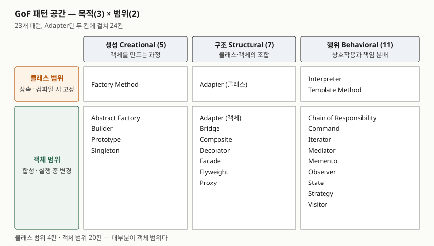

> **실행 검증 없음.** 원전(GoF, 1994) 1장의 출판사 공개 미리보기를 근거로 정리한 개념 글이다.
> 패턴별 사용 빈도나 효과 같은 수치는 1차 출처가 없어 싣지 않았다.

## 들어가며

디자인 패턴은 소프트웨어 공학 과목에서 "23개 패턴을 분류하고 대표 패턴을 설명하라" 형태로 나온다.
패턴 이름을 외워 표에 넣는 것만으로는 점수가 갈리지 않는다. 채점자가 보는 것은 **왜 그 칸에 들어가는가**,
즉 분류 기준을 정확히 쓰는지와 Adapter처럼 두 칸에 걸친 패턴을 아는지다.
실무에서는 코드 리뷰와 설계 문서에서 "여기는 Strategy로 빼자"처럼 설계 의도를 짧게 전하는 어휘로 쓰인다.

## 정의

- **디자인 패턴** — GoF는 "특정 맥락의 일반적 설계 문제를 풀도록 다듬은, 서로 통신하는 객체와 클래스의 기술(description)"로 정의한다(1.1절).
  건축가 Alexander의 패턴 정의(반복해서 생기는 문제와 그 해법의 핵심을 기술한 것)를 객체지향 설계에 옮긴 것이다.
- **패턴의 4요소** — 패턴 이름(name), 문제(problem), 해법(solution), 결과(consequences). 해법은 구체적 구현이 아니라
  여러 상황에 적용하는 **틀**이고, 결과는 공간·시간 트레이드오프와 유연성·확장성·이식성에 미치는 영향이다.

## 등장 배경

숙련된 설계자는 문제를 매번 처음부터 풀지 않고 전에 통했던 해법을 다시 쓴다. GoF는 그런 경험이 기록되지 않아
초심자가 배우기 어렵다는 점을 문제로 들었다(1장 서문). 그래서 **서로 다른 시스템에서 두 번 이상 적용된 설계만** 골라
일관된 형식의 카탈로그로 남겼다. 새로운 설계가 아니라 이미 쓰이던 설계에 이름을 붙인 것이다.

패턴이 23개로 늘자 찾아 쓰기 위한 분류가 필요해졌다. 1.5절이 이 분류를 두 기준으로 정한다.

## 구성요소

### 분류 기준 2가지

| 기준 | 묻는 것 | 값 |
|---|---|---|
| ① **목적(purpose)** | 그 패턴이 **무엇을 하는가** | 생성 · 구조 · 행위 (3) |
| ② **범위(scope)** | 주로 **클래스**에 적용되는가 **객체**에 적용되는가 | 클래스 · 객체 (2) |

### 목적 3분류 — 23개

| 분류 | 다루는 것 | 패턴 (개수) |
|---|---|---|
| **생성** | 객체를 **만드는 과정** | Abstract Factory, Builder, Factory Method, Prototype, Singleton (**5**) |
| **구조** | 클래스나 객체를 **조합**하는 방식 | Adapter, Bridge, Composite, Decorator, Facade, Flyweight, Proxy (**7**) |
| **행위** | 클래스·객체가 **상호작용하고 책임을 나누는** 방식 | Chain of Responsibility, Command, Interpreter, Iterator, Mediator, Memento, Observer, State, Strategy, Template Method, Visitor (**11**) |

### 범위 2분류 — 상속인가 합성인가

- **클래스 범위** — 클래스와 서브클래스의 관계를 다룬다. 관계가 **상속**으로 맺어지므로 컴파일 시점에 고정된다.
  Factory Method, Adapter(클래스형), Interpreter, Template Method **4개**뿐이다
- **객체 범위** — 객체 사이의 관계를 다룬다. 실행 중에 바꿀 수 있다. 나머지 **19개 + Adapter(객체형)**

GoF는 거의 모든 패턴이 어느 정도 상속을 쓴다고 적는다. 그래서 "클래스 패턴"은 상속 관계 자체가 **중심인** 패턴에만 붙인 이름이다.

범위와 목적을 겹치면 각 칸의 성격이 정해진다(1.5절).

| | 클래스 범위 | 객체 범위 |
|---|---|---|
| 생성 | 생성의 일부를 **서브클래스**에 미룬다 | 생성을 **다른 객체**에 미룬다 |
| 구조 | 상속으로 **클래스를 조합**한다 | **객체를 조립**하는 방법을 기술한다 |
| 행위 | 상속으로 **알고리즘과 제어 흐름**을 기술한다 | 객체 여럿이 **협력해 한 객체로는 못 할 일**을 한다 |

## 도식

> **출처**: [Gamma 외, Design Patterns — 1.5 Organizing the Catalog, Table 1.1 Design pattern space (출판사 미리보기)](https://api.pageplace.de/preview/DT0400.9780321700698_A40421732/preview-9780321700698_A40421732.epub)

답안에는 3열 2행 격자와 각 칸의 패턴 이름만 옮긴다. 열 머리에 개수(5·7·11)를 붙이고,
Adapter가 두 칸에 걸쳐 칸 수가 24라는 것을 한 줄로 덧붙이면 분류를 정확히 안다는 표시가 된다.

## 비교

시험은 의도가 비슷한 패턴의 구분을 자주 묻는다. 아래 의도는 원전 1.4절의 패턴별 요약(intent)을 우리말로 옮긴 것이다.

| 비교 쌍 | 공통점 | 가르는 기준 |
|---|---|---|
| **Factory Method / Abstract Factory** | 생성할 구체 클래스를 숨긴다 | FM은 **서브클래스가** 무엇을 만들지 정한다(클래스 범위). AF는 관련된 객체 **군(family)** 을 만드는 인터페이스를 따로 둔다(객체 범위) |
| **Adapter / Bridge** | 인터페이스와 구현 사이에 한 층을 둔다 | Adapter는 **호환되지 않는** 인터페이스를 클라이언트가 기대하는 인터페이스로 **바꾼다**. Bridge는 추상과 구현을 **분리해** 둘이 각자 바뀌게 한다 |
| **Decorator / Proxy** | 같은 인터페이스로 대상 객체를 감싼다 | Decorator는 **책임을 덧붙인다**(서브클래싱의 대안). Proxy는 대상에 대한 **접근을 통제한다** |
| **Composite / Decorator** | 구조도가 비슷하다(1.5절이 직접 지적) | Composite는 부분-전체 **트리**를 만들어 개별과 묶음을 똑같이 다룬다. Decorator는 객체 **하나**에 기능을 얹는다 |
| **Facade / Mediator** | 여러 객체 앞에 한 객체를 둔다 | Facade는 하위 시스템에 **단일 진입 인터페이스**를 준다(구조). Mediator는 객체들 사이의 **상호작용 자체**를 캡슐화한다(행위) |
| **Strategy / State** | 행위를 별도 객체로 빼 바꿔 끼운다 | Strategy는 **알고리즘 군**을 교체 가능하게 한다. State는 **내부 상태**가 바뀌면 행위가 바뀌어 클래스가 바뀐 것처럼 보이게 한다 |
| **Template Method / Strategy** | 알고리즘의 변하는 부분을 분리한다 | TM은 **상속**으로 일부 단계를 서브클래스에 미룬다(클래스 범위). Strategy는 **합성**으로 알고리즘 전체를 갈아 끼운다(객체 범위) |
| **Prototype / Abstract Factory** | 생성할 객체 종류를 바꾼다 | 1.5절이 서로 **대안**이 된다고 적는다. Prototype은 원형을 **복제**하고, AF는 팩토리 객체를 바꾼다 |

## 적용 시 고려사항

1. **패턴은 문제에서 출발한다.** 4요소 중 "문제"가 언제 적용하는지를 정한다. 문제가 없는데 패턴을 넣으면
   간접 계층만 늘어난다. "결과" 항목이 그 비용(공간·시간 트레이드오프)을 함께 적는 이유다.
2. **범위는 변경 시점을 정한다.** 클래스 범위 패턴은 상속으로 고정되어 실행 중에 바꿀 수 없다.
   알고리즘을 설정이나 요청마다 바꿔야 하면 Template Method 대신 Strategy처럼 객체 범위 패턴을 고른다.
   GoF는 상속 재사용을 **화이트박스**, 합성 재사용을 **블랙박스** 재사용으로 구분한다(1.6절).
3. **인터페이스에 맞춰 짠다.** GoF가 1.6절에서 내세운 원칙은 "구현이 아니라 인터페이스에 맞춰 프로그래밍하라"이고,
   생성 패턴 5개가 이를 가능하게 한다고 적는다. 구체 클래스 생성을 한곳으로 모아야 나머지 코드가 인터페이스에만 의존한다.
4. **언어가 패턴의 필요를 바꾼다.** GoF는 Smalltalk·C++ 수준의 언어 기능을 전제했고, 다중 메서드가 있는 CLOS에서는
   Visitor의 필요가 줄어든다고 적는다(1.1절). 일급 함수가 있는 언어에서 Strategy·Command를 클래스로 만들지 함수로 넘길지는 이 관점에서 판단한다.
5. **카탈로그 밖의 영역이 있다.** 원전은 동시성·분산·실시간·도메인 특화 패턴을 다루지 않는다고 스스로 밝힌다.
   이런 문제에 23개 중 하나를 억지로 대응시키지 않는다.

## 정리

암기 단서는 **"4요소 · 2기준 · 5-7-11 · 클래스 4칸"**이다.

- 패턴의 **4요소**: 이름·문제·해법·결과
- 분류 **2기준**: 목적(무엇을 하는가)과 범위(클래스인가 객체인가)
- 목적별 개수 **생성 5 · 구조 7 · 행위 11 = 23**
- 클래스 범위는 **Factory Method·Adapter(클래스)·Interpreter·Template Method 4칸**, 나머지는 객체 범위. Adapter만 두 칸에 걸쳐 24칸
- 생성 5개 두문자: **AB-FPS**(Abstract Factory·Builder·Factory Method·Prototype·Singleton)

## 참고 자료

- [Gamma, E., Helm, R., Johnson, R., Vlissides, J. — Design Patterns: Elements of Reusable Object-Oriented Software, Addison-Wesley, 1994 (Pearson InformIT)](https://www.informit.com/store/design-patterns-elements-of-reusable-object-oriented-9780201633610) — 원전
- [같은 책 1장 출판사 미리보기 (pageplace)](https://api.pageplace.de/preview/DT0400.9780321700698_A40421732/preview-9780321700698_A40421732.epub) — 1.1 What Is a Design Pattern?(4요소), 1.4 The Catalog of Design Patterns(23개 의도), 1.5 Organizing the Catalog(Table 1.1, 두 기준), 1.6(인터페이스 원칙, 화이트박스·블랙박스 재사용)
- [Hillside Group — Design Patterns: Elements of Reusable Object-Oriented Software](https://www.hillside.net/elements-of-reusable-object-oriented-software-book) — 패턴 커뮤니티의 원전 소개
