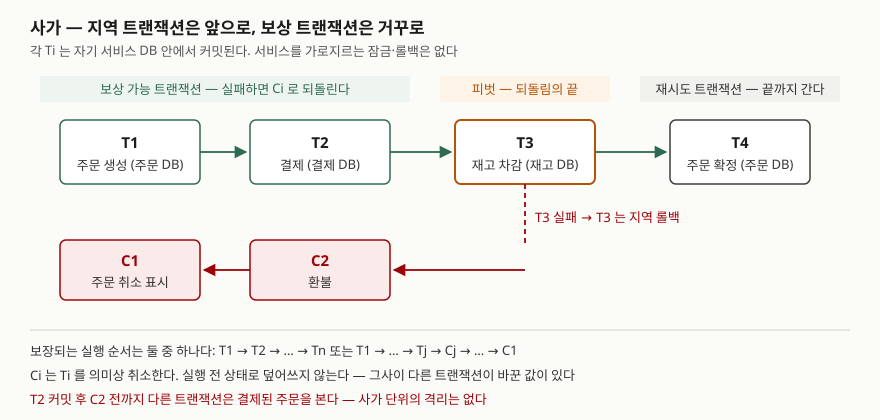

> 정의와 보장은 사가를 처음 제안한 논문(Garcia-Molina & Salem, 1987)을, 트랜잭션 종류·조정 방식·이상 현상·대응책은
> Microsoft Azure 아키텍처 센터의 패턴 문서(2025-02-25 갱신)를 근거로 했다. 보상 순서와 격리 부재는
> 예제 코드를 실제로 돌려 확인했다. 성능 수치는 싣지 않는다.

## 들어가며

MSA 문제는 "서비스별 DB를 쓰면 데이터 일관성을 어떻게 지키는가"로 이어진다. 답은 대개 사가인데,
"보상 트랜잭션으로 롤백한다"까지만 쓰면 변별이 안 된다. 점수가 갈리는 곳은 **무엇을 포기했는가**다.
사가는 원자성을 의미상의 보상으로 대신하고, **격리는 아예 내려놓는다.** 실무에서는 주문·결제·재고처럼 DB가
나뉜 서비스를 하나의 업무로 묶을 때, 2단계 커밋(2PC) 없이 일관성을 맞추는 방법으로 쓰인다.

MSA의 분해 기준과 비용은 [MSA — 분해 기준과 감당해야 할 비용](../2026-09-22-msa-decomposition-and-cost/index.md)에서 다뤘다.
이 글은 분해한 뒤 생기는 트랜잭션 문제만 본다.

## 정의

> **사가**는 다른 트랜잭션과 임의로 섞여 실행될 수 있는 하위 트랜잭션들로 쪼갤 수 있는 장기 트랜잭션(LLT)이다.
> 각 하위 트랜잭션 Ti 에는 보상 트랜잭션 Ci 가 짝지어지며, Ci 는 Ti 가 한 일을 **의미상** 취소하되
> Ti 실행 전 상태로 데이터베이스를 되돌린다고 보장하지는 않는다. — Garcia-Molina & Salem(1987) 서론

Azure 아키텍처 센터는 같은 개념을 MSA 맥락으로 옮겨 정의한다. **여러 서비스에 걸친 지역 트랜잭션의
순서를 조정해 분산 시스템의 데이터 일관성을 유지하고, 한 단계가 실패하면 보상 트랜잭션들이 이미 끝난
단계의 변경을 되돌리는 패턴**이다. 답안 첫 줄에는 뒤쪽을 쓰고 *지역 트랜잭션*과 *보상 트랜잭션* 두 낱말을 남긴다.

원 논문이 시스템에 요구한 보장은 하나다. 실행 순서가 다음 **2가지** 중 하나가 된다.

1. T1, T2, …, Tn — 전부 성공 (바람직한 쪽)
2. T1, …, Tj, Cj, …, C1 (0 ≤ j < n) — 중간에 멈추면 이미 한 것을 거꾸로 보상

## 등장 배경

**원 논문의 문제는 오래 걸리는 트랜잭션이었다.** 하나의 원자적 트랜잭션으로 돌리면 그 트랜잭션이 잡은
객체를 쓰려는 다른 트랜잭션은 그것이 커밋할 때까지 기다려야 하고, 잠금 이외의 방식을 써도 긴 지연과
높은 철회율은 남는다고 논문은 적는다. 그래서 원자성 요구를 풀어 **중간에 자원을 놓아주는** 쪽을 택했다.

**MSA에서는 DB가 나뉜 것이 문제다.** 서비스마다 전용 DB를 두면 ACID 보장이 여러 독립 저장소에 그대로
적용되지 않는다(Azure). 2PC로 묶을 수는 있지만 Gray & Lamport(2006)의 2PC 문제점 절(§3.3)은 2PC가
조정자 하나에 결정을 맡기므로, 모든 참여자가 준비 완료를 보낸 직후 조정자가 죽으면 **참여자들이 커밋인지
철회인지 알 수 없어 조정자가 복구될 때까지 막힌다**고 적는다. 사가는 이 대기를 없애는 대신 격리를 내준다.

## 구성요소

**트랜잭션 3종** (Azure)

| 종류 | 뜻 | 예제에서 |
|---|---|---|
| 보상 가능(compensable) | 반대 효과의 트랜잭션으로 되돌릴 수 있다 | T1 주문 생성, T2 결제 |
| 피벗(pivot) | 되돌릴 수 없는 지점. 성공하면 뒤는 끝까지 가야 한다 | T3 재고 차감 |
| 재시도(retryable) | 피벗 뒤. 멱등이어서 일시 장애가 나도 반복해 끝낸다 | T4 주문 확정 |

**복구 방식 2가지** (원 논문 §4·§5)

1. **후방 복구** — 보상 트랜잭션으로 이미 한 것을 되돌린다. 보상 트랜잭션이 필요하다
2. **전방 복구** — 저장점(save-point)에서 빠진 트랜잭션을 다시 실행해 끝낸다. 매 트랜잭션 시작에 저장점을 두고
   사가 철회를 금지하면 **보상 트랜잭션 없이** 전방 복구만으로 갈 수 있다. 단 모든 하위 트랜잭션이
   재시도하면 결국 성공한다는 가정이 붙는다

**조정 방식 2가지** (Azure)

1. **코레오그래피(choreography)** — 중앙 제어 없이 각 지역 트랜잭션이 도메인 이벤트를 발행하고 다음 서비스가 그것을 받아 움직인다
2. **오케스트레이션(orchestration)** — 중앙의 오케스트레이터가 상태를 저장·해석하며 참여자에게 다음 작업을 지시하고 보상도 맡는다

## 도식



> **출처**: 실행 순서 보장과 의미상 보상은 [Garcia-Molina & Salem, Sagas (SIGMOD 1987) — 1. Introduction](https://www.cs.cornell.edu/andru/cs711/2002fa/reading/sagas.pdf), 보상 가능·피벗·재시도 구분은 [Azure Architecture Center — Saga design pattern: Key concepts](https://learn.microsoft.com/en-us/azure/architecture/patterns/saga#key-concepts-in-the-saga-pattern)를 따랐다.
> 서비스 이름과 단계 배치는 예제 코드의 구성이다.

답안지에는 위 줄 박스 4개와 아래 줄 박스 2개, 그리고 T3에서 꺾이는 화살표만 옮기면 된다.
"앞으로는 Ti, 실패하면 거꾸로 Ci"가 이 그림의 전부다.

## 실행으로 확인한 것

주문·결제·재고를 서로 다른 SQLite DB 세 개로 두고 오케스트레이터가 T1~T4를 차례로 커밋하게 했다.
전체 소스는 [`code/saga_demo.py`](code/saga_demo.py), 실행 기록은 [`code/output.txt`](code/output.txt).

```text
== A-2. 재고 0개 — T3 가 CHECK 에 걸린다 ==
  순서: T1 → T2 → T3✗(CHECK constraint failed: qty >= 0) → C2 → C1
  끝  : 주문=CANCELLED 잔액=100000 재고=0

== B. T2 직후 다른 조회가 끼어든다 (격리 없음) ==
  끼어든 조회가 본 값: 주문=PENDING 잔액=70000 재고=0
  사가가 끝난 뒤   : 주문=CANCELLED 잔액=100000 재고=0
```

A-2는 논문이 말한 두 번째 순서(j = 2)다. T3 자신은 재고 DB 안에서 지역 롤백되고, 이미 커밋된 T2·T1만 보상된다.
B에서는 **곧 취소될 결제를 다른 조회가 이미 봤다.** 논문도 보상할 때 그 결과를 본 트랜잭션에 알리거나
그것을 철회하려 하지 않는다고 적는다.

```text
== C. T2 직후 5000원 입금이 커밋된 뒤 사가가 실패한다 ==
  [C-1 보상 = 금액만큼 더한다]
    끝  : 주문=CANCELLED 잔액=105000 재고=0 (기대 잔액 105000)
  [C-2 보상 = 이전 잔액으로 덮어쓴다]
    끝  : 주문=CANCELLED 잔액=100000 재고=0 (기대 잔액 105000)
```

C-2는 결제 전 잔액을 기억해 두었다가 덮어썼고, 그사이 커밋된 **입금 5,000원이 사라졌다.** 논문의 좌석 예약
예시가 정확히 이 경우다. 보상은 "좌석 수를 그때 값으로 되돌리기"가 아니라 "예약 하나를 빼기"여야 한다.
Azure가 말하는 갱신 손실(lost update)이 보상 단계에서 생긴 모습이다.

## 비교 — 2PC와 사가

| 비교축 | 2단계 커밋(2PC) | 사가 |
|---|---|---|
| 원자성 | 참여자 전체가 한 번에 커밋 또는 철회 | 전부 성공 또는 보상으로 의미상 취소 |
| 격리 | 결정 전까지 어느 참여자도 커밋하지 않는다 | 없다. 커밋한 단계의 결과가 바로 보인다 |
| 되돌리는 방법 | DB의 롤백 | 업무 코드로 짠 보상 트랜잭션 |
| 조정자 장애 | 준비 완료 뒤 장애면 참여자가 막힌다 | 로그로 미완료 사가를 찾아 보상 또는 재개 |
| 자원 점유 | 결정까지 참여자 트랜잭션이 모두 열려 있다 | 지역 트랜잭션 하나가 끝나면 놓는다 |

2PC 열은 Gray & Lamport(2006) §3.3, 사가 열은 원 논문 서론·§4와 Azure 문서에서 왔다.
**어느 쪽이 낫다고 쓰지 않는다.** Azure도 대응책 하나로 위험이 큰 갱신에는 분산 트랜잭션을, 낮은 갱신에는 사가를
고르는 방식을 든다.

**조정 방식 비교**도 자주 묻는다.

| 비교축 | 코레오그래피 | 오케스트레이션 |
|---|---|---|
| 맞는 경우 | 서비스가 적고 단순한 흐름 | 복잡한 흐름, 서비스 추가가 잦을 때 |
| 장애점 | 책임이 흩어져 단일 장애점이 없다 | 오케스트레이터가 장애점이 된다 |
| 의존 | 서로의 이벤트를 소비해 순환 의존 위험 | 오케스트레이터가 흐름을 쥐어 순환을 피한다 |
| 추적·시험 | 단계를 더할수록 흐름 파악이 어렵고 통합 시험에 전 서비스가 필요하다 | 조정 로직을 따로 구현해야 한다 |

## 적용 시 고려사항

1. **보상은 의미상 취소로 짠다.** 이전 값을 덮어쓰지 말고 반대 연산을 적는다. 예제 C-2가 그 반례다.
   보상 대상도 지우지 말고 상태로 남긴다 — 이미 그 행을 본 쪽이 있다.
2. **격리 부재에 대응책을 고른다.** Azure는 이상 현상 **3가지**(갱신 손실·더티 읽기·반복 불가능 읽기)와 대응책
   **6가지**(의미상 잠금, 교환 가능한 갱신, 비관적 순서 배치, 값 재확인, 버전 파일, 위험도별 동시성 선택)를 든다.
   예제 C-1은 교환 가능한 갱신, 주문의 `PENDING` 상태는 의미상 잠금에 해당한다.
3. **피벗을 어디에 둘지 정한다.** 실패 가능성이 높은 단계를 피벗 앞쪽에 두고, 피벗 뒤에는 멱등으로 재시도할 수 있는
   단계만 남긴다. 비관적 순서 배치도 갱신을 재시도 단계로 옮겨 더티 읽기를 줄이는 방법이다.
4. **보상이 실패하는 경우를 설계한다.** 원 논문의 기타 오류 절(§6)은 보상 코드에 결함이 있으면 다시 돌려도 같은
   오류가 나서 시스템이 철회도 완료도 못 한다고 적는다. Azure도 보상이 늘 성공하지는 않는다고 경고한다.
   사람이 개입할 경로와 사가 상태 모니터링이 필요하다.
5. **되돌릴 수 없는 행위는 피벗 뒤로 미룬다.** 원 논문은 미사일 발사처럼 취소할 수 없는 행위를 들고, 편지는 정정 편지로,
   수표는 지급 정지로 보상할 수 있다고 적는다. 보상이 업무 행위라면 그 비용도 설계에 넣는다.

## 정리

- **정의**: 지역 트랜잭션 T1…Tn 을 차례로 커밋하고, 실패하면 보상 트랜잭션 Cj…C1 을 거꾸로 실행하는 패턴.
  두 낱말 — *지역 트랜잭션*, *보상 트랜잭션*.
- **보장 2가지 순서**: T1…Tn 또는 T1…Tj·Cj…C1.
- **숫자로 묶는다**: 트랜잭션 종류 **3**(보상 가능·피벗·재시도), 복구 **2**(후방·전방), 조정 **2**(코레오그래피·오케스트레이션),
  이상 현상 **3**(갱신 손실·더티 읽기·반복 불가능 읽기), 대응책 **6**.
- **대가는 격리다**: 커밋된 단계의 결과가 바로 보이고, 보상은 의미상 취소라 이전 값 복원이 아니다.
- **2PC와의 차이 한 줄**: 2PC는 조정자 결정까지 기다리고, 사가는 기다리지 않는 대신 업무 코드로 되돌린다.

## 참고 자료

- [Garcia-Molina, H., Salem, K. Sagas. Proceedings of ACM SIGMOD 1987, pp. 249–259](https://www.cs.cornell.edu/andru/cs711/2002fa/reading/sagas.pdf) — 서론의 정의·실행 순서 보장·격리 부재, §2 사용자 기능(저장점), §4 후방 복구, §5 전방 복구, §6 보상 트랜잭션 오류, §9 사가 설계
- [Microsoft Azure Architecture Center — Saga design pattern (2025-02-25)](https://learn.microsoft.com/en-us/azure/architecture/patterns/saga) — 트랜잭션 3종, 코레오그래피·오케스트레이션 장단점, 이상 현상 3가지와 대응책 6가지
- [Gray, J., Lamport, L. Consensus on Transaction Commit. ACM TODS 31(1), 2006](https://www.microsoft.com/en-us/research/publication/consensus-on-transaction-commit/) — §3.3 The Problem with Two-Phase Commit
- [AWS Prescriptive Guidance — Saga pattern](https://docs.aws.amazon.com/prescriptive-guidance/latest/modernization-data-persistence/saga-pattern.html) — 장기 트랜잭션이 다른 서비스를 막지 않게 할 때 쓰고, 디버깅이 어렵고 보상 설계가 필요하다는 경고
