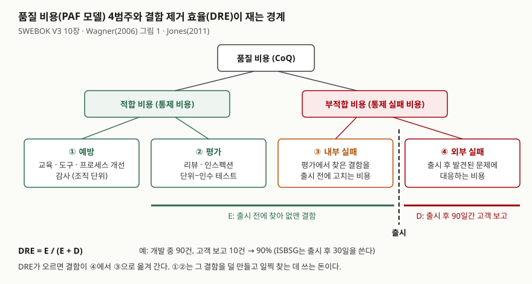

> 정의와 분류는 SWEBOK V3.0 10장, Wagner(ISSTA 2006), Capers Jones(2011) 근거로 정리했다.
> DRE 계산은 Jones의 표를 파이썬으로 다시 계산해 검산했다([`code/output.txt`](code/output.txt)).
> 비율의 "적정 수준"은 1차 자료에서 찾지 못해 쓰지 않았다.

## 들어가며

품질 비용은 품질 관리·테스트·프로세스 개선 문항의 배경으로 나오고, 단독으로 나오면 "4범주를 쓰고 품질 향상
방안과 연결하라"는 형태다. 범주 이름만 나열하면 점수가 나지 않는다. 채점 포인트는 **적합 비용과 부적합 비용이
서로 맞바뀐다**는 관계를 쓰는지, 그리고 그 관계를 **DRE 같은 결함 지표**로 측정하는 방법을 쓰는지다.
실무에서는 "테스트를 늘렸는데 왜 장애가 안 줄지"라는 질문으로 나타난다. 그 답이 대개 이 두 지표 사이에 있다.

## 정의

**소프트웨어 품질 비용**(Cost of Software Quality, CoSQ): 소프트웨어 개발·유지보수 프로세스를 경제적으로
평가해 얻는 측정값의 묶음이다. 품질이 나빠서 생기는 일을 처리하는 활동의 비용으로부터 제품의 품질 수준을
추정할 수 있다는 것이 전제다(SWEBOK V3.0, 10장 1.2절).

**결함 제거 효율**(Defect Removal Efficiency, DRE): 소프트웨어를 출시하기 전에 찾아 고친 결함의 비율이다.
개발 중 찾은 결함을 기록해 두고, 출시 후 **90일** 동안 고객이 보고한 결함을 더해 내부 제거 비율을 계산한다
(Capers Jones, 2011).

```text
DRE = E / (E + D)
  E: 출시 전에 찾아 없앤 결함 수
  D: 출시 후 90일 동안 고객이 보고한 결함 수
```

## 등장 배경

품질 비용 모델은 제조업에서 먼저 나왔고, 소프트웨어용 모델은 그것을 옮긴 것이다. Wagner(2006)는 Juran의
품질 핸드북 등을 제조 쪽 근거로 들고, Knox(1993)·Krasner(1998)·Slaughter 외(1998)를 소프트웨어용 모델로 든다.
옮겨 온 이유는 품질 활동의 비용을 **돈이라는 한 단위**로 맞춰야 테스트·리뷰·교육 중 어디에 쓸지를 비교할 수
있기 때문이다. SWEBOK도 CoSQ를 비용·일정·가치 사이의 맞바꿈을 판단하는 근거로 쓰라고 적는다.

DRE는 1970년대 IBM이 요구사항·설계·코드·사용자 문서·잘못된 수정의 결함을 따로 측정하던 작업에서 나왔다
(Jones는 당시 IBM에 있었다). Jones는 DRE를 소프트웨어 품질의 가장 중요한 단일 지표로 꼽고, 측정하기도
비교적 쉽다는 점을 이유로 든다. 결함 예방도 중요하지만 결과를 숫자로 확인하기 쉬운 쪽이 제거라는 것이다.

## 구성요소 — 2분류 4범주

품질 비용은 **2분류, 4범주**다.

| 분류 | 범주 | 무엇에 드는 비용인가 | 예 |
|---|---|---|---|
| 적합 비용 | ① 예방 | 결함이 들어가지 않게 하는 비용. 대개 조직 단위로 든다 | 프로세스 개선, 품질 기반, 도구, 교육, 감사, 경영 검토 |
| (통제 비용) | ② 평가 | 결함을 찾는 프로젝트 활동의 비용 | 설계·동료 리뷰, 단위·통합·시스템·인수 테스트 |
| 부적합 비용 | ③ 내부 실패 | 평가에서 찾은 결함을 **출시 전에** 고치는 비용 | 수정, 재테스트, 재검토 |
| (통제 실패 비용) | ④ 외부 실패 | **출시 후** 발견된 문제에 대응하는 비용 | 장애 대응, 긴급 패치, 보상 |

예방·평가·실패의 머리글자를 따서 **PAF 모델**이라고도 부른다. Wagner(2006)는 외부 실패에 수정 비용 말고도
보상 같은 **영향 비용**이 따로 붙는다고 구분한다. 같은 결함이라도 출시 뒤에 찾으면 고치는 비용에 영향 비용이 더해진다.

DRE는 이 4범주 중 ③과 ④의 **경계**를 결함 개수로 잰다. ③에서 고친 결함이 E, ④로 넘어간 결함이 D다.

## 도식



> **출처**: 4범주의 내용은 [SWEBOK V3.0 Chapter 10 Software Quality §1.2 Value and Costs of Quality](https://swebokwiki.org/Chapter_10:_Software_Quality#Value_and_Costs_of_Quality),
> 적합·부적합 2분류와 통제 비용이라는 별칭은 [Wagner, ISSTA 2006 §2 Software Quality Costs, Figure 1](https://arxiv.org/abs/1612.03785),
> DRE 식과 90일·30일 기간은 [Capers Jones, Software Defect Removal Efficiency (2011) "Measuring Defect Removal Efficiency"](https://www.ppi-int.com/wp-content/uploads/2021/01/Software-Defect-Removal-Efficiency.pdf)를 따랐다.

## 계산으로 보는 DRE — Jones 표 검산

Jones(2011)는 1만 3천여 프로젝트의 미국 평균 근사치로 결함을 다섯 출처로 나눠 **결함 잠재량**(기능 점수당 결함 수)과
출처별 DRE를 표로 냈다. 표의 합계(잠재량 5.00, DRE 85%, 전달 결함 0.75)가 출처별 값에서 나오는지 다시 계산했다.
전체 소스는 [`code/dre_check.py`](code/dre_check.py)다.

```text
2. 출처별 전달 결함 = 잠재량 x (1 - 출처별 DRE)
   출처          잠재량   DRE      제거      전달
   요구사항       1.00   77%  0.7700  0.2300
   설계         1.25   85%  1.0625  0.1875
   코딩         1.75   95%  1.6625  0.0875
   문서         0.60   80%  0.4800  0.1200
   잘못된 수정     0.40   70%  0.2800  0.1200
   합계         5.00 85.1%  4.2550  0.7450

4. 전달 결함은 어디서 오는가 (전달 결함 합계 대비)
   요구사항      30.9%
   설계        25.2%
   잘못된 수정    16.1%
   문서        16.1%
   코딩        11.7%
   코딩 외    88.3%
```

합계는 85.1%로 표의 85%와 맞는다. 눈여겨볼 것은 4번이다. **코딩은 잠재량이 가장 많은데(1.75) 출시 후 남는 결함
비중은 가장 작다(11.7%).** 코딩 결함의 DRE가 95%로 가장 높기 때문이다. 남는 결함의 88%는 코딩 밖에서 온다.

```text
5. 코딩 결함 DRE 만 95% -> 99% 로 올리면
   전달 0.6750 / 전체 DRE 86.50%
6. 요구사항 결함 DRE 만 77% -> 95% 로 올리면
   전달 0.5650 / 전체 DRE 88.70%
```

코딩 쪽을 거의 완벽하게 올려도 전체 DRE는 1.4%p 오르고, 요구사항 쪽을 코딩 수준으로 올리면 3.6%p 오른다.
테스트를 늘려도 장애가 줄지 않는 이유 하나가 여기서 보인다. 테스트는 주로 코드를 실행해 결함을 찾는데,
남은 결함 대부분은 요구사항·설계·문서에 있다. Jones도 대부분의 테스트 형태는 결함 발견 효율이 50%에
못 미치고, 정형 설계·코드 인스펙션은 65%를 넘는다고 적는다. 95%를 넘기려면 인스펙션·정적 분석·테스트를
함께 써야 한다는 것이 그의 결론이다.

## 비교

| 구분 | 품질 비용(CoSQ) | 결함 제거 효율(DRE) |
|---|---|---|
| 단위 | 돈(또는 공수) | 비율(결함 개수) |
| 재는 것 | 품질 활동 전체에 든 비용과 그 구성비 | 출시 전에 걸러낸 결함의 비율 |
| 측정 시점 | 프로젝트·조직 단위로 기간 집계 | 출시 후 일정 기간(90일)이 지나야 확정 |
| 답하는 질문 | 품질에 쓴 돈이 예방·평가·실패 중 어디로 갔는가 | 결함이 고객에게 얼마나 새어 나갔는가 |
| 약점 | 범주 분류가 조직마다 달라 비교가 어렵다 | 기간 정의(90일·30일)와 결함 판정 기준에 따라 값이 바뀐다 |

DRE 기간도 출처마다 다르다. Jones는 90일을 쓰고 ISBSG는 출시 후 30일을 쓴다. 기간이 짧으면 D가 작게 잡히므로
같은 제품의 DRE가 ISBSG 방식에서 더 높게 나온다. 두 값을 비교할 때는 기간부터 맞춘다.

## 적용 시 고려사항

1. **범주 분류 기준을 먼저 정한다.** 코드 리뷰 시간은 평가 비용이고, 리뷰에서 찾은 결함을 고치는 시간은 내부
   실패 비용이다. 같은 회의에서 둘이 섞이므로 기록 단위를 미리 나눠 두지 않으면 구성비가 의미를 잃는다.
2. **DRE의 결함 판정 기준을 고정한다.** Jones는 잘못된 수정으로 생긴 결함, 출시 후 내부에서 찾은 결함, 이전
   릴리스에서 넘어온 결함, 결함이 아닌 보고가 DRE 측정을 까다롭게 만든다고 적는다. 이것들을 E와 D 중 어디에
   넣을지 정하지 않으면 릴리스마다 값이 흔들린다.
3. **평가 비용을 어느 단계에 쓰는지 본다.** 검산에서 보듯 남는 결함은 코딩 밖에 몰려 있다. 평가 비용 전부가
   테스트에 들어가 있으면 요구사항·설계 결함은 그대로 외부 실패로 넘어간다. 요구사항·설계 인스펙션에 평가 비용을
   나눠 쓰는 것이 같은 돈으로 DRE를 더 올리는 방법이다.
4. **비율의 기준선은 출처를 확인한 것만 쓴다.** "예방 비용이 몇 %면 성숙한 조직" 같은 수치는 이 글이 확인한
   1차 자료에 없다. 조직 안에서 릴리스마다 구성비와 DRE가 어느 쪽으로 움직이는지를 보는 것이 쓸 수 있는 해석이다.

## 정리

- **CoSQ = 2분류 4범주**: 적합(①예방 ②평가) + 부적합(③내부 실패 ④외부 실패). 머리글자로 **PAF**.
- **DRE = E / (E + D)**, D는 출시 후 **90일**(Jones). ISBSG는 30일이라 값이 더 높게 나온다.
- 두 지표는 **출시 경계**에서 만난다. DRE가 오르면 결함이 ④에서 ③으로 옮겨 간다.
- Jones 표 검산: 전체 DRE 85%, 남는 결함의 **88%가 코딩 밖**. 테스트만으로는 95%를 넘기 어렵다.

## 참고 자료

- [SWEBOK V3.0 — Chapter 10: Software Quality, §1.2 Value and Costs of Quality](https://swebokwiki.org/Chapter_10:_Software_Quality#Value_and_Costs_of_Quality) — CoSQ 정의와 4범주 (IEEE Computer Society, 2014)
- [Stefan Wagner, "A model and sensitivity analysis of the quality economics of defect-detection techniques", ISSTA 2006](https://arxiv.org/abs/1612.03785) — §2 적합·부적합 비용, PAF 모델, 영향 비용
- [Capers Jones, "Software Defect Removal Efficiency" (2011)](https://www.ppi-int.com/wp-content/uploads/2021/01/Software-Defect-Removal-Efficiency.pdf) — DRE 정의, 90일 기간, 출처별 표, ISBSG 30일
- H. Krasner, "Using the Cost of Quality Approach for Software", *CrossTalk* 11(11):6–11, 1998 — 원문은 열람하지 못했고 Wagner(2006)의 인용으로만 확인했다
