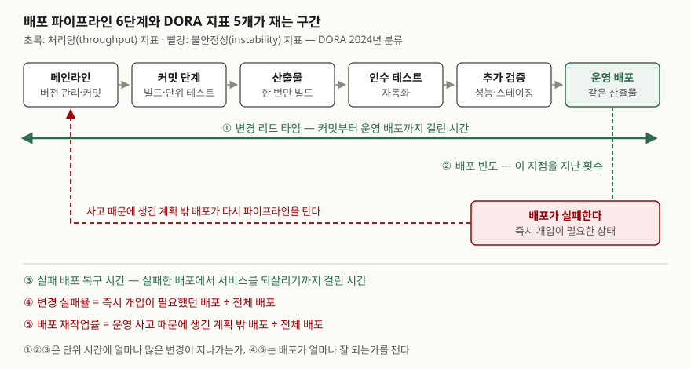

> 실행 검증 없음. DORA 공식 가이드와 지표 변천 기고, Martin Fowler의 CI·CD 문서, Jez Humble의
> continuousdelivery.com 근거로 정리했다. 지표의 업계 기준값(엘리트·하위 등급 수치)은 해마다 바뀌므로 싣지 않았다.

## 들어가며

DevOps를 도입했는지 물으면 대부분 "CI/CD 도구를 깔았다"고 답한다. 도구가 있다는 것과 변경이 빠르고 안전하게
운영에 닿는다는 것은 다른 이야기라서, 그 차이를 재는 수단이 DORA 지표다. 시험에서는 파이프라인 구성요소와 지표를
함께 묻는 경우가 많은데, 지표 이름만 나열하면 점수가 나지 않는다. **각 지표가 파이프라인의 어느 구간을 재는지**를
그려야 두 문항이 하나의 답으로 이어진다. 또 지표는 2023~2024년에 이름과 개수가 바뀌어서, 옛 "4대 지표"만 쓰면 최신 자료와 어긋난다.

## 정의

- **배포 파이프라인(deployment pipeline)** — 빌드를 여러 단계로 나누고, **단계를 지날 때마다 이 변경을 운영에 내보내도 된다는
  확신이 커지도록** 구성한 자동화 경로다(Fowler, 2013). 뒤 단계일수록 확신은 커지고 시간은 더 든다.
- **지속적 통합(CI)** — 팀원 각자가 자기 변경을 **적어도 하루에 한 번** 공동 코드베이스에 합치는 개발 실천이다(Fowler, 2024).
- **지속적 인도(CD)** — 기능·설정 변경·버그 수정·실험 등 모든 종류의 변경을 **안전하고 빠르게, 지속 가능한 방식으로**
  운영 또는 사용자에게 보낼 수 있는 능력이다(Humble). Fowler는 "언제든 운영에 내보낼 수 있는 상태로 만드는 규율"로 정의한다.
- **DORA 소프트웨어 인도 지표** — DORA(DevOps Research and Assessment)가 팀이 소프트웨어를 **안전하고 빠르고 효율적으로**
  인도하는 능력을 재려고 정한 지표다. 현행 5개이고 **처리량 3개 · 불안정성 2개**로 나뉜다.

## 등장 배경

DORA 지표 변천 기고(2026-01-02)를 따라 정리하면 다음과 같다.

| 시기 | 변화 |
|---|---|
| 2014 | 배포 빈도 · 변경 리드 타임 · 평균 복구 시간(MTTR) · 변경 실패율 4개를 정의했으나, 통계 분석에서 변경 실패율이 나머지와 하나의 구성 개념으로 묶이지 않아 **3개**로 출발 |
| 2015~2018 | 변경 실패율이 합류해 **4대 지표(four keys)**로 정착. 이후 운영 측정치로 가용성을 더해 "인도·운영 성과"로 확장 |
| 2021 | 가용성을 **신뢰성**으로 바꿈(지연·성능·확장성 포함) |
| 2023 | MTTR을 **실패 배포 복구 시간**으로 바꿈. 이전 정의는 변경 때문에 생긴 장애와 데이터센터 정전 같은 외부 요인을 구분하지 못했다 |
| 2024 | **배포 재작업률**을 추가하고 처리량·불안정성 두 묶음으로 재편 |

신뢰성은 현재 소프트웨어 **인도** 지표 5개에 들지 않는다. 같은 기고는 신뢰성을 인도 성과보다 운영 성과의 척도로 본다.

## 구성요소

### 배포 파이프라인 — 6단계

Humble의 배포 파이프라인 패턴과 Fowler의 CI 실천을 합쳐 6단계로 나눈다. 단계 이름과 개수는 자료마다 다르므로,
답안에서는 **"커밋 단계 → 인수 단계 → 운영"이라는 뼈대와 산출물 한 번 빌드 원칙**을 빠뜨리지 않는 것이 중요하다.

1. **메인라인** — 모든 것을 버전 관리되는 메인라인에 두고, 매일 커밋한다(Fowler CI 실천 1·4)
2. **커밋 단계** — 배포 가능한 패키지를 만들고 단위 테스트·정적 분석을 돌린다. **몇 분 안에** 끝나도록 최적화한다. 실패하면 누구도 그 위에 새 작업을 올리지 않고 즉시 고친다(Humble)
3. **산출물** — 패키지는 **한 번만** 빌드한다. 운영에 내보내는 것이 파이프라인 내내 테스트한 바로 그것이어야 배포 실패 때 패키지를 원인에서 뺄 수 있다(Humble)
4. **자동 인수 테스트** — 더 포괄적인 자동 테스트를 돌린다(Humble)
5. **추가 검증(선택)** — 탐색적 테스트, 성능 테스트, 스테이징(Humble)
6. **운영 배포** — 배포도 자동화한다(Fowler CI 실천 11)

CD 원칙은 **5가지**다(continuousdelivery.com). 품질을 내재화 · 작은 단위로 작업 · 반복 작업은 컴퓨터가, 문제 해결은 사람이 ·
끊임없는 개선 · 모두가 책임진다. Fowler의 CI 문서(2024년판)는 실천 **11가지**를 든다.

### DORA 지표 — 5개 (처리량 3 · 불안정성 2)

| 묶음 | 지표 | DORA 정의 |
|---|---|---|
| 처리량 | ① 변경 리드 타임 | 변경이 버전 관리에 커밋된 때부터 운영에 배포될 때까지 걸린 시간 |
| 처리량 | ② 배포 빈도 | 일정 기간의 배포 횟수, 또는 배포 사이의 시간 |
| 처리량 | ③ 실패 배포 복구 시간 | 즉시 개입이 필요한 실패 배포에서 회복하기까지 걸린 시간 |
| 불안정성 | ④ 변경 실패율 | 배포 직후 즉시 개입이 필요했던 배포의 비율 |
| 불안정성 | ⑤ 배포 재작업률 | 운영 사고 때문에 생긴, 계획에 없던 배포의 비율 |

DORA는 처리량을 **일정 기간에 시스템을 통과하는 변경의 양**, 불안정성을 **배포가 얼마나 잘 되는가**로 정의한다.

## 도식

> **출처**: 파이프라인 단계는 [J. Humble, continuousdelivery.com — Patterns](https://continuousdelivery.com/implementing/patterns/)의 커밋 단계·인수 단계·산출물 한 번 빌드 원칙과
> [M. Fowler, Continuous Integration (2024-01-18)](https://martinfowler.com/articles/continuousIntegration.html)의 메인라인·배포 자동화 실천을 합쳐 그렸다.
> 지표의 구간과 색 구분은 [DORA — DORA's software delivery metrics: Throughput and instability](https://dora.dev/guides/dora-metrics-four-keys/)의 정의와 2024년 분류를 따랐다.

답안지에는 위쪽 6칸과 리드 타임 화살표, 실패 상자와 되돌아가는 점선만 옮기면 된다. 지표 다섯을 번호로 붙이면 5분 안에 그린다.

## 비교

### 지표가 무엇을 대신 보여 주는가

DORA 가이드는 이 지표들을 조직 성과의 **선행 지표**이자 개발·인도 **실천의 후행 지표**로 본다. 실천을 바꾸면 지표가 따라 움직인다는 뜻이다.
아래 오른쪽 칸은 정의가 재는 구간에서 끌어낸 것이고, 근거를 괄호에 적었다.

| 지표 | 직접 재는 것 | 대신 보여 주는 것 |
|---|---|---|
| 변경 리드 타임 | 커밋 → 운영 배포 시간 | 파이프라인 6단계의 처리·대기 시간 합 (정의의 구간) |
| 배포 빈도 | 운영 배포 지점의 통과 횟수 | 한 번에 내보내는 변경의 크기 (CD 원칙 "작은 단위로 작업") |
| 실패 배포 복구 시간 | 실패 배포 → 회복 시간 | 실패를 되돌리거나 고쳐 내보내는 능력 (2023년 재정의 사유) |
| 변경 실패율 | 즉시 개입이 필요한 배포 비율 | 운영 전 검증 단계가 실패를 걸러 낸 정도 (정의) |
| 배포 재작업률 | 사고로 생긴 계획 밖 배포 비율 | 버그 수정에 쓰이는 계획 밖 작업의 비중 (DORA 변천 기고) |

### 4대 지표(2015~)와 현행 5지표(2024~)

| 구분 | 4대 지표 | 현행 5지표 |
|---|---|---|
| 개수 | 4 | 5 (처리량 3 · 불안정성 2) |
| 복구 지표 | 평균 복구 시간(MTTR) — 모든 장애 | 실패 배포 복구 시간 — **배포로 생긴** 장애만 |
| 새 지표 | — | 배포 재작업률 |
| 묶는 방식 | 처리량 2 · 안정성 2 | 복구 시간이 **처리량** 쪽으로 이동 |

복구 시간을 처리량으로 옮긴 이유를 DORA 문서는 따로 설명하지 않는다. 처리량 정의("일정 기간에 통과하는 변경의 양")에
비춰 보면, 실패에서 회복하는 동안 다음 변경이 운영에 닿지 못한다는 점에서 처리량을 깎는 시간으로 읽을 수 있다. 이 해석은 글쓴이의 것이다.

### CI · 지속적 인도 · 지속적 배포

| 구분 | CI | 지속적 인도 | 지속적 배포 |
|---|---|---|---|
| 끝나는 지점 | 메인라인에 합쳐 빌드·테스트 | 언제든 운영에 내보낼 수 있는 상태 | 모든 변경이 자동으로 운영에 나감 |
| 운영 반영 결정 | 해당 없음 | 사람이 정한다 (사업상 이유로 늦출 수 있다) | 자동 |
| 관계 | 앞 단계 | CI가 전제 | 지속적 인도가 전제 (Fowler) |

## 적용 시 고려사항

DORA 가이드의 "흔한 함정" 절을 기준으로 정리하면 **5가지**다.

1. **지표를 목표로 삼지 않는다.** 숫자 자체가 목표가 되면 굿하트의 법칙대로 지표가 개선 수단이 아니라 맞춰야 할 값이 된다.
   배포 빈도를 올리라고 하면 의미 없는 작은 배포를 쪼개 늘리는 식이다.
2. **애플리케이션·서비스 단위로 잰다.** 조직 전체를 한 숫자로 묶으면 서로 다른 시스템의 값이 섞여 무엇을 고쳐야 하는지 보이지 않는다.
3. **서로 다른 앱·팀끼리 비교하지 않는다.** 배포 대상과 위험이 다르면 같은 수치도 뜻이 다르다.
4. **다섯 지표를 한 팀이 함께 본다.** 개발은 처리량, 운영은 불안정성만 맡으면 속도와 안정성 중 한쪽만 재게 된다.
   DORA는 반복 연구에서 **속도와 안정성이 상충 관계가 아니라는** 결과를 핵심 통찰로 든다.
5. **측정 정밀도보다 개선을 우선한다.** 다만 정의의 낱말은 조직이 먼저 정해야 한다. 무엇을 "배포"로 세는지,
   어떤 상황이 "즉시 개입"인지가 정해지지 않으면 같은 팀의 수치도 달마다 기준이 바뀐다.

## 정리

암기 단서는 **"파이프라인 6 · CD 원칙 5 · DORA 5 = 처리량 3 + 불안정성 2"**다.

- 배포 파이프라인은 단계를 지날수록 확신이 커지는 자동화 경로다. **커밋 단계는 몇 분, 산출물은 한 번만 빌드**
- DORA 지표는 2014년 3개 → 2015년 4대 지표 → 2023년 MTTR을 실패 배포 복구 시간으로 → 2024년 재작업률 추가로 **5개**
- 처리량 3: 변경 리드 타임 · 배포 빈도 · 실패 배포 복구 시간 / 불안정성 2: 변경 실패율 · 배포 재작업률
- 리드 타임은 파이프라인 전 구간, 배포 빈도는 마지막 지점, 불안정성 두 지표는 배포 뒤를 잰다
- 지표는 목표가 아니다. 서비스 단위로, 다섯을 함께 본다

> 개념 연결: [애자일과 DevOps — 무엇이 같고 무엇이 다른가](../2026-09-22-agile-and-devops-scope/index.md) — DevOps 표준 정의와 원칙 4가지

## 참고 자료

- [DORA — DORA's software delivery metrics (2026-01-05 갱신)](https://dora.dev/guides/dora-metrics-four-keys/) — 지표 5개의 정의, 처리량·불안정성 구분, 흔한 함정
- [N. Harvey, A history of DORA's software delivery metrics (DORA, 2026-01-02)](https://dora.dev/insights/dora-metrics-history/) — 2014년 3개에서 2024년 5개까지의 변천과 각 변경 사유
- [M. Fowler, Continuous Integration (2024-01-18 갱신)](https://martinfowler.com/articles/continuousIntegration.html) — CI 정의와 실천 11가지
- [M. Fowler, DeploymentPipeline (2013-05-30)](https://martinfowler.com/bliki/DeploymentPipeline.html) — 단계마다 확신이 커지는 구조
- [M. Fowler, ContinuousDelivery (2013-05-30)](https://martinfowler.com/bliki/ContinuousDelivery.html) — 지속적 인도와 지속적 배포의 구분
- [J. Humble, continuousdelivery.com](https://continuousdelivery.com/) — 지속적 인도 정의
- [J. Humble, continuousdelivery.com — Principles](https://continuousdelivery.com/principles/) — CD 원칙 5가지
- [J. Humble, continuousdelivery.com — Patterns](https://continuousdelivery.com/implementing/patterns/) — 커밋 단계, 산출물 한 번 빌드, 실패 시 즉시 수정
