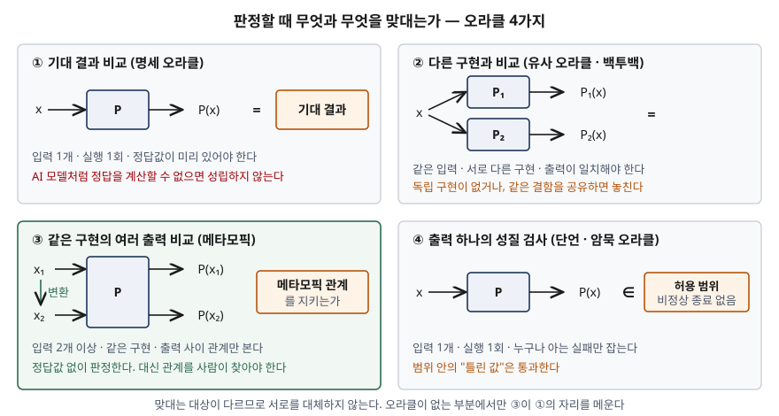

> 실행 검증 없음. ISO/IEC/IEEE 29119-4:2021 용어 정의, 테스트 오라클 서베이 논문(Barr 등),
> 메타모픽 테스트 원 보고서와 리뷰 논문(Chen 등), ISTQB CT-AI 실러버스 근거만으로 정리했다.

## 들어가며

테스트는 실행보다 **판정**에서 막히는 경우가 많다. 결과가 맞는지 알려면 정답을 알아야 하는데,
기계학습 모델·검색 엔진·수치 시뮬레이션처럼 정답을 계산할 수 없어서 프로그램을 만든 경우가
있다. 이 판정의 어려움이 테스트 오라클 문제이고, 메타모픽 테스트는 이것을 덜어 주는 대표
기법이라 AI 품질·테스트 기법 문항에서 함께 나온다. 점수는 정의보다 **"무엇과 무엇을 맞대어
판정하는가"**로 다른 기법과 가르는 데서 난다.

## 정의

**테스트 오라클 문제**: 주어진 입력에 대해 올바른 동작과 잘못된 동작을 가려내기 어려워
테스트의 통과·실패를 판정하지 못하는 문제다(Barr 등 2015). 테스트 오라클은 그 판정의 근거를 말한다.

**메타모픽 테스트**: 테스트 대상이 **두 개 이상의 입력과 그 출력들 사이에서 반드시 지켜야 하는
관계(메타모픽 관계)**를 이용해 기존 케이스에서 후속 케이스를 만들고, 출력들이 그 관계를
지키는지로 결함을 판정하는 명세 기반 테스트 설계 기법이다.

| 용어 | ISO/IEC/IEEE 29119-4:2021 | Chen 등 (2018) |
|---|---|---|
| 메타모픽 관계 (MR) | 테스트 입력의 변화가 기대 출력에 어떻게 영향을 주는지를 요구 동작에 근거해 기술한 것 (3.34) | 대상 알고리즘 f가 두 개 이상의 입력과 그 출력들에 대해 반드시 지켜야 하는 성질 (Definition 1) |
| 메타모픽 테스트 | 기존 테스트 케이스와 MR을 바탕으로 테스트 케이스를 생성하는 명세 기반 테스트 설계 기법 (3.35) | MR의 f를 구현 P로 바꿔 원천·후속 케이스의 실행 결과를 검사하는 절차 (Definition 4) |

두 정의는 강조점이 다르다. 표준은 **케이스를 만드는 설계 기법**으로, Chen 등은 **결과를 검사하는
오라클**로 본다. 메타모픽 테스트는 둘 다 한다는 것이 핵심이다.

## 등장 배경

Weyuker(1982)는 오라클이 아예 없거나, 이론상 있어도 출력의 정확성을 확인하기가 현실적으로
너무 어려운 프로그램을 **"테스트할 수 없는 프로그램"**으로 불렀다. 정답을 모르니까 계산하려고
만든 프로그램이 대표적이다. 첫 대안은 Davis와 Weyuker의 **유사 오라클**(pseudo-oracle)이었다.
독립적으로 만든 다른 구현을 같은 입력으로 돌려 결과를 맞대는 방식인데, 독립 구현을 하나 더
만드는 비용이 크고 두 구현이 같은 실수를 하면 일치해 버린다.

Chen 등(1998)은 다른 쪽에서 출발했다. 결함을 드러내지 못한 "성공한" 케이스도 대상에 대한
정보를 담고 있으니, 그 케이스를 변환해 **다음 케이스를 만들자**는 것이다. 이때 원래 출력과
새 출력 사이의 관계만 알면 둘 다의 정답을 몰라도 판정이 된다. 구현을 하나 더 만들 필요가
없고, 관계 하나가 케이스 생성과 판정을 함께 맡는다.

## 구성요소 / 절차

### 구성요소 — 4가지

| 구성요소 | 내용 | 최단 경로 예 (Chen 등 2018) |
|---|---|---|
| ① 메타모픽 관계 | 입력 사이 관계와 출력 사이 관계를 묶은 필요 성질 | 시작·끝을 바꿔도 최단 경로의 길이는 같다 |
| ② 원천 테스트 케이스 | 먼저 실행하는 케이스. 정답을 몰라도 된다 | (G, a, b) |
| ③ 후속 테스트 케이스 | MR에 따라 원천 입력(필요하면 출력까지)을 변환한 케이스 | (G, b, a) |
| ④ 메타모픽 그룹 | 하나의 MR로 엮인 원천·후속 입력의 묶음. 판정 단위 | 〈(G, a, b), (G, b, a)〉 |

### 수행 절차 — 5단계

① MR 식별 → ② 원천 케이스 생성·실행 → ③ 후속 케이스 생성 → ④ 후속 케이스 실행 →
⑤ 출력이 MR을 지키는지 검사. 위반이면 결함이다. Chen 등의 정의는 ②~⑤를 다루고 MR 식별을
전제로 두지만, 실무에서 품이 가장 많이 드는 단계가 ①이라 따로 세운다.

### 오라클 문제의 해법 — 4분류

Barr 등은 해법을 **4가지**로 나눈다. ① 명세 오라클(형식 명세·계약), ② 유도 오라클(다른 산출물이나
실행에서 이끌어 냄), ③ 암묵 오라클(비정상 종료처럼 누구나 아는 실패), ④ 자동 오라클 없음(사람의
판정 부담을 줄이는 쪽). 유도 오라클 안에는 유사 오라클·N-버전, 메타모픽 관계, 회귀 테스트,
명세 추론, 문서에서 추출이 들어간다.

MR의 자리가 흥미롭다. MR은 대상이 구현하려는 정답 f의 성질이므로 명세 오라클로 볼 수도 있다.
그런데도 Barr 등은 유도 오라클에 넣었는데, **실제로는 MR을 구현을 들여다보며 사람이 추론해
내기 때문**이라고 이유를 적는다.

## 도식

> **출처**: [Barr et al., The Oracle Problem in Software Testing: A Survey §4–7, §5.1 Pseudo-Oracles, §5.2 Metamorphic Relations](https://doi.org/10.1109/TSE.2014.2372785) · [Chen et al., Metamorphic Testing: A Review of Challenges and Opportunities §2.2 Definition 1–4](https://doi.org/10.1145/3143561)

답안지에는 네 칸에 화살표를 그리고 **오른쪽에서 맞대는 대상**만 바꿔 적으면 된다. 기대값,
다른 구현의 출력, 같은 구현의 다른 출력, 허용 범위. 이 네 단어가 비교표의 첫 행이 된다.

## 비교

| 구분 | 기대 결과 비교 | 백투백 (유사 오라클) | 메타모픽 테스트 | 단언 · 암묵 오라클 | A/B 테스트 |
|---|---|---|---|---|---|
| 맞대는 대상 | 미리 정한 정답값 | 같은 입력에 대한 **다른 구현**의 출력 | **다른 입력**에 대한 **같은 구현**의 출력 | 출력 하나의 성질 | 두 변형의 통계적 지표 |
| 입력 수 / 실행 수 | 1 / 1 | 1 / 2 이상 | 2 이상 / 2 이상 | 1 / 1 | 운영 입력 다수 |
| Barr 분류 | 명세 | 유도 | 유도 | 암묵(단언은 명세) | — |
| 추가로 필요한 것 | 정답 계산 | 독립 구현 | MR | 범위·불변식 | 운영 트래픽 |
| 놓치는 결함 | — | 두 구현이 공유하는 결함 | 원천·후속 출력이 함께 틀려 관계가 유지되는 결함 | 범위 안의 틀린 값 | 개별 입력의 오류 |

Barr 등은 형식으로도 둘을 가른다. 유사 오라클은 **서로 다른 두 구현에 같은 값**을 넣어 출력이
같기를 요구하고, MR은 **하나의 구현을 두 번 이상** 자극해 응답들 사이의 제약을 건다.
그래서 −1 ≤ sin(x) ≤ 1처럼 입력 하나에 대한 성질은 MR이 아니라 단언이다.

ISTQB CT-AI 실러버스는 AI 시스템의 오라클 문제를 덜어 주는 기법으로 메타모픽 테스트, 백투백
테스트, A/B 테스트를 함께 든다. 셋은 대체재가 아니라 **판정 근거가 무엇이냐**로 고르는 선택지다.

## 적용 시 고려사항

- **통과가 정확성을 보장하지 않는다.** 원천 출력과 후속 출력이 똑같이 틀려 있으면 관계는
  지켜진다. CT-AI 실러버스도 메타모픽 테스트의 기대 결과가 절대값이 아니라 상대적이라 확정적인
  결과를 내는 데는 맞지 않는다고 적는다. 정답값을 알 수 있는 부분은 전통적 테스트로 맡긴다.
- **위반이 나도 어느 케이스가 틀렸는지 모른다.** Chen 등은 오라클이 없으면 그룹 안 어느 케이스가
  잘못됐는지 가릴 수 없고, 이것이 기법의 본래 성질이라고 적는다. 위반 그룹의 입력·출력을 함께
  저장해 결함 분석의 출발점으로 삼아야 한다.
- **성격이 다른 MR을 여러 개 쓴다.** Liu 등(IEEE TSE 2014)은 서로 다른 MR 3~6개로 오라클 기반
  테스트가 찾는 결함의 90% 이상을 찾았다고 보고한다. 같은 성질을 표현만 바꾼 MR은 효과가 적다.
- **비결정적 대상에는 등식 대신 허용 범위를 둔다.** Barr 등은 실행마다 출력이 흔들리는 분류기에
  출력 동일성만으로 MR을 정의하면 대개 부족하다고 적고, 집합 교집합 같은 관계를 쓴 연구를 든다.
  "얼마나 달라지면 위반인가"를 미리 정하지 않으면 정상 동작이 위반으로 잡힌다.
- **MR을 요구사항 산출물로 남긴다.** MR은 결국 "이 시스템이 반드시 지켜야 할 성질"이다. 요구
  단계에서 불변 성질을 목록으로 남기면 테스트 설계로 바로 이어지고, 모델을 다시 학습할 때마다
  같은 묶음을 회귀 테스트로 돌릴 수 있다.

## 정리

- **오라클 문제**: 정답을 몰라 판정을 못 한다. Weyuker의 "테스트할 수 없는 프로그램"이 출발점.
- **해법 4분류**: 명세 · 유도 · 암묵 · 없음(사람). **메타모픽은 유도** — 성질은 정답의 것이지만
  사람이 구현을 보고 추론하기 때문.
- **MT 구성 4**: MR · 원천 · 후속 · 메타모픽 그룹. **절차 5**: 식별 → 원천 실행 → 후속 생성 →
  후속 실행 → 관계 검사.
- **맞대는 대상**으로 가른다: 기대값(전통) / 다른 구현(백투백) / **같은 구현의 다른 입력(MT)** /
  출력 하나의 성질(단언).
- **한계 2**: 만족 ≠ 정확, 위반 시 결함 위치 모름.

> 기출 답안: [기출문제 — AI 시스템 신뢰성과 메타모픽 테스트 (테스트 오라클 문제, 메타모픽 관계, 전통적 테스트와의 차이)](../../exam/2026-10-03-metamorphic-testing-ai-systems/index.md)

## 참고 자료

- [ISO/IEC/IEEE 29119-4:2021, Software and systems engineering — Software testing — Part 4: Test techniques](https://www.iso.org/standard/79430.html) — 3.32 expected result, 3.34 metamorphic relation, 3.35 metamorphic testing, 5.2.11 Metamorphic testing ([iTeh 미리보기](https://cdn.standards.iteh.ai/samples/79430/6c93dfe4a05b46a8895e04dfd74ddd24/ISO-IEC-IEEE-29119-4-2021.pdf))
- [E. T. Barr, M. Harman, P. McMinn, M. Shahbaz, S. Yoo, The Oracle Problem in Software Testing: A Survey, IEEE TSE 41(5) (2015-05)](https://doi.org/10.1109/TSE.2014.2372785) — §1 4분류, §5 Derived Test Oracles, §5.1 Pseudo-Oracles, §5.2 Metamorphic Relations ([저자 공개본](https://coinse.github.io/publications/pdfs/Barr2015qd.pdf))
- [E. J. Weyuker, On Testing Non-Testable Programs, The Computer Journal 25(4) (1982-11)](https://doi.org/10.1093/comjnl/25.4.465)
- [T. Y. Chen, S. C. Cheung, S. M. Yiu, Metamorphic Testing: A New Approach for Generating Next Test Cases, Technical Report HKUST-CS98-01 (1998)](https://arxiv.org/abs/2002.12543)
- [T. Y. Chen et al., Metamorphic Testing: A Review of Challenges and Opportunities, ACM Computing Surveys 51(1), Article 4 (2018-01)](https://doi.org/10.1145/3143561) — §2.2 Definition 1–4, §6 결함 위치
- [H. Liu, F.-C. Kuo, D. Towey, T. Y. Chen, How Effectively Does Metamorphic Testing Alleviate the Oracle Problem?, IEEE TSE 40(1) (2014)](https://doi.org/10.1109/TSE.2013.46)
- [ISTQB, Certified Tester AI Testing (CT-AI) Syllabus v1.0 (2021-10-01)](https://istqb.org/wp-content/uploads/2024/11/ISTQB_CT-AI_Syllabus_v1.0_mghocmT.pdf) — §8.7 Test Oracles for AI-Based Systems, §9.3~9.5, §9.7
