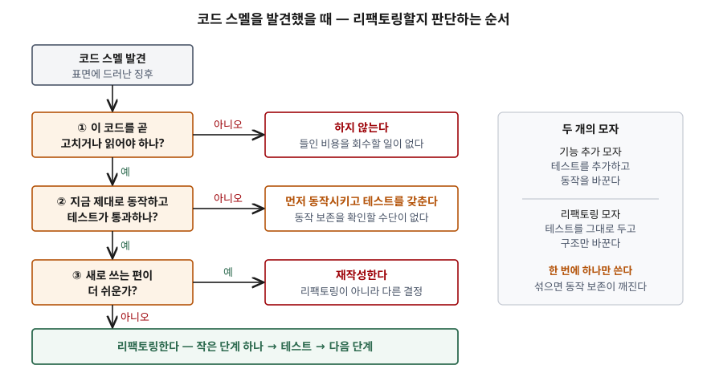

> 실행 검증 없음. Martin Fowler의 『Refactoring』 2판과 저자 웹 문서, Mäntylä의 코드 스멜 분류
> 논문과 저자 페이지, Chikofsky·Cross의 역공학 용어 분류 논문 근거로 정리했다.

## 들어가며

리팩토링은 소프트웨어 유지보수·품질 문항에서 기술부채, 테스트 주도 개발과 묶여 나온다.
"코드를 깨끗하게 고치는 것"으로만 쓰면 점수가 나지 않는다. 채점 포인트는 세 가지다.
**겉으로 보이는 동작을 바꾸지 않는다**는 조건, 무엇을 고칠지 알려 주는 **코드 스멜의 분류**,
그리고 **언제 하고 언제 하지 않는가**다. 실무에서도 마지막이 가장 자주 틀린다.
고칠 일이 없는 코드를 정리하느라 일정을 쓰거나, 테스트 없이 구조를 바꾸다 동작을 깨뜨린다.

## 정의

**리팩토링**(명사): 소프트웨어의 **겉으로 보이는 동작을 바꾸지 않으면서**, 이해하기 쉽고 고치는
비용이 적게 들도록 내부 구조를 바꾸는 것이다. 동사로는 이런 변경을 **연속해서 적용해** 소프트웨어를
재구조화하는 일을 말한다(Fowler, Definition Of Refactoring, 2004).

**코드 스멜**: 대개 시스템의 더 깊은 문제에 대응하는, **표면에 드러난 징후**다(Fowler, Code Smell, 2006).
용어는 Kent Beck이 『Refactoring』 초판 작업을 돕다 만들었다.

정의에서 두 가지를 읽어야 한다. 목적이 **이해와 수정 비용**이라는 점, 그리고 조건이 **관찰 가능한
동작의 보존**이라는 점이다. 성능을 올리려고 구조를 바꾸는 것은 목적이 달라 리팩토링이 아니다.

## 등장 배경

설계를 처음부터 완벽하게 할 수 없다는 반성에서 반복 개발이 나왔지만, 기존 코드를 고칠 때마다
버그가 들어갈 위험이 남았다. Fowler(1998)는 리팩토링을 **반복 개발을 통제된 방식으로 하는 첫
기법**으로 소개한다. 지금 동작하지만 다음 기능을 넣기에 맞지 않는 소프트웨어에서 출발해,
설계를 "그때 원했던 모양"에서 "지금 원하는 모양"으로 바꾼다.

이론 쪽 뿌리는 Opdyke의 박사 논문(1992, 일리노이대)이다. 변환마다 동작을 보존하는 전제조건을
정해 두면 안전하게 자동화할 수 있다는 것을 보였고, Brant와 Roberts의 Smalltalk 리팩토링
브라우저가 이를 도구로 만들었다. 도구가 없는 언어에서는 Fowler가 원칙 두 가지로 줄였다.
**작은 단계로 나누고, 자주 테스트한다.**

## 구성요소 / 절차

### 리팩토링을 하는 이유 — 4가지 (Fowler 2판 2장)

① 설계를 개선한다 ② 코드를 이해하기 쉽게 만든다 ③ 버그를 찾는 데 도움이 된다
④ 프로그래밍을 빠르게 한다. 넷째가 핵심이다. 구조가 무너진 코드에서는 기능 하나를 넣는 데
드는 시간이 점점 길어지고, 리팩토링은 그 속도를 되찾으려고 한다.

### 코드 스멜 — 24가지 (Fowler 2판 3장)

이름이 수상함, 중복 코드, 긴 함수, 긴 매개변수 목록, 전역 데이터, 가변 데이터, 뒤엉킨 변경,
산탄총 수술, 기능 편애, 데이터 뭉치, 기본형 집착, 반복되는 switch, 반복문, 성의 없는 요소,
추측성 일반화, 임시 필드, 메시지 체인, 중개자, 내부자 거래, 거대한 클래스, 인터페이스가 다른
대안 클래스, 데이터 클래스, 상속 거부, 주석. 초판의 22가지에서 전역 데이터·가변 데이터·반복문처럼
함수형 관점의 항목이 더해졌다.

### 코드 스멜의 분류 — 5가지 (Mäntylä)

24개를 그대로 외우기는 어렵다. Mäntylä는 2003년 학회 논문에서 Fowler와 Beck의 스멜을 묶는 분류를
제안했고, 저자 페이지는 2006년 저널 논문 기준의 **5분류**를 싣는다. 아래 표는 그 페이지를 옮긴
것으로, 스멜 이름이 초판 기준이다. 초판의 불완전한 라이브러리 클래스·주석은 빠지고 초판에 없던
죽은 코드가 들어 있다.

| 분류 | 무엇이 문제인가 | 해당 스멜 |
|---|---|---|
| ① 비대 (Bloaters) | 너무 커져서 다룰 수 없게 됐다 | 긴 메서드, 거대한 클래스, 기본형 집착, 긴 매개변수 목록, 데이터 뭉치 |
| ② 객체지향 남용 (OO Abusers) | 객체지향 설계를 제대로 살리지 못했다 | switch 문, 임시 필드, 상속 거부, 인터페이스가 다른 대안 클래스 |
| ③ 변경 방해 (Change Preventers) | 수정·확장을 가로막는다 | 뒤엉킨 변경, 산탄총 수술, 평행 상속 계층 |
| ④ 불필요 (Dispensables) | 없어야 할 것이 남아 있다 | 게으른 클래스, 데이터 클래스, 중복 코드, 죽은 코드, 추측성 일반화 |
| ⑤ 결합 (Couplers) | 클래스 사이 결합이 지나치다 | 기능 편애, 부적절한 친밀, 메시지 체인, 중개자 |

### 리팩토링 시점 — 6가지 (Fowler, Workflows of Refactoring 2014 · 2판 2장)

| 시점 | 언제 |
|---|---|
| ① TDD 리팩토링 | 테스트를 통과시킨 직후. "동작하게 → 깨끗하게" |
| ② 줍기 리팩토링 | 작업하던 곳에서 지저분한 코드를 만났을 때 조금씩. 들어올 때보다 나은 상태로 둔다 |
| ③ 이해 리팩토링 | 코드를 읽고 겨우 이해했을 때, 그 이해를 코드 구조에 옮겨 둔다 |
| ④ 준비 리팩토링 | 기능을 넣기 **직전**, 넣기 쉬운 모양으로 먼저 바꾼다 |
| ⑤ 계획 리팩토링 | 일정에 따로 잡는다. Fowler는 이것이 많으면 **평소 리팩토링이 부족하다는 신호**로 본다 |
| ⑥ 장기 리팩토링 | 몇 주~몇 달에 걸친 큰 구조 변경. 기존·새 구현을 함께 받는 추상화 계층을 두고 동작을 유지한 채 옮긴다 |

①~④는 다른 작업을 하다 그 작업을 위해 하는 **기회적 리팩토링**이다. 2판은 같은 일을 세 번째
할 때 리팩토링하라는 **3의 법칙**도 함께 든다.

### 하지 말아야 할 때 — 3가지

- **고칠 일이 없는 코드**: 2판은 지저분해도 수정할 필요가 없는 코드는 리팩토링할 필요가 없다고 적는다.
  Workflows 문서도 **투자를 회수할 것 같지 않으면** 하지 말라고 한다
- **새로 쓰는 편이 쉬운 코드**: 2판이 두는 또 하나의 예외다. 이것은 리팩토링이 아니라 재작성 결정이다
- **테스트가 통과하지 않을 때**: Fowler는 테스트가 초록색일 때만 리팩토링하라고 적는다. 동작 보존을
  확인할 수단이 없으면 구조 변경은 그냥 위험한 수정이 된다

## 도식

> **출처**: [Fowler, Workflows of Refactoring (2014-01-08) — Two Hats, Planned Refactoring](https://martinfowler.com/articles/workflowsOfRefactoring/) · [Fowler, Opportunistic Refactoring (2011-11-01)](https://martinfowler.com/bliki/OpportunisticRefactoring.html) · [Fowler, Refactoring 2nd ed. (2018) ch.2 When Should We Refactor?](https://martinfowler.com/books/refactoring.html)

판단은 **비용을 회수할 수 있는가 → 동작 보존을 확인할 수 있는가 → 리팩토링이 맞는 수단인가**
순서다. 오른쪽의 **두 개의 모자**는 Kent Beck의 표현으로, 기능을 추가할 때는 테스트를 더하고
리팩토링할 때는 테스트를 건드리지 않는다. 두 일을 한 번에 하면 테스트가 실패했을 때 어느 쪽
변경 때문인지 가릴 수 없다.

## 비교

| 구분 | 리팩토링 | 재구조화 (Restructuring) | 재작성 (Rewrite) | 리엔지니어링 | 성능 최적화 |
|---|---|---|---|---|---|
| 외부 동작 | 보존 | 보존 | 다시 구현 (보존을 목표로 할 뿐 보장 수단 없음) | 바뀔 수 있다 (새 기능·새 형태) | 보존 |
| 목적 | 이해·수정 비용 감소 | 같은 추상 수준에서 표현을 바꾼다 | 기존 코드를 버린다 | 이해 → 새 형태로 재구성 | 속도·자원 사용 |
| 단위 | 작은 변환 하나씩, 매번 테스트 | 변환 규모를 정하지 않는다 | 시스템·모듈 전체 | 시스템 전체 | 병목 지점 |
| 근거 | Fowler | Chikofsky & Cross | Fowler 2판 예외 | Chikofsky & Cross | Fowler 2판 |

Chikofsky와 Cross(1990)는 재구조화를 **같은 추상 수준 안에서 한 표현을 다른 표현으로 바꾸되 외부
동작을 보존하는 변환**으로, 리엔지니어링을 **대상 시스템을 분석해 새 형태로 재구성하고 구현하는 것**으로
정의한다. 리팩토링은 재구조화 가운데 **작은 동작 보존 변환을 테스트로 확인하며 쌓아 가는** 방식으로
볼 수 있다. 성능 최적화도 동작을 보존하지만, 2판은 최적화가 코드를 오히려 다루기 어렵게 만들 수
있다는 점에서 목적이 다르다고 가른다.

## 적용 시 고려사항

- **자동화된 테스트가 전제다.** 2판의 리팩토링 문제점 절은 테스트와 레거시 코드를 따로 다룬다.
  테스트가 없는 레거시 코드는 먼저 테스트를 붙일 수 있도록 구조를 조금 바꾸고, 그다음 리팩토링한다.
- **브랜치와 코드 소유권이 리팩토링을 막는다.** Fowler는 엄격한 코드 소유권과 오래 사는 기능 브랜치가
  기회적 리팩토링을 어렵게 만든다고 적는다. 이름 하나를 바꿔도 여러 브랜치에서 병합 충돌이 난다.
  지속적 통합처럼 자주 합치는 방식과 짝을 이뤄야 한다.
- **공개된 인터페이스와 데이터베이스는 따로 다룬다.** 내가 호출자 전부를 고칠 수 없는 API나 스키마는
  한 번에 바꾸지 못한다. 2판도 데이터베이스를 문제점으로 따로 들며, 옛 이름과 새 이름을 한동안 함께
  두는 점진적 이전을 권한다. 장기 리팩토링의 추상화 계층이 같은 생각이다.
- **스멜이 곧 결함은 아니다.** Fowler는 긴 메서드 가운데 괜찮은 것도 있으며 밑에 진짜 문제가 있는지
  더 봐야 한다고 적는다. 정적 분석 도구가 잡은 경고 수를 줄이는 것을 목표로 두면 고칠 일이 없는
  코드까지 건드리게 된다.
- **관리자에게 따로 허락을 구하는 일로 만들지 않는다.** Fowler(1998)는 리팩토링에 시간을 따로 떼어
  두기보다 기능을 넣거나 버그를 고치려고 하는 일로 다루라고 권한다. 기능 일정과 분리된 "리팩토링
  스프린트"는 계획 리팩토링이 쌓였다는 신호다.

## 정리

- **정의 1줄**: 겉으로 보이는 동작을 바꾸지 않고 이해·수정 비용을 줄이도록 내부 구조를 바꾸는 것.
- **이유 4**: 설계 개선 · 이해 쉬움 · 버그 발견 · 개발 속도. 핵심은 마지막.
- **스멜 24 → 5분류**: **비·객·변·불·결** — 비대, 객체지향 남용, 변경 방해, 불필요, 결합.
- **시점 6**: TDD · 줍기 · 이해 · 준비 (여기까지 기회적) · 계획 · 장기. 계획이 많으면 평소가 부족하다.
- **하지 않을 때 3**: 고칠 일 없음 · 재작성이 쉬움 · 테스트가 빨간색.
- **두 개의 모자**: 기능 추가와 리팩토링을 섞지 않는다.

## 참고 자료

- [M. Fowler, Refactoring: Improving the Design of Existing Code, 2nd ed., Addison-Wesley (2018)](https://martinfowler.com/books/refactoring.html) — ch.2 Principles in Refactoring (Why / When Should We Refactor?, Problems with Refactoring, Refactoring and Performance), ch.3 Bad Smells in Code ([목차, InformIT](https://www.informit.com/store/refactoring-improving-the-design-of-existing-code-9780134757711))
- [M. Fowler, Definition Of Refactoring (2004-09-01)](https://martinfowler.com/bliki/DefinitionOfRefactoring.html)
- [M. Fowler, Code Smell (2006-02-09)](https://martinfowler.com/bliki/CodeSmell.html)
- [M. Fowler, Workflows of Refactoring (2014-01-08)](https://martinfowler.com/articles/workflowsOfRefactoring/)
- [M. Fowler, Opportunistic Refactoring (2011-11-01)](https://martinfowler.com/bliki/OpportunisticRefactoring.html)
- [M. Fowler, Refactoring: Doing Design After the Program Runs, Distributed Computing (1998-09)](https://martinfowler.com/distributedComputing/refactoring.pdf)
- W. F. Opdyke, Refactoring Object-Oriented Frameworks, Ph.D. thesis, University of Illinois at Urbana-Champaign (1992)
- M. Mäntylä, J. Vanhanen, C. Lassenius, A Taxonomy and an Initial Empirical Study of Bad Smells in Code, ICSM 2003, pp. 381–384
- [M. Mäntylä, Bad Code Smells — A Taxonomy (저자 페이지, Mäntylä & Lassenius 2006 기준)](https://mmantyla.github.io/BadCodeSmellsTaxonomy)
- [E. J. Chikofsky, J. H. Cross II, Reverse Engineering and Design Recovery: A Taxonomy, IEEE Software 7(1) (1990-01)](https://doi.org/10.1109/52.43044)
