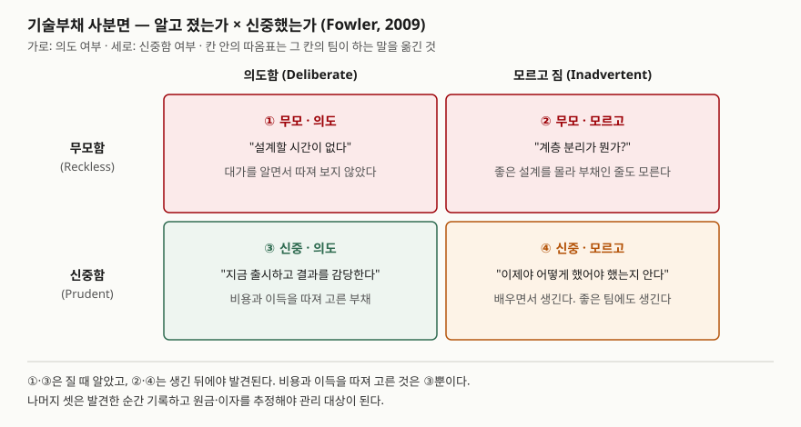
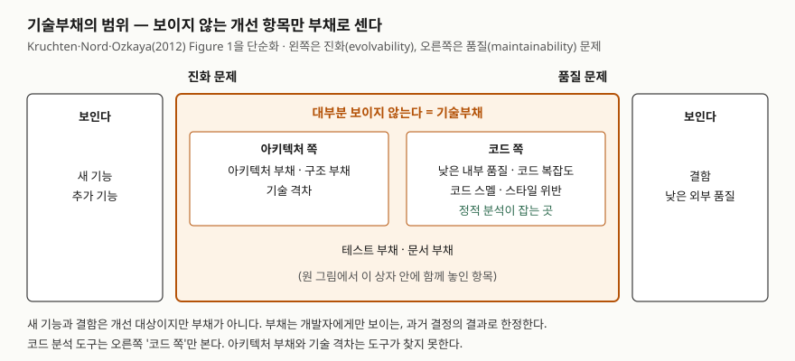

> 실행 검증 없음. Dagstuhl 세미나 보고서, Cunningham의 OOPSLA '92 경험 보고, Kruchten·Nord·Ozkaya의
> IEEE Software 기고, Fowler와 McConnell의 저자 문서, SonarQube 공식 문서 근거로 정리했다.

## 들어가며

기술부채는 유지보수·품질·리팩토링 문항의 배경으로 자주 나오고, 단독으로 나오면 "측정과 관리 방안"을 묻는다.
"빨리 짜서 생긴 나쁜 코드"로만 쓰면 점수가 나지 않는다. 채점 포인트는 **원금과 이자**를 구분하는지,
**무엇이 부채가 아닌지**를 아는지, 그리고 측정과 상환을 **수치와 절차**로 쓰는지다. 실무에서는 "언젠가 고칠 것"
목록이 아무도 보지 않는 곳에 쌓이다가, 기능 하나 넣는 데 드는 시간이 눈에 띄게 늘어난 뒤에야 문제가 된다.

## 정의

**기술부채**: 소프트웨어 집약 시스템에서, 단기적으로는 편리하지만 향후 변경을 더 비싸게 하거나 불가능하게
만드는 기술적 맥락을 남기는 **설계·구현 구성물의 모음**이다. 기술부채는 실제의 또는 우발적인 부채이며,
그 영향은 **내부 품질, 주로 유지보수성과 진화성**에 한정된다(Dagstuhl Seminar 16162, 2016).

이 정의에서 두 가지를 읽는다. 부채는 사람의 행동이 아니라 **코드·설계에 남은 구성물**이라는 점,
그리고 영향이 **내부 품질**에 한정된다는 점이다. 사용자에게 보이는 결함은 이 정의의 부채가 아니다.

## 등장 배경

비유는 Ward Cunningham의 1992년 OOPSLA 경험 보고에서 나왔다. 처음 짠 코드를 내보내는 것은 빚을 지는 것과
같고, 빨리 다시 짜서 갚으면 개발을 빠르게 해 준다. 갚지 않으면 덜 맞는 코드에 쓰는 시간이 **이자**로 쌓이고,
조직 전체가 멈출 수 있다고 적었다. Kruchten 등은 이 비유가 기술을 모르는 이해관계자에게 오늘날 리팩토링이라
부르는 일의 필요를 설명하려고 나왔다고 정리한다.

20년 뒤 Kruchten·Nord·Ozkaya(2012)는 이 비유가 **아무 비용에나 붙는 말**이 됐다고 보고 범위를 좁히자고 했다.
Dagstuhl 보고서(2016)도 부채가 원래 비유처럼 의도한 결정이라기보다 **의도하지 않게 생겨** 유지보수 단계에서
발견되는 경우가 많다고 적고, 그래서 정의를 명확히 했다.

## 구성요소 / 절차

### 기본 요소 — 2가지 (Fowler 2019 · McConnell)

| 요소 | 뜻 | 예 (Fowler) |
|---|---|---|
| **원금** | 구조를 고쳐 부채를 없애는 데 드는 비용 | 모듈 구조를 정리하는 데 5일 |
| **이자** | 고치지 않아서 변경할 때마다 더 드는 비용 | 깨끗하면 4일, 지금 구조로는 6일 — 차이 2일 |

McConnell은 **이자가 없으면 부채가 아니다**라고 선을 긋는다. 미뤄 둔 기능, 뺀 기능, 기능 백로그는 나중에 할
일일 뿐 이자를 만들지 않으므로 부채가 아니다.

### 분류 ① 사분면 — 4가지 (Fowler 2009)

두 축은 **의도했는가(Deliberate/Inadvertent)** 와 **신중했는가(Prudent/Reckless)** 다.

> **출처**: [M. Fowler, Technical Debt Quadrant (2009-10-14)](https://martinfowler.com/bliki/TechnicalDebtQuadrant.html) — 두 축과 네 칸, 칸마다의 예시 문장.

Fowler는 무모한 부채도 부채로 본다. 이자가 크다는 점을 경영진과 이야기하는 데 비유가 그대로 쓸모 있기 때문이다.
④ 신중하지만 모르고 진 부채는 **좋은 팀에도 반드시 생긴다.** 만들면서 배우므로, 좋은 설계는 끝난 뒤에 보인다.

### 분류 ② 유형 — 5가지 (McConnell)

| 대분류 | 소분류 | 예 |
|---|---|---|
| 비의도 부채 (낮은 품질의 결과) | ① 정직한 실수 | 다음 판 프레임워크가 훨씬 나을 줄 몰랐다 |
| | ② 부주의한 실수 | 설계를 건너뛰었다 |
| 의도 부채 — 단기 (전술적, 대응적) | ③ 집중된 단기 부채 | 하나하나 짚을 수 있는 지름길. 클래스를 일부만 구현 |
| | ④ 분산된 단기 부채 | 자잘한 지름길 다수. 코딩 표준 미준수 |
| 의도 부채 — 장기 (전략적, 선제적) | ⑤ 장기 부채 | 전략적 이유로 미리 계획해 진다 |

비의도 부채가 많은 팀은 전략적 부채를 질 여력이 적다는 것도 McConnell이 함께 든다.

### 측정 방법 — 3가지

| 방법 | 무엇을 재나 | 근거 |
|---|---|---|
| ① 원금 추정 | 정적 분석 규칙 위반마다 정한 **수정 비용(분)의 합** | SonarQube 기술부채 지표 |
| ② 이자 관찰 | 개발 속도(velocity) 저하, 재작업량, 같은 크기 기능의 소요 시간 차 | McConnell, Fowler |
| ③ 예산 비율 | 유지보수 예산 중 **새 가치를 만들지 않는 작업의 비율**, 백로그에 쌓인 부채 합계 | McConnell |

①은 비율로 바꿔 등급을 매긴다. SonarQube는 **부채 비율 = 기술부채 ÷ (코드 한 줄 개발 비용 × 줄 수)** 로
계산하고, 한 줄 개발 비용 기본값은 30분이다. 문서의 예는 기술부채 122,563분, 63,987줄로 비율 6.4%다
(122,563 ÷ 1,919,610). 등급은 5% 이하 A, 10% 미만 B, 20% 미만 C, 50% 미만 D, 그 이상 E다.

①은 자동으로 나오지만 아래 도식의 코드 쪽만 잰다. ②는 코드 밖의 부채도 비용으로 드러내지만, 속도 수치는
어느 부분이 원인인지 가리키지 않는다. 둘을 함께 써야 한다.

### 관리 활동 — 4가지 (Dagstuhl 16162)

① 인식 ② 분석 ③ 모니터링 ④ 측정. Kruchten 등은 첫 단계를 **인식**(부채와 그 원인 찾기)으로, 다음 단계를
**명시적 관리**(부채 작업을 다른 할 일과 같은 백로그에 올리기)로 든다. 백로그를 새 기능(초록)·아키텍처
투자(노랑)·결함(빨강)·기술부채(검정)의 **4색**으로 나누면, 보통 검정은 어디에도 없다고 적는다.

### 상환 방식 — 5가지 (McConnell)

① 제품 출시 직후 부채 상환 반복을 한 번 둔다(단기 부채용) ② 작은 상환을 매 반복에 나눠 넣는다(예: 노력의 10%)
③ 일정 규모(100~250시간 안팎) 이상은 별도 프로젝트로 승인받는다 ④ 상환 업무를 사람마다 돌아가며 맡는다
⑤ 외부 인력에 맡긴다.

어느 것부터 갚는가는 **이자율**로 정한다. 이자가 높은 것부터 갚고, 이자가 낮은 것은 끝내 갚지 않아도 된다.
Fowler도 자주 바뀌는 곳은 적극적으로 정리하고, 거의 안 바뀌는 곳은 지저분해도 두라고 한다. 이자는 그 코드를
고칠 때만 내기 때문이다. 시스템을 폐기하면 부채도 함께 사라지므로, 수명이 끝나 가는 시스템에는 상환 근거를
세우기 어렵다.

## 도식

> **출처**: [P. Kruchten, R. L. Nord, I. Ozkaya, Technical Debt: From Metaphor to Theory and Practice, IEEE Software 29(6) (2012-11), Figure 1 The technical debt landscape](https://www.sei.cmu.edu/documents/360/2012_019_001_58818.pdf) — 보이는/보이지 않는 축과 진화/품질 축, 상자 안 항목. 단순화하면서 칸 배치를 바꿨다.

Kruchten·Nord·Ozkaya(2012)는 개선 항목을 둘로 가른다. 새 기능과 결함은 **보이는** 항목이고, 부채는 개발자에게만
보이는 쪽으로 한정한다. 저자들은 코드 분석 도구가 상자의 오른쪽(코드 쪽)만 다룬다고 적는다. 부채는 코드 자체보다
구조·아키텍처 선택이나 기술 격차에서 오는 경우가 더 많고, 이것은 도구가 찾지 못한다. Dagstuhl 보고서도 산업
사례에서 가장 큰 부채가 **코드 품질 측정으로는 안 보이는 설계 절충**에서 나왔다고 적는다.

답안에는 가운데 상자(부채)와 양옆(보이는 개선 항목) 세 칸만 그리고, 상자 안을 아키텍처 쪽·코드 쪽으로 나누면 된다.

## 비교

### 의도한 부채와 방치된 부채

"방치된 부채"는 출처의 용어가 아니라, McConnell의 **바람직하지 않은 부채의 지표**와 **부채를 지기 전에 물을
질문**을 묶어 이 글이 붙인 이름이다.

| 기준 | 의도한(관리되는) 부채 | 방치된 부채 |
|---|---|---|
| 추적 | 백로그·결함 목록에 올라 있다 | 어디에도 기록이 없다 |
| 소유자 | 업무 쪽 책임자가 정해져 있다 | 없다 |
| 추정 | 지금 비용·나중 비용·이자를 추정했다 | 추정한 적이 없다 |
| 사분면 (이 글의 대응) | 주로 ③ | ①·②, 그리고 발견 후 기록하지 않은 ④ |
| 이자 | 낮거나 일시적이다 | 높고 계속 나간다 |

판별 질문은 하나로 줄일 수 있다. **이 부채를 추적할 수 있는가.** McConnell은 좋은 부채는 정의상 추적할 수
있다고 적는다.

### 인접 개념

| 구분 | 기술부채 | 결함 | 기능 백로그 | 코드 스멜 | 리팩토링 |
|---|---|---|---|---|---|
| 보이는가 | 개발자에게만 | 사용자에게 | 사용자에게 | 개발자에게만 | — |
| 이자 | 있다 | — | 없다 | 징후일 뿐 | — |
| 부채인가 | 그렇다 | 아니다 (Kruchten) | 아니다 (McConnell) | 부채의 표면 징후 | 상환 수단 |

## 적용 시 고려사항

- **정적 분석 수치를 부채의 전부로 보지 않는다.** 부채 비율 A 등급인 시스템도 아키텍처 부채와 기술 격차는
  남아 있을 수 있다. 개발 속도와 재작업량을 함께 본다.
- **상환 근거는 업무 이익으로 쓴다.** McConnell은 "설계가 낡았다"는 이유는 업무 쪽이 받아들이지 않고,
  "부채를 줄이면 출시 주기가 6개월에서 5개월로 준다"는 식이어야 한다고 적는다.
- **지기 전에 대안을 찾는다.** 부채를 진다/안 진다의 둘만 놓지 말고, 지금 조금 더 들이면 이자가 없는 선택지를
  찾는다. 갚지 않아도 되는 부채라면 그것이 가장 싸다.
- **애자일 반복이 부채를 막아 주지 않는다.** Kruchten 등은 설계를 돌아볼 시간 없이 빠르게 내보내고 자동화
  테스트가 부족한 애자일 프로젝트가, 폭포수보다 빠르게 부채를 쌓기도 한다고 적는다.

## 정리

- **정의 1줄**: 단기적으로 편리하지만 향후 변경을 비싸게 만드는 설계·구현 구성물. 영향은 내부 품질에 한정.
- **2요소**: 원금(고치는 비용) · 이자(안 고쳐서 더 드는 비용). **이자 없으면 부채 아님.**
- **사분면 4**: 의도/모르고 × 신중/무모. **신중·모르고**는 좋은 팀에도 생긴다.
- **유형 5**: 정직한 실수 · 부주의한 실수 · 집중 단기 · 분산 단기 · 장기.
- **측정 3**: **원·이·예** — 원금 추정(수정 비용 합·비율·등급), 이자 관찰(속도·재작업), 예산 비율.
- **상환 5**: 출시 직후 · 분할 · 별도 프로젝트 · 순환 · 외부. 순서는 **이자율 높은 것부터.**
- **의도 vs 방치**: 추적할 수 있는가.

> 개념 연결: [리팩토링 — 코드 스멜 분류와 적용 시점](../2026-10-03-refactoring-code-smells-when-to-apply/index.md) — 상환 수단과 스멜 분류

## 참고 자료

- [P. Avgeriou, P. Kruchten, I. Ozkaya, C. Seaman, Managing Technical Debt in Software Engineering (Dagstuhl Seminar 16162), Dagstuhl Reports 6(4), pp. 110–138 (2016)](https://drops.dagstuhl.de/storage/04dagstuhl-reports/volume06/issue04/16162/DagRep.6.4.110/DagRep.6.4.110.pdf) — p.112 The Definition of Technical Debt and a Conceptual Model, p.111 관리 활동
- [W. Cunningham, The WyCash Portfolio Management System, OOPSLA '92 Experience Report (1992)](http://c2.com/doc/oopsla92.html)
- [P. Kruchten, R. L. Nord, I. Ozkaya, Technical Debt: From Metaphor to Theory and Practice, IEEE Software 29(6), pp. 18–21 (2012-11)](https://www.sei.cmu.edu/documents/360/2012_019_001_58818.pdf) — Figure 1 The technical debt landscape, Figure 2 Four colors in a backlog
- [M. Fowler, Technical Debt Quadrant (2009-10-14)](https://martinfowler.com/bliki/TechnicalDebtQuadrant.html)
- [M. Fowler, Technical Debt (2003-10-01, 2019 개정)](https://martinfowler.com/bliki/TechnicalDebt.html) — 원금·이자 예시, 자주 바뀌는 곳부터
- [S. McConnell, Managing Technical Debt, Construx 강연 자료 (2007–2013), ICSE 2013 MTD 워크숍](https://2013.icse-conferences.org/documents/publicity/MTD-WS-McConnell-slides.pdf) — 유형 분류, 이자 없는 지연 작업, 바람직하지 않은 부채의 지표, 측정·추적·상환 방식
- [SonarSource, SonarQube Server — Metrics definition: Maintainability](https://docs.sonarsource.com/sonarqube-server/user-guide/code-metrics/metrics-definition) — 기술부채, 부채 비율, 유지보수성 등급
