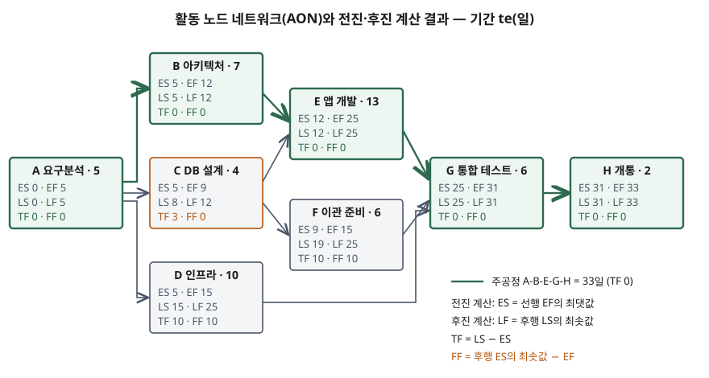

> 계산 문제이므로 직접 계산해 검산했다. 전진·후진 계산, 지연 실험, PERT 확률, 몬테카를로 결과는 전부
> [`code/cpm_pert.py`](code/cpm_pert.py)를 돌린 기록 [`code/output.txt`](code/output.txt)에서 가져왔다.

## 들어가며

정보시스템 구축사업의 일정표에는 활동이 수백 개 있지만, 그중 하루만 늦어도 개통일이 밀리는 활동은 일부다.
어느 활동이 그런지 모르면 관리 노력이 전 활동에 고르게 흩어진다. 시험은 네트워크를 주고 주공정과 여유시간을
계산하게 하거나, PERT의 3점 추정으로 납기 확률을 묻는다. 계산 자체보다 **총 여유와 자유 여유가 무엇을 뜻하는지**,
**PERT 확률이 왜 낙관적으로 나오는지**를 쓸 수 있어야 점수가 붙는다.

## 정의

**주공정(critical path)**: 네트워크 일정에서 현재 시점부터 완료까지 **전체 기간이 가장 긴 활동의 연쇄**로,
이 경로의 활동이 늦어지면 프로젝트 기간이 늘어난다(NASA Schedule Management Handbook 용어집).
**CPM**(Critical Path Method)은 이 경로를 계산해 일정을 관리하는 기법이다.

**PERT**(Program Evaluation and Review Technique): 활동 기간을 **낙관값 a, 최빈값 m, 비관값 b의 3점**으로 추정해
기대 기간 te = (a + 4m + b) / 6, 분산 σ² = ((b − a) / 6)²로 두고 일정의 불확실성을 확률로 평가하는 기법이다
(Malcolm 외 1959. 공식은 NASA CR-119777이 정리한 PERT 표준 가정으로 확인).

**여유(float, slack)**: **총 여유(TF)**는 프로젝트 종료일에 영향 없이 활동이 늦어질 수 있는 시간, **자유 여유(FF)**는
바로 다음 활동의 시작에 영향 없이 늦어질 수 있는 시간이다(NASA Handbook 5.8.3).

## 등장 배경

두 기법은 1950년대 말 대형 사업에서 **간트 차트가 활동 사이의 의존 관계를 표현하지 못하는 문제**를 풀려고 따로 생겼다.

- **CPM** — 듀폰의 Walker와 레밍턴 랜드의 Kelley가 만들어 1959년에 발표했다.
  활동 기간을 하나의 값으로 두고, 후속 논문(Kelley 1961)은 기간을 줄일 때의 비용 관계까지 수식으로 다룬다
- **PERT** — 미 해군 특수사업실이 폴라리스 탄도미사일 개발을 관리하려고 Booz Allen Hamilton과 만들었다. 처음 해보는
  연구개발이라 기간을 하나로 정할 수 없어, 기술자에게 3점을 받아 **확률로** 표현했다(Malcolm 외 1959)

## 구성요소 / 절차

### 네트워크의 구성요소 — 3가지

활동(기간을 소비하는 작업), 선후 관계(어느 활동이 끝나야 다음이 시작되는가), 마일스톤(기간 0인 사건).
요즘 도구는 활동을 노드로 두는 **AON**(선후행 도형법)을 쓴다. PERT 원 논문은 사건을 노드로 두는 형태였다.

### CPM 계산 절차 — 5단계

1. **전진 계산** — ES = 선행 활동 EF의 최댓값, EF = ES + 기간
2. **후진 계산** — LF = 후행 활동 LS의 최솟값, LS = LF − 기간
3. **총 여유** — TF = LS − ES (= LF − EF)
4. **자유 여유** — FF = 후행 활동 ES의 최솟값 − EF
5. **주공정 식별** — TF가 0(제약이 없을 때)인 활동을 잇는다

### PERT 확률 계산 — 4단계

1. 활동마다 a·m·b를 받는다
2. te와 σ²를 계산한다
3. 주공정의 te를 더해 기대 완료일 T, σ²를 더해 분산을 구한다
4. 납기 D에 대해 Z = (D − T) / σ로 정규분포 확률을 읽는다

## 도식

8개 활동으로 된 구축 일정을 계산했다. 입력은 이렇다.

```text
활동  이름          선행         a   m   b
A   요구분석        -          3   5   7
B   아키텍처 설계     A          4   6  14
C   DB 설계       A          2   4   6
D   인프라 구축      A          4   8  24
E   애플리케이션 개발   B,C        8  12  22
F   데이터 이관 준비   C          3   5  13
G   통합 테스트      D,E,F      4   6   8
H   개통          G          1   2   3
```



> **출처**: [NASA/SP-2010-3403 Schedule Management Handbook §5.8.3 Float (Slack), Appendix B Glossary — Critical Path, Free Float](https://ntrs.nasa.gov/api/citations/20110012668/downloads/20110012668.pdf) · 값은 [`code/output.txt`](code/output.txt)의 계산 결과

```text
활동     te   ES   EF   LS   LF   TF   FF  주공정
A       5    0    5    0    5    0    0  *
B       7    5   12    5   12    0    0  *
C       4    5    9    8   12    3    0  
D      10    5   15   15   25   10   10  
E      13   12   25   12   25    0    0  *
F       6    9   15   19   25   10   10  
G       6   25   31   25   31    0    0  *
H       2   31   33   31   33    0    0  *
프로젝트 기간 33일, 주공정 A-B-E-G-H
```

### 여유가 뜻하는 것 — 지연 실험

```text
B +2일 → 프로젝트 35일, ES가 밀린 활동 ['E', 'G', 'H']
C +3일 → 프로젝트 33일, ES가 밀린 활동 ['F']
C +4일 → 프로젝트 34일, ES가 밀린 활동 ['E', 'F', 'G', 'H']
F +10일 → 프로젝트 33일, ES가 밀린 활동 없음
F +11일 → 프로젝트 34일, ES가 밀린 활동 ['G', 'H']
```

C가 차이를 보여 준다. TF가 3이라 3일 늦어도 개통일은 그대로지만, FF가 0이라 **바로 뒤의 F가 즉시 밀린다.**
F를 맡은 팀은 일정이 바뀐 것을 통보받아야 한다. 총 여유는 **경로가 함께 쓰는** 시간이다. C가 3일을 다 쓰면
C-E 구간의 여유는 0이 되어 그 뒤 활동은 여유 없이 진행된다. 반면 F의 10일은 FF와 TF가 같아 혼자 써도 남에게 영향이 없다.

## 비교

### CPM과 PERT

| 항목 | CPM | PERT |
|---|---|---|
| 출발 | 듀폰·레밍턴 랜드 (1959) | 미 해군 미사일 연구개발 (1959) |
| 기간 추정 | 1점, 확정적 | 3점(a·m·b), 확률적 |
| 관심사 | 기간과 비용의 맞교환 | 납기 달성 확률 |
| 결과 | 주공정, 여유 | 기대 완료일, 표준편차, 확률 |
| 맞는 사업 | 비슷한 작업을 반복한 경험이 있는 사업 | 처음 해보는 연구개발 |

### 총 여유와 자유 여유

| 항목 | 총 여유(TF) | 자유 여유(FF) |
|---|---|---|
| 기준 | 프로젝트 종료일 | 바로 다음 활동의 시작 |
| 계산 | LS − ES | 후행 ES 최솟값 − EF |
| 공유 | 같은 경로의 활동이 나눠 쓴다 | 그 활동만의 몫 |
| 쓰는 곳 | 프로젝트 전체 일정 성과 관리 | 특정 활동군의 충돌 분석, 자원 우선순위 |

NASA Handbook은 자유 여유를 프로젝트 전체 일정 성과를 관리하는 수단으로 쓰지 말고, 종료일을 끌고 가는 활동은 총 여유로 보라고 적는다.

### PERT 공식과 몬테카를로

```text
납기 36일: Z = (36-33)/3.037 = 0.988, P = 0.838
```

평균이 te가 되도록 모수를 잡은 베타분포로 활동마다 10만 번 기간을 뽑아 전체 네트워크를 다시 계산했다.
변형 행은 D를 (10, 18, 26)으로 바꿔 여유 2일짜리 준주공정으로 만든 경우다. te 기준 주공정과 PERT 공식 값은 그대로다.

| 경우 | 주공정 합의 표본 분산 | 36일 이내 — 주공정만 | 36일 이내 — 전체 네트워크 | 종료일 평균 — 전체 |
|---|---|---|---|---|
| 기본 | 10.762 | 0.816 | 0.815 | 33.05일 |
| D 준주공정 | 10.644 | 0.817 | 0.770 | 33.91일 |

PERT 공식(0.838)과 "주공정만"의 차이는 분산 가정에서 온다. 공식은 주공정 분산을 9.222로 두지만 이 분포의 표본 분산은
10.7 안팎이다. "주공정만"과 "전체 네트워크"의 차이가 **병합 편향**(merge bias)이다. 기본 경우에는 다른 경로의 여유가
10일이라 차이가 없지만, D의 여유가 2일이 되자 확률이 0.817에서 0.770으로 떨어지고 평균 종료일이 0.9일 늦어진다.
이때 D는 표본의 33.0%에서 주공정이 됐다. GAO 일정 평가 지침은 병렬 경로가 합쳐지는 지점의 위험이 **곱으로 커지므로**
전체 일정이 경로 기간의 단순 합보다 길어질 수 있다고 적는다. PERT 공식은 주공정 하나만 보므로 이 효과를 놓친다.

## 적용 시 고려사항

- **논리가 완전해야 여유가 맞다.** NASA Handbook은 완전하고 검증된 네트워크 논리가 있어야 정확한 여유 값이 나온다고 적는다.
  후행 활동이 없는 활동이 있으면 그 활동의 여유가 종료일까지 늘어나 실제보다 커 보인다. 날짜 제약(예: "~이전 완료")은
  선후 관계보다 우선하므로 여유 계산을 바꾼다. 일정 도구에서 제약을 쓴 활동은 별도로 표시해 검토한다.
- **여유는 일정 예비(margin)가 아니다.** NASA Handbook은 네트워크 논리로 계산되는 여유를 사업관리자가 소유·통제하는
  일정 예비로 보지 말라고 적는다. 예비는 위험에 대비해 일부러 넣은 기간이고, 여유는 계산 결과다. 둘을 섞으면 비주공정 활동의
  여유를 예비처럼 써 버려 경로가 주공정으로 바뀐다.
- **준주공정을 같이 본다.** 위 변형처럼 여유가 작은 경로는 기간 편차가 크면 주공정이 된다. TF가 작은 경로 목록과 몬테카를로
  일정 위험 분석(GAO 지침 모범사례 8)을 함께 쓰고, 병렬 경로가 많이 모이는 지점은 선후 관계를 다시 검토한다.
- **3점 추정은 근거를 남긴다.** a·m·b가 담당자 감에 따라 달라지면 확률도 흔들린다. 과거 사업의 실적 기간을 일정 관리 시스템에
  활동 유형별로 쌓아 두면 추정의 근거가 된다. GAO 지침은 기간 추정의 방법과 근거 자료를 문서로 남기게 한다.
- **기간 단위를 통일한다.** NASA Handbook은 한 일정에 시간·일·주 단위가 섞이면 도구가 계산하는 여유 값에 미세한 불일치가
  생겨 주공정 식별이 어려워진다고 적는다. 기본은 작업일 단위다.

> 관련 개념: [WBS와 범위 기준선 — 100% 규칙, 작업 패키지, 통제 계정](../../it-management/2026-09-29-wbs-scope-baseline-control-account/index.md)
>
> 관련 개념: [PMBOK 지식 영역과 프로세스 그룹](../../it-management/2026-10-01-pmbok-knowledge-areas-process-groups/index.md)

## 정리

- CPM **5단계** — 전진(ES·EF) · 후진(LS·LF) · TF · FF · 주공정. "전·후·총·자·주".
- 전진은 **최댓값**, 후진은 **최솟값**. TF = LS − ES, FF = 후행 ES 최솟값 − EF.
- **TF는 경로가 나눠 쓰고, FF는 그 활동만의 몫이다.** TF > 0, FF = 0이면 늦을 때 뒤 활동이 바로 밀린다.
- PERT **3점** — te = (a + 4m + b)/6, σ² = ((b − a)/6)², Z = (D − T)/σ.
- PERT 확률은 주공정 하나만 보므로 **병합 편향**만큼 낙관적이다. 여유가 작은 준주공정이 있으면 차이가 커진다.

## 참고 자료

- J. E. Kelley Jr., M. R. Walker, "Critical-Path Planning and Scheduling," Proceedings of the Eastern Joint Computer Conference, pp. 160–173 (1959-12) — CPM 원 논문
- [J. E. Kelley Jr., "Critical-Path Planning and Scheduling: Mathematical Basis," Operations Research 9(3), pp. 296–320 (1961)](https://doi.org/10.1287/opre.9.3.296) — 기간·비용 관계
- [D. G. Malcolm, J. H. Roseboom, C. E. Clark, W. Fazar, "Application of a Technique for Research and Development Program Evaluation," Operations Research 7(5), pp. 646–669 (1959)](https://doi.org/10.1287/opre.7.5.646) — PERT 원 논문
- [R. M. Nicholson, A critical look at PERT analysis, NASA-CR-119777 (1971)](https://ntrs.nasa.gov/citations/19710023019) — §1.2 Standard PERT Definitions: 베타분포 가정, 평균 (a+4m+b)/6, 분산 ((b−a)/6)²
- [NASA/SP-2010-3403, NASA Schedule Management Handbook (2010-01)](https://ntrs.nasa.gov/api/citations/20110012668/downloads/20110012668.pdf) — §5.4 Task/Activity Sequencing (제약), §5.5.1 Determine Task Durations, §5.7 Schedule Margin, §5.8.3 Float (Slack), Appendix B Glossary (Critical Path, Free Float)
- [GAO-16-89G, GAO Schedule Assessment Guide: Best Practices for Project Schedules (2015-12)](https://www.gao.gov/assets/gao-16-89g.pdf) — Best Practice 2 Path Convergence, Best Practice 8 Merge Bias and Schedule Underestimation
