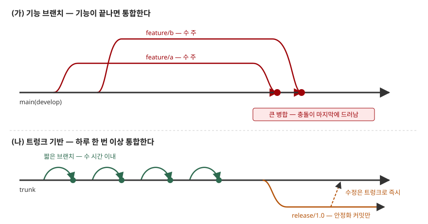

> **실행 검증 없음.** 이 글은 표준 문서와 공식 가이드의 정의·분류를 정리한 개념 글이다.
> 실행 예제가 없고, 도입 효과 수치는 싣지 않았다.

## 들어가며

형상관리 문제에서 도구 선정을 물으면 "브랜치 전략과 맞는가"가 첫 질문으로 나온다. 브랜치
전략은 도구 사용법이 아니라 **형상관리 계획의 일부**이기 때문이다. 기능을 몇 주씩 따로
개발하다 마지막에 합치는 팀과, 하루에도 여러 번 공용 줄기에 합치는 팀은 같은 Git을 쓰면서도
개발 기준선이 생기는 간격과 병합 위험이 전혀 다르다. 시험에서는 전략의 이름보다
**어떤 전략이 무엇을 바꾸는지**를 쓸 수 있는지가 점수를 가른다.

## 정의

SWEBOK V3.0은 형상관리 관점에서 **브랜치를 "진화하는 소스 파일 버전의 집합"으로, 병합을
"같은 파일에 가해진 서로 다른 변경을 합치는 것"으로** 정의한다(형상관리 계획 절, §1.3).

브랜치·병합 전략은 이 정의 위에서 **어떤 브랜치를 두고, 각 브랜치를 얼마나 오래 유지하며,
언제 어떤 검증을 거쳐 공용 줄기(mainline)에 병합하는지를 정한 규칙**이다. SWEBOK은 이
전략이 "많은 형상관리 활동에 영향을 주므로 신중히 계획하고 공유해야 한다"고 적고, 형상관리
계획서(SCMP)를 구현하는 하위 절차의 첫 예로 **"어떤 브랜치 전략을 쓸 것인가"** 를 든다(§1.4).

전략의 두 끝은 다음과 같다.

- **기능 브랜치**: 한 기능의 작업 전체를 별도 브랜치에 두고, 기능이 완성되면 통합한다
  (Fowler, Feature Branching)
- **트렁크 기반 개발**: 개발자가 작업을 작은 단위로 나눠 **하루 한 번 이상** 트렁크에
  병합한다(DORA)

## 등장 배경

브랜치는 병렬 개발을 가능하게 하지만, 갈라진 기간만큼 **병합해야 할 차이가 쌓인다.**
Fowler는 큰 병합의 문제가 작업량보다 **작업량을 예측할 수 없다는 데** 있다고 지적한다.
두 브랜치가 몇 주씩 떨어져 있으면 충돌이 마지막 통합 때 한꺼번에 드러난다.

더 까다로운 것은 **의미 충돌(semantic conflict)** 이다. 한 사람이 함수 이름을 바꾸고 다른
사람이 옛 이름으로 새 호출을 넣으면, 텍스트 병합은 성공하는데 시스템은 동작하지 않는다.
버전 관리 도구가 잡지 못하므로, Fowler는 자체 시험 코드(self-testing code)를 갖춰야 드러난다고 본다.

여기에 지속적 통합이 확산되면서 SWEBOK도 "잦은 빌드-시험-배포 주기에 맞춰 형상관리 활동을
계획해야 한다"고 적는다. 통합 주기가 짧아지면 개발 기준선이 생기는 간격도 짧아지므로,
**브랜치 전략은 곧 기준선 정책**이 된다.

## 구성요소 — 전략을 정하는 4가지 결정

Fowler의 브랜치 패턴을 결정 항목으로 묶으면 **4가지**다. 어떤 정책이든 이 넷에 답한 것이다.

| 결정 | 묻는 것 | 대표 패턴 |
|---|---|---|
| ① 공용 줄기 | 제품의 현재 상태를 나타내는 브랜치가 무엇인가 | Mainline |
| ② 통합 빈도 | 작업 브랜치를 얼마 만에 공용 줄기에 합치는가 | Feature Branching ↔ Continuous Integration |
| ③ 통합 전 검증 | 병합 전에 무엇을 통과해야 하는가 | Healthy Branch(커밋마다 자동 검사), Pre-Integration Review(병합 전 동료 검토) |
| ④ 릴리스 경로 | 운영 배포를 어디서 만드는가 | Release Branch, Release-Ready Mainline, Hotfix Branch |

②가 전략의 성격을 정하고, ③이 ②를 감당할 수 있게 하며, ④가 개발과 출시를 분리할지 정한다.

### 트렁크 기반 개발의 3가지 규칙

DORA는 트렁크 기반 개발이 갖춰졌는지를 **3가지**로 판별한다.

1. 저장소의 활성 브랜치가 **3개 이하**다
2. 브랜치를 **하루 한 번 이상** 트렁크에 병합한다. 브랜치 수명은 몇 시간을 넘지 않는다
3. **코드 동결과 통합 단계가 없다**

전제 조건도 함께 적는다. 커밋마다 수 분 안에 끝나는 자동 시험이 돌고, 빌드가 깨지면
개발자가 바로 고치며, 작업을 작은 단위로 나눌 줄 알아야 한다.

## 도식

> **출처**: [Martin Fowler, Patterns for Managing Source Code Branches (2020-05-28)](https://martinfowler.com/articles/branching-patterns.html) — Feature Branching, Continuous Integration, Release Branch 절과 [DORA — Trunk-based development](https://dora.dev/capabilities/trunk-based-development/) (브랜치 수명, 하루 1회 이상 병합, 릴리스 브랜치 변경의 트렁크 반영)을 합쳐 그렸다.

답안에는 줄기 하나와 그 위로 갈라지는 화살표만 그리면 된다. (가)는 길게 갈라져 늦게
합쳐지고, (나)는 짧게 갈라져 바로 합쳐진다. 병합 지점에 "충돌 발견 시점"을 적으면 차이가 한눈에 보인다.

## 비교 — 3가지 정책

| 구분 | git-flow | GitHub Flow | 트렁크 기반 개발 |
|---|---|---|---|
| 공용 줄기 | `develop`(개발), `master`(운영) 2개 | 기본 브랜치 1개 | 트렁크 1개 |
| 보조 브랜치 | feature·release·hotfix 3종 | 작업 브랜치 | 수 시간짜리 작업 브랜치, 필요 시 릴리스 브랜치 |
| 통합 시점 | 기능 완료 시 `develop`으로 | 리뷰 통과 후 병합 | 하루 한 번 이상 |
| 출시 경로 | release 브랜치에서 안정화 후 `master`로 | 기본 브랜치가 배포 가능 상태 | 트렁크 또는 트렁크에서 자른 릴리스 브랜치 |
| 개발 기준선 간격 | 기능 단위 | 풀 리퀘스트 단위 | 통합(빌드 통과) 단위 |
| 맞는 상황 | 여러 버전을 동시에 지원하는 패키지 제품 | 지속적 배포하는 웹 서비스 | 지속적 통합·배포, 자동 시험이 갖춰진 팀 |

git-flow의 보조 브랜치 규칙은 원문이 명시한다. feature는 `develop`에서 갈라져 `develop`으로,
release는 `develop`에서 갈라져 `develop`과 `master` 양쪽으로, hotfix는 `master`에서 갈라져
양쪽으로 합쳐진다. 제안자 Driessen은 2020년에 덧붙인 글에서 **지속적 배포하는 팀에는
GitHub Flow 같은 단순한 흐름을 권하고**, git-flow는 여러 버전을 운영에서 지원해야 하는
소프트웨어에 맞는다고 밝혔다.

GitHub Flow는 GitHub 문서가 **6단계**로 적는다. 브랜치 생성 → 변경 → 풀 리퀘스트 생성 →
리뷰 반영 → 병합 → 브랜치 삭제.

## 적용 시 고려사항

- **자동 시험이 통합 빈도의 상한을 정한다.** 커밋마다 수 분 안에 도는 시험이 없으면 하루
  여러 번 병합은 깨진 트렁크를 하루 여러 번 만드는 일이 된다. 트렁크 기반을 택하기 전에
  Healthy Branch(③)부터 갖춘다.
- **리뷰 방식이 통합 빈도와 맞아야 한다.** DORA는 승인을 여럿 요구하는 무거운 리뷰와
  비동기 리뷰를 흔한 실패 원인으로 든다. 병합이 리뷰 대기에 묶이면 브랜치가 다시 길어진다.
- **미완성 기능은 브랜치 대신 코드로 숨긴다.** 짧게 통합하면 덜 만든 기능이 줄기에 들어간다.
  Fowler는 사용자 화면을 마지막에 연결하거나 기능 플래그로 가리는 방법을 든다. 플래그는
  그 자체가 관리 대상이므로 제거 시점을 정해 둔다.
- **지원할 버전 수를 먼저 센다.** 운영 중인 버전이 하나면 릴리스 브랜치가 거의 필요 없고,
  여럿이면 버전마다 릴리스·핫픽스 경로가 필요하다. 이 수가 git-flow와 트렁크 기반 사이의 선택을 가른다.
- **도구와 기준선 저장소를 전략에 맞춘다.** SWEBOK은 도구 선정 질문에 "계획한 브랜치·병합
  전략과 호환되는가"를 넣는다. 분산 버전 관리에서는 어느 저장소의 어느 브랜치가 기준선인지,
  누가 그곳에 병합할 수 있는지를 SCMP에 적어야 통제가 실제로 걸린다.

## 정리

- 정의: 브랜치는 **진화하는 버전의 집합**, 병합은 **서로 다른 변경의 결합**. 전략은 그
  브랜치의 종류·수명·병합 규칙이며 **SCMP에서 정한다**(SWEBOK).
- 전략의 4결정 **"줄·빈·검·출"** — 공용 줄기, 통합 빈도, 통합 전 검증, 출시 경로.
- 트렁크 기반 3규칙 **"3·1·0"** — 활성 브랜치 3개 이하, 하루 1회 이상 병합, 코드 동결 0.
- git-flow는 **2+3** — 주 브랜치 2개(`master`·`develop`), 보조 3종(feature·release·hotfix).
- 통합 빈도가 높을수록 병합은 작아지고, **개발 기준선은 촘촘해진다.**

> 기출 답안: [기출문제 — 소프트웨어 형상관리의 절차, 기준선, 도구](../../exam/2026-10-06-software-configuration-management-baseline-tools/index.md)
>
> 개념 정리: [형상관리 — 4대 활동과 베이스라인](../2026-09-22-configuration-management-baseline/index.md)

## 참고 자료

- [SWEBOK Guide V3.0 — Chapter 6. Software Configuration Management (IEEE Computer Society, 2014)](https://ieeecs-media.computer.org/media/education/swebok/swebok-v3.pdf) — §1.3 Planning for SCM(브랜치·병합 정의, 지속적 통합), §1.3.3 도구 선정, §1.4 SCM Plan
- [ISO/IEC TR 19759:2016 — Software Engineering Body of Knowledge (SWEBOK)](https://www.iso.org/standard/67604.html)
- [DORA — Capabilities: Trunk-based development](https://dora.dev/capabilities/trunk-based-development/)
- [Martin Fowler — Patterns for Managing Source Code Branches (2020-05-28)](https://martinfowler.com/articles/branching-patterns.html)
- [Vincent Driessen — A successful Git branching model (2010-01-05, 2020-03-05 덧붙임)](https://nvie.com/posts/a-successful-git-branching-model/)
- [GitHub Docs — GitHub flow](https://docs.github.com/en/get-started/using-github/github-flow)
- [Pro Git 2판 — 3.4 Branching Workflows (Scott Chacon, Ben Straub)](https://git-scm.com/book/en/v2/Git-Branching-Branching-Workflows)
