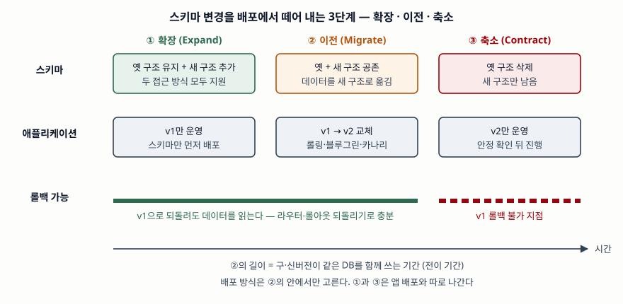

> 실행 검증 없음. Kubernetes API 레퍼런스(v1.37), Google SRE Workbook의 카나리 장,
> Martin Fowler 사이트의 블루그린·병행 변경·진화적 DB 설계 글을 근거로 정리했다.

## 들어가며

배포 방식 문제는 롤링·블루그린·카나리 세 이름을 쓰는 것으로 시작하지만, 그것만으로는 점수가
갈리지 않는다. 실무에서 무중단 배포가 실패하는 지점은 대개 트래픽 전환이 아니라
**데이터베이스**다. 컬럼 하나를 바꾼 신버전을 블루그린으로 올렸다가 문제가 생겨 라우터를
되돌리면, 구버전이 바뀐 스키마를 읽지 못해 롤백 자체가 장애가 된다. 그래서 이 개념은
**트래픽을 어떻게 옮기는가**와 **그 동안 데이터를 어떻게 양쪽 버전에 맞추는가**를 함께 써야 완성된다.

## 정의

**무중단 배포(Zero-Downtime Deployment)** 는 새 버전을 운영 환경에 올리는 동안 요청을 받는
인스턴스가 항상 남도록 교체 순서와 트래픽 경로를 제어해, 서비스 중단 없이 버전을 바꾸는 배포 방식이다.

세부 방식의 정의는 각 1차 자료를 따른다.

- **롤링 업데이트** — 옛 레플리카 집합을 점진적으로 줄이고 새 집합을 늘려 교체한다(Kubernetes Deployment 명세)
- **블루그린** — 동일한 운영 환경 두 벌 중 하나만 서비스하고, 다른 쪽에 새 버전을 올려 마지막 시험을 한 뒤 라우터로 트래픽을 넘긴다(Fowler, 2010)
- **카나리** — 서비스 변경을 **일부에, 정해진 시간 동안만** 배포하고 평가해 전체 배포 여부를 정하는 것이다(SRE Workbook)
- **병행 변경(확장-축소)** — 하위 호환이 깨지는 인터페이스 변경을 **확장 → 이전 → 축소 3단계**로 나눠 안전하게 하는 기법이다(Sato, 2014)

## 등장 배경

무중단 배포 이전의 기본형은 **재생성(Recreate)** 이다. Kubernetes 명세는 이를 "새 파드를 만들기 전에
기존 파드를 모두 종료한다"로 정의한다. 문제는 두 가지다.

1. **교체 구간에 요청을 받을 인스턴스가 없다.** 배포 시간이 곧 중단 시간이다
2. **롤백이 재배포다.** 구버전을 처음부터 다시 올려야 하므로 장애 시간만큼 복구 시간이 길다

무중단 배포는 두 문제를 **배포와 롤백을 트래픽 경로의 변경으로 바꿔** 푼다. 그러자 새 문제가 생겼다.
교체 동안 구버전과 신버전이 **같은 데이터베이스를 동시에** 읽고 쓴다. 스키마 변경이 앱 배포와 함께
나가면 이 기간에 한쪽 버전이 깨진다. 확장-축소는 이 문제에 대한 답으로 함께 다뤄진다.

## 구성요소

### 트래픽 전환 방식 — 3가지

**① 롤링** — Kubernetes Deployment의 기본 전략이다. 두 값이 속도와 여유를 정한다.

| 필드 | 뜻 | 기본값 | 백분율 환산 |
|---|---|---|---|
| `maxSurge` | 원하는 개수보다 더 띄울 수 있는 파드 수 | 25% | 올림 |
| `maxUnavailable` | 교체 중 사용 불가로 둘 수 있는 파드 수 | 25% | 내림 |

명세는 둘을 동시에 0으로 둘 수 없다고 정한다. 레플리카 10개면 `maxSurge`는 2.5를 올린 3,
`maxUnavailable`은 2.5를 내린 2이므로 교체 중 파드는 **최소 8개, 최대 13개**다.
이 밖에 롤링의 안전을 정하는 필드가 셋 있다.

- `minReadySeconds`(기본 0) — 새 파드가 컨테이너 충돌 없이 이 시간만큼 준비 상태를 유지해야 "사용 가능"으로 센다
- `progressDeadlineSeconds`(기본 600초) — 이 시간 안에 진행이 없으면 `ProgressDeadlineExceeded` 조건을 상태에 남긴다. **자동으로 되돌리지는 않는다**
- `revisionHistoryLimit`(기본 10) — 롤백에 쓸 옛 레플리카 집합을 몇 개 남길지

**② 블루그린** — 라우터 한 번으로 전환하고, 문제가 생기면 라우터를 되돌린다. Fowler는 쉬는 쪽 환경이
다음 릴리스의 스테이징이 되고, 같은 전환 장치가 핫 스탠바이와 같으므로 **배포 때마다 재해 복구 절차를
시험하는 셈**이라고 적는다. 대가는 전환 기간의 자원 두 벌이다.

**③ 카나리** — 일부 트래픽만 신버전에 보내고, 같은 기간 구버전을 받는 대조군과 지표를 비교한다.

### 데이터 변경 — 확장 · 이전 · 축소 3단계

1. **확장** — 옛 구조를 그대로 두고 새 구조를 **추가만** 한다. 이 시점 스키마는 두 접근 방식을 모두 지원한다
2. **이전** — 클라이언트를 옛 방식에서 새 방식으로 점진적으로 옮긴다. DB에서는 앱 v1 → v2 교체와 데이터 이전이 이 단계다
3. **축소** — 옛 구조를 지운다. 이 순간부터 v1으로는 되돌릴 수 없다

Sadalage와 Fowler는 DB가 옛 접근과 새 접근을 함께 지원하는 기간을 **전이 기간(transition phase)** 이라
부르고, 테이블 이름을 바꿀 때 옛 이름의 뷰를 남겨 기존 앱이 그대로 쓰게 하는 예를 든다.
Fowler의 블루그린 글도 같은 순서를 권한다 — 스키마를 먼저 양쪽 버전을 지원하게 바꿔 배포하고,
앱을 배포한 뒤, 안정을 확인하고 옛 버전 지원을 지운다. Sato는 카나리와 블루그린이 구·신 코드를 나란히
돌려 사용자를 점진적으로 옮긴다는 점에서 **같은 병행 변경 패턴을 배포에 적용한 것**이라고 쓴다.

예를 들어 `name` 컬럼을 `first_name`·`last_name`으로 나누려면(글쓴이가 만든 예다) 확장에서 두 컬럼을 추가하고,
v2를 배포해 새 컬럼을 쓰게 하면서 기존 행을 채우고, v1 인스턴스가 하나도 남지 않고 롤백할 일도 없다고
판단한 뒤에 `name`을 지운다.

### 카나리 판정 — 4가지 조건

SRE Workbook의 카나리 장에서 판정을 자동화할 때의 조건을 추리면 4가지다.

1. **대조군과 비교한다.** 서비스 전체 평균이 아니라 같은 기간 구버전을 받는 대조군과 맞대어 본다
2. **지표는 사용자 영향을 나타내는 것으로, 많아야 열두 개 안팎으로.** HTTP 오류 코드와 지연이 CPU 사용률보다 낫고, 변경과 무관하게 흔들리는 지표는 뺀다
3. **충분히 크고 충분히 길게.** 대표적인 트래픽을 담을 만큼 커야 하고, 한가한 시간대만으로 판정하지 않는다. 배치처럼 대화형이 아닌 시스템은 작업 단위 하나가 끝날 만큼 길게 잡는다
4. **공유 의존성을 의심한다.** 카나리와 대조군이 백엔드·캐시를 함께 쓰면 카나리의 나쁜 동작이 대조군 지표까지 끌어내린다. 그래서 비교 지표와 함께 SLO 같은 절대 기준도 본다

카나리 오류율이 대조군에서 너무 멀어지면 배포를 멈추고 되돌린다. 이 판정을 릴리스 파이프라인에 넣는 것이 권고다.

## 도식

> **출처**: [D. Sato, ParallelChange (2014-05-13)](https://martinfowler.com/bliki/ParallelChange.html) · [P. Sadalage, M. Fowler, Evolutionary Database Design — Transition phase (2016-05)](https://martinfowler.com/articles/evodb.html) · [M. Fowler, BlueGreenDeployment (2010-03-01)](https://martinfowler.com/bliki/BlueGreenDeployment.html)

답안지에는 세 칸 두 줄(스키마·앱)과 아래 롤백 띠만 그린다. 핵심은 **배포 방식이 ② 안에 들어간다**는 것과
**③ 이후 롤백 불가**를 색으로 구분하는 것이다.

## 비교

### 3가지 방식

| 구분 | 재생성 (비교용) | ① 롤링 | ② 블루그린 | ③ 카나리 |
|---|---|---|---|---|
| 전환 단위 | 전체 일괄 | 인스턴스 몇 개씩 | 환경 전체, 한 번에 | 트래픽 비율 단계별 |
| 추가 자원 | 없음 | `maxSurge` 만큼 | 환경 1벌 (전환 기간) | 카나리 인스턴스 |
| v1·v2 동시 응답 | 없음 | 있음 (교체 중) | 전환 시점 외 없음 | 있음 (의도적) |
| 롤백 | 재배포 | 역방향 롤링 | 라우터 되돌리기 | 카나리 트래픽 회수 |
| 장애 영향 범위 | 전체 | 교체된 비율만큼 | 전환 후 전체 | 카나리 비율만큼 |
| 판정 근거 | 없음 | 준비 상태 검사 | 전환 전 Green 시험 | 대조군 대비 지표 |

세 방식은 배타적이지 않다. SRE Workbook은 블루그린의 두 환경에 동시에 배포하고 트래픽을 조금씩 옮기면
카나리 원칙을 그대로 적용할 수 있다고 적는다.

### 혼동하기 쉬운 개념

| 비교 | 카나리 배포 | A/B 테스트 | 기능 토글 |
|---|---|---|---|
| 묻는 것 | 신버전이 **안전한가** | 어느 안이 **사업 지표에 나은가** | 기능을 **언제 누구에게** 켤까 |
| 나누는 대상 | 배포된 바이너리 | 사용자 경험 | 코드 경로 |
| 성격 | 배포 방식 | 실험 설계 | 출시 제어 (배포와 출시의 분리) |

기능 토글은 코드를 꺼진 상태로 배포해 두고 노출을 따로 켜는 기법이다(Hodgson, 2017). 배포 방식이 아니라
**배포와 출시를 떼어 놓는 수단**이므로 위 3가지와 같은 줄에 두지 않는다.

## 적용 시 고려사항

1. **롤백할 수 없는 변경을 앱 배포에 섞지 않는다.** 컬럼 삭제·의미 변경은 축소 단계로 미뤄 따로 나간다.
   블루그린의 빠른 롤백은 데이터가 양쪽 버전과 호환될 때만 성립한다.
2. **전이 기간의 길이를 정해 둔다.** Sadalage와 Fowler는 조직에 따라 전이 기간이 몇 달에서 몇 년까지
   간다고 적는다. 축소를 미루면 옛 구조가 쌓이므로 축소 시점을 배포 계획에 넣는다.
3. **자동화가 어디까지인지 안다.** Kubernetes의 진행 기한 초과는 상태 조건을 남길 뿐 되돌리지 않는다.
   카나리 판정과 자동 롤백은 파이프라인이나 별도 도구가 맡아야 한다.
4. **세션과 장기 연결을 처리한다.** 세션을 서버 메모리에 두거나 오래 붙는 연결이 있으면 교체된 인스턴스에서
   사용자가 끊긴다. 세션은 외부 저장소로 빼고, 내릴 인스턴스는 처리 중인 요청을 끝낸 뒤 종료한다.

## 정리

암기 단서는 **"방식 3 · 확장-이전-축소 3 · 카나리 판정 4"**다.

- 롤링(몇 개씩, `maxSurge` 올림·`maxUnavailable` 내림, 기본 25%) · 블루그린(라우터 한 번, 자원 두 벌) · 카나리(일부·한시·평가)
- 확장 → 이전 → 축소. 배포 방식은 **이전 단계 안**에서 고르고, **축소 뒤에는 롤백 불가**
- 카나리 판정: 대조군 비교 · 사용자 영향 지표 열두 개 안팎 · 충분한 크기와 기간 · 공유 의존성 경계
- 카나리는 안전성, A/B는 사업 지표, 기능 토글은 출시 제어

> 개념 연결: [DevOps 파이프라인 구성요소와 DORA 지표 — 지표마다 재는 구간](../2026-10-03-devops-pipeline-dora-metrics/index.md) — 배포 뒤 변경 실패율·실패 배포 복구 시간을 재는 자리
>
> 개념 연결: [브랜치·병합 전략 — 트렁크 기반 개발과 기능 브랜치](../2026-10-06-branching-merging-strategy-trunk-feature/index.md)

> 기출 답안: [기출문제 — 소프트웨어 무중단 배포 방식: 롤링·블루그린·카나리](../../exam/2026-10-09-zero-downtime-deployment-strategies/index.md)

## 참고 자료

- [Kubernetes API Reference — Deployment v1 apps (v1.37)](https://kubernetes.io/docs/reference/kubernetes-api/workload-resources/deployment-v1/) — `Recreate`·`RollingUpdate` 정의, `maxSurge`·`maxUnavailable` 기본값과 반올림, `minReadySeconds`·`progressDeadlineSeconds`·`revisionHistoryLimit`
- [Kubernetes Documentation — Deployments (v1.37)](https://kubernetes.io/docs/concepts/workloads/controllers/deployment/) — 롤아웃·롤백·일시 정지
- [Google SRE Workbook, Ch.16 Canarying Releases (O'Reilly, 2018)](https://sre.google/workbook/canarying-releases/) — 카나리 정의, 대조군 비교, 지표 선택, 의존성과 격리, 블루그린과의 관계
- [M. Fowler, BlueGreenDeployment (2010-03-01)](https://martinfowler.com/bliki/BlueGreenDeployment.html) — 라우터 전환·롤백, 스키마 변경을 앱 배포와 분리, 재해 복구 시험
- [D. Sato, ParallelChange (2014-05-13)](https://martinfowler.com/bliki/ParallelChange.html) — 확장·이전·축소 3단계, 카나리·블루그린과의 관계
- [P. Sadalage, M. Fowler, Evolutionary Database Design (2016-05)](https://martinfowler.com/articles/evodb.html) — 전이 기간, 다중 버전 지원
- [P. Hodgson, Feature Toggles (aka Feature Flags) (2017-10-09)](https://martinfowler.com/articles/feature-toggles.html) — 배포와 출시의 분리
