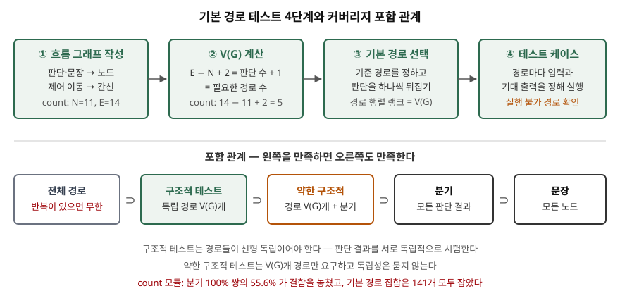

> 4단계 절차와 결함 검출 비교를 NIST 문서의 예제 모듈 `count`를 파이썬으로 옮겨
> 검산했다. 계산 기록은 [code/output.txt](code/output.txt)에 있다. 정의와 절차는
> NIST SP 500-235를 근거로 했다.

## 들어가며

순환복잡도는 소프트웨어 공학 과목의 단골이지만, 공식 `E − N + 2`만 쓰면 그 숫자를
어디에 쓰는지가 빠진다. 그 숫자의 쓸모가 기본 경로 테스트다. V(G)가 곧 **테스트해야 할
경로의 수**가 되고, 어떤 경로를 고를지는 정해진 절차가 있다. 실무에서는 "분기 커버리지
100%"가 단위 테스트 완료 기준으로 자주 쓰이는데, 이 글은 그 기준이 판단끼리의 상호작용에서
생기는 결함을 놓치는 경우를 숫자로 보인다.

## 정의

NIST SP 500-235의 구조적 테스트 기준(5.1절)은 **모듈마다 제어 흐름 그래프의 기본 경로
집합을 테스트한다**는 것이다. 기본 경로 집합은 서로 선형 독립이면서 그 선형 결합으로 모든
경로를 만들어 내는 경로들이고, 그 개수가 V(G)다(2.3절).

답안 첫 줄은 이렇게 끊는다. **기본 경로 테스트는 제어 흐름 그래프에서 V(G)개의 선형 독립
경로를 골라, 모든 판단 결과를 서로 독립적으로 실행하는 화이트박스 테스트 기법이다.**

용어 하나를 구분한다. **기본 경로 테스트(basis path testing)** 는 구조적 테스트의 다른
이름으로 "기본 경로 집합을 시험하라"는 기준이다. **기준 경로 방법(baseline method)** 은
그 집합을 만드는 절차 중 하나다(6장 도입부). 기준과 절차는 다르다.

## 등장 배경

문장·분기 커버리지는 **테스트 양이 복잡도에 비례하지 않는다.** NIST 문서(5.2절)는
반복문 하나가 임의로 복잡한 코드를 감싸면 그 안을 여러 번 돌려 모든 문장과 분기를 테스트
하나로 덮을 수 있다고 지적한다. 반대로 전체 경로 테스트는 반복이 있으면 경로가 무한해
이론상으로도 끝나지 않는다.

McCabe(1976)는 그래프 이론의 순환수로 그 사이의 기준을 만들었다. 경로를 간선 통과 횟수
벡터로 보면, 아무리 많은 경로를 모아도 랭크는 V(G)를 넘지 않는다. **V(G)개를 넘는 경로는
기본 경로의 선형 결합이므로 중복**이고, V(G)개보다 적으면 독립적으로 시험되지 않은 판단이
반드시 남는다(5.1절).

## 절차 — 4단계

| 단계 | 할 일 | 산출물 |
|---|---|---|
| ① 흐름 그래프 작성 | 판단·문장 묶음을 노드로, 제어 이동을 간선으로 그린다 | 노드 N, 간선 E |
| ② V(G) 계산 | `E − N + 2` 또는 `판단 수 + 1` | 필요한 경로 수 |
| ③ 기본 경로 선택 | 기준 경로를 정하고 판단 결과를 하나씩 뒤집는다 | 경로 V(G)개, 랭크 = V(G) |
| ④ 테스트 케이스 도출 | 경로마다 그 경로를 타는 입력과 명세상 기대 출력을 정한다 | 입력·기대 출력 쌍 |

③의 기준 경로 방법(6.3절)은 다음 순서로 진행된다.

1. **기준 경로**를 고른다. 오류 처리 경로가 아니라 모듈의 대표 기능을 타는 경로가 좋다.
2. 기준 경로의 **첫 번째 판단 결과만 뒤집고**, 나머지는 기준 경로에 다시 합류해 끝까지
   따른다. 두 번째, 세 번째 판단도 같은 방식으로 하나씩 뒤집는다.
3. 기준 경로의 판단을 다 뒤집었으면, 새로 생긴 경로에 처음 나타난 판단을 같은 방식으로
   뒤집는다. 모든 판단을 한 번씩 뒤집으면 끝난다.

반복 때문에 같은 판단을 다시 만나도 별개의 판단으로 세지 않는다(6.4절).

## 도식



> **출처**: [A. H. Watson, T. J. McCabe, NIST SP 500-235 Structured Testing §2.2 Definition of cyclomatic complexity, §5.1 The structured testing criterion, §5.2 Intuition behind structured testing, §5.5 Weak structured testing, §6.3 The baseline method in practice (1996)](https://www.mccabe.com/pdf/mccabe-nist235r.pdf) — 아래 줄의 수치는 [code/output.txt](code/output.txt)의 계산 결과다

답안지에는 위 네 칸과 아래 포함 관계 사슬만 그리면 된다.

## 동작 — count 모듈로 4단계 따라가기

`count`는 NIST 문서 5.4절의 예제다. 문자열이 `A`로 시작하면 `C`의 개수를, 아니면 −1을
돌려줘야 하는데, `B`와 `C`를 알아보는 두 분기의 본문이 뒤바뀌어 `B`를 센다.

**①②** 판단 4개(`=A`, `=B`, `=C`, `!=NUL`)와 노드 11개, 간선 14개로 그래프가 나온다.
`14 − 11 + 2 = 5`, `4 + 1 = 5`다. 길이 0~4 문자열 341개를 전부 넣으면 서로 다른 경로가
21개 나오지만, 그 21개의 랭크는 5에서 멈춘다.

**③** 대표 기능을 타는 `AB`를 기준 경로로 두고 판단을 하나씩 뒤집었다.

```text
  경로 1: 입력 'AB'    기준 경로              =AT =BT =BF =CF !=NULF
  경로 2: 입력 ''      =A 를 F 로 뒤집음       =AF
  경로 3: 입력 'A'     =B 를 F 로 뒤집음       =AT =BF =CF !=NULF
  경로 4: 입력 'ABC'   =C 를 T 로 뒤집음       =AT =BT =BF =CT =BF =CF !=NULF
  경로 5: 입력 'ABA'   !=NUL 를 T 로 뒤집음    =AT =BT =BF =CF !=NULT =BF =CF !=NULF
  경로 5개의 랭크 5  (V(G) 와 같으면 기본 경로 집합)
```

NIST 문서의 그림 6-2는 경로 2·5에 `X`·`ABX`를 쓴다. 판단 결과가 같으므로 같은 경로다.

**④** 명세대로 기대 출력을 정해 실행하면 `AB`(기대 0, 실제 1)와 `ABA`(기대 0, 실제 1)에서
결함이 드러난다.

**분기 커버리지와 비교한다.** NIST 문서 그림 5-4의 두 입력 `X`, `ABCX`는 판단 결과 8개와
노드 11개를 모두 지나지만 둘 다 통과하고, 경로 랭크는 2다. 길이 0~5 문자열 1,365개로
만든 쌍 가운데 분기 커버리지 100%인 쌍은 110,592개였고, 그중 61,440개(55.6%)가 결함을
놓쳤다. 길이 0~3 입력이 만드는 서로 다른 경로 11개로 짤 수 있는 기본 경로 집합 141개는
**하나도 빠짐없이** 결함을 잡았다. `B`와 `C`를 세는 판단을 독립적으로 시험하려면 `B`와
`C`의 개수가 다른 입력이 반드시 들어가기 때문이다.

**실행 불가능한 경로**도 확인했다. 같은 값을 `n<0`, `n==0`, `n>0`으로 세 번 묻는
`classify`는 V(G) = 4지만 어떤 입력이든 참이 정확히 하나라 경로가 3개뿐이고 랭크도
3이다. `if-elif-else`로 고치면 V(G)가 3이 되어 기준과 실제가 일치한다.

## 비교

| 기준 | 요구 | 테스트 수 | count에서 |
|---|---|---|---|
| 문장 커버리지 | 모든 노드 실행 | 복잡도와 무관 | `X`·`ABCX`로 충족, 결함 못 찾음 |
| 분기 커버리지 | 모든 판단 결과 실행 | 복잡도와 무관 | 같은 2개로 충족, 결함 못 찾음 |
| 약한 구조적 테스트 | 경로 V(G)개 + 분기 커버리지 | V(G) 이상 | 판단 결과의 독립 시험은 요구하지 않음(5.5절) |
| 구조적(기본 경로) 테스트 | 선형 독립 경로 V(G)개 | 정확히 V(G) | 141개 집합 모두 결함 발견 |
| 전체 경로 | 모든 경로 | 반복이 있으면 무한 | 길이 4까지만 21개, 길이 제한 없으면 끝없음 |

포함 관계는 `전체 경로 ⊃ 구조적 ⊃ 약한 구조적 ⊃ 분기 ⊃ 문장`이다. 기본 경로 집합은 모든
간선과 노드를 지나므로 분기·문장 커버리지를 자동으로 충족한다(5.2절). 약한 구조적
테스트는 구조적 테스트에 포함되지만 그 역은 아니다(5.5절).

## 적용 시 고려사항

- **실행 불가능한 경로가 있으면 기준을 실현 가능한 최대 랭크로 낮춘다.** 판단끼리 데이터로
  묶여 있으면 어떤 입력으로도 V(G)개를 채울 수 없다. NIST 문서(9.1절)는 이를 실현 가능
  복잡도로 부르고, 계산 자체는 결정 불가능하다고 적는다. 먼저 코드를 고쳐 불필요한
  판단을 없애는 것이 낫다 — `classify`가 그 예다.
- **처음부터 기본 경로로 짜기보다 기능 테스트를 먼저 돌리고 모자란 경로만 채운다.**
  기능 테스트의 경로를 행렬에 넣고, 기준 경로 방법으로 만든 후보 중 랭크를 올리는 것만
  추가한다(6.5절). 위 검산에서 `X`, `ABCX`에 `AB`, `A`, `ABC` 세 개를 더해 랭크 5가
  됐다. 추가 수는 항상 `V(G) − 기존 랭크`다.
- **경로의 독립성은 사람이 눈으로 확인하기 어렵다.** 합류 규칙을 어기고 경로를 자유롭게
  고르면 선형 종속이 생겨 약한 구조적 테스트로 떨어진다(6.3절). 경로 추적과 랭크 계산을
  도구로 확인한다.
- **기본 경로 테스트는 명세 기반 테스트를 대신하지 않는다.** 코드에 없는 기능(빠뜨린
  요구사항)은 어떤 경로에도 나타나지 않는다. NIST 문서도 이 기법을 블랙박스 테스트의
  보완으로 둔다(5장 도입부).

> 기출 답안: [기출문제 — 맥케이브 순환복잡도](../../exam/2026-10-10-mccabe-cyclomatic-complexity/index.md)

## 정리

- 절차 **4단계: 그래프 → V(G) → 기본 경로 → 케이스.** 암기 단서는 "**그·계·선·도**"(그리고, 계산하고, 선택하고, 도출한다).
- 기준 경로 방법 **3규칙**: 대표 기능 경로를 기준으로, 판단 하나만 뒤집고 다시 합류, 새 경로의 새 판단도 뒤집기.
- 포함 관계 **5단: 전체 경로 ⊃ 구조적 ⊃ 약한 구조적 ⊃ 분기 ⊃ 문장.** 구조적 테스트만 판단 결과를 독립적으로 시험한다.

## 참고 자료

- [A. H. Watson, T. J. McCabe, NIST Special Publication 500-235, Structured Testing: A Testing Methodology Using the Cyclomatic Complexity Metric (1996)](https://www.mccabe.com/pdf/mccabe-nist235r.pdf) — §2.3 기본 경로 집합과 랭크, §5.1 구조적 테스트 기준, §5.2 분기·문장 커버리지 포함, §5.4 예제 모듈 count, §5.5 약한 구조적 테스트, §6.2~6.5 기준 경로 방법, §9.1 실제 복잡도와 실현 가능 복잡도 (1차)
- [T. J. McCabe, A Complexity Measure, IEEE Transactions on Software Engineering SE-2(4), pp. 308–320 (1976)](https://doi.org/10.1109/TSE.1976.233837) — 순환복잡도 원 논문 (1차)
