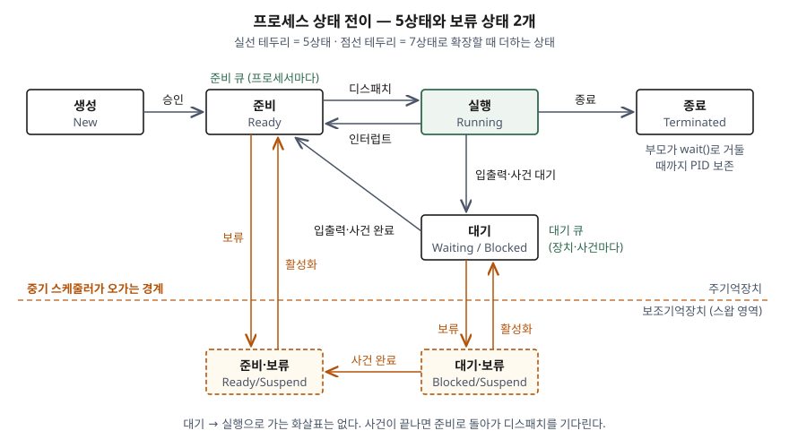

> **실행 검증 없음.** 운영체제 교재와 표준·매뉴얼의 정의를 정리한 개념 글이다.
> 출력·측정값은 싣지 않는다.

## 들어가며

프로세스 상태 전이는 운영체제 문항의 바탕이다. 좀비·고아 프로세스, 문맥 교환,
CPU 스케줄링 문제가 전부 이 도식 위에서 설명된다. 좀비 답안에서 "종료했는데 왜 아직
남아 있는가"를 쓰려면 종료 상태가 따로 있다는 사실부터 깔아야 하고, 스케줄링 답안에서
"누가 무엇을 고르는가"를 쓰려면 준비 큐와 대기 큐가 갈라져 있다는 사실이 먼저 필요하다.
실무에서는 `ps`와 `top`이 찍는 상태 문자를 읽는 기준이 된다.

## 정의

**프로세스 상태 전이 모델**: 실행 중인 프로그램(프로세스)이 수명 동안 거치는 상태와,
상태 사이를 옮기는 사건을 유향 그래프로 나타낸 모델이다.

Silberschatz 교재는 상태를 **5가지**로 정의한다.

| 상태 | 교재 정의 |
|---|---|
| 생성 New | 프로세스가 막 만들어졌다 |
| 준비 Ready | 실행할 수 있으나 프로세서 배정을 기다린다 |
| 실행 Running | 명령어가 실행되고 있다 |
| 대기 Waiting | 어떤 사건이 일어나기를 기다리며, 프로세서를 쓸 수 없다 |
| 종료 Terminated | 실행을 마쳤다 |

교재마다 이름이 다르다. Stallings는 대기를 **Blocked**, 종료를 **Exit**로 쓴다.
답안에서는 한쪽 이름으로 통일하되 괄호로 다른 이름을 붙여 두면 채점자가 어느 교재로
배웠든 읽힌다.

## 등장 배경

다중 프로그래밍 이전에는 프로그램 하나가 끝날 때까지 CPU를 쥐고 있었으므로
"실행 중이냐 아니냐"만 구분하면 됐다. 여러 프로세스를 메모리에 올려 번갈아 돌리기
시작하면서 **실행하지 않고 있는 프로세스를 두 부류로 나눌 필요**가 생겼다.
CPU만 주면 바로 돌 수 있는 프로세스와, CPU를 줘도 입출력이 끝나기 전에는 진행할 수
없는 프로세스다. 둘을 한 목록에 섞으면 스케줄러가 매번 목록을 훑으며 돌 수 있는 것을
골라내야 한다. 준비와 대기를 가른 것은 이 선별 비용을 없애기 위해서다.

이어서 메모리가 모자라는 문제가 붙었다. 메모리에 올린 프로세스가 전부 입출력을
기다리면 CPU가 논다. Stallings는 이때 일부 프로세스를 디스크로 내보내고 새 프로세스를
들이는 **보류(suspend)** 상태를 더해 모델을 7상태로 늘린다.

## 구성요소 — 5상태, 전이 6가지, 큐 2종류

**전이 6가지**는 Silberschatz의 상태 전이도에 붙은 사건 이름을 그대로 따른다.

| 전이 | 사건 | 담당 |
|---|---|---|
| 생성 → 준비 | 승인(admitted) | 장기 스케줄러 |
| 준비 → 실행 | 스케줄러 디스패치 | 단기 스케줄러 |
| 실행 → 준비 | 인터럽트 (시간 할당량 만료 포함) | 커널 |
| 실행 → 대기 | 입출력 또는 사건 대기 | 프로세스 자신 (시스템 호출) |
| 대기 → 준비 | 입출력 또는 사건 완료 | 인터럽트 처리기 |
| 실행 → 종료 | 종료(exit) | 프로세스 자신 |

**대기에서 실행으로 곧바로 가는 전이는 없다.** 사건이 끝난 프로세스는 준비로 돌아가
다시 디스패치를 기다린다. 사건이 끝났다고 CPU를 바로 넘기면 단기 스케줄러가
우선순위를 비교할 기회가 사라지기 때문이다.

**큐는 2종류**다. 교재는 준비 큐를 "주기억장치에 있고 실행 준비가 된 프로세스의 집합",
대기 큐를 "입출력 같은 사건을 기다리는 프로세스의 집합"으로 정의하고, 준비 큐는
프로세서마다, 대기 큐는 **장치마다** 하나씩 둔다. 대기 큐를 사건별로 나누는 이유는
사건이 끝났을 때 커널이 깨울 대상을 전체에서 찾지 않고 그 큐에서만 꺼내면 되기
때문이다. 전이는 결국 **PCB를 한 큐에서 다른 큐로 옮기는 일**이다.

**7상태 확장** — Stallings는 보류 상태 **2개**를 더한다.

- **준비·보류(Ready/Suspend)**: 디스크에 있고, 메모리에 올라오면 바로 실행할 수 있다
- **대기·보류(Blocked/Suspend)**: 디스크에 있고, 사건도 아직 끝나지 않았다

보류와 활성화를 오가는 것은 **중기 스케줄러**다. 대기·보류에 있던 프로세스의 사건이
끝나면 메모리로 올라오지 않은 채 준비·보류로 옮겨 간다. Stallings는 보류 사유를
**5가지**로 든다 — 스와핑, 운영체제가 문제를 의심한 경우, 사용자 요청(디버깅 등),
주기 실행 프로세스의 다음 주기 대기, 부모 프로세스의 요청이다.

## 도식

> **출처**: 5상태와 전이 사건 이름은 [Silberschatz et al., *Operating System Concepts* 10th ed., Ch.3 Process State · Process State Transition Diagram · Ready and Wait Queues 슬라이드](https://www.cs.hunter.cuny.edu/~sweiss/course_materials/csci340/slides/chapter03.pdf) · 보류 상태 2개와 보류·활성화 전이는 [Stallings, *Operating Systems: Internals and Design Principles* §3.2 Figure 3.9(b)](https://www.pearson.com/en-us/subject-catalog/p/operating-systems-internals-and-design-principles/P200000003446) · 종료 상태에서 남는 정보는 [POSIX.1-2024 §3.426 Zombie Process](https://pubs.opengroup.org/onlinepubs/9799919799/basedefs/V1_chap03.html)

답안지에는 윗줄에 생성·준비·실행·종료 네 칸, 실행 아래에 대기 한 칸을 먼저 그린다.
그게 5상태다. 7상태를 묻는 문제면 점선을 하나 긋고 그 아래에 보류 두 칸을 더한다.

## 비교

### 5상태 · 7상태 · 리눅스 상태 문자

리눅스는 교재 모델과 상태를 다르게 나눈다. `/proc/[pid]/stat`의 상태 문자를 기준으로
대응시키면 다음과 같다.

| 교재 5상태 | 7상태에서 더해지는 것 | 리눅스 상태 문자 (`proc_pid_stat(5)`) |
|---|---|---|
| 생성 | 생성 → 준비·보류로 바로 갈 수 있다 | 대응하는 문자 없음 |
| 준비 | 준비 ↔ 준비·보류 | `R` (실행과 구분하지 않는다) |
| 실행 | 실행 → 준비·보류 | `R` |
| 대기 | 대기 ↔ 대기·보류 | `S` 인터럽트 가능 대기, `D` 인터럽트 불가 디스크 대기 |
| 종료 | 변화 없음 | `Z` 좀비, `X` 소멸 |
| — | — | `T` 시그널로 정지, `t` 추적 정지 |

### 스케줄러 3종

| 구분 | 장기 스케줄러 | 중기 스케줄러 | 단기 스케줄러 |
|---|---|---|---|
| 담당 전이 | 생성 → 준비 | 보류 ↔ 활성화 | 준비 → 실행 |
| 결정하는 것 | 다중 프로그래밍 정도 | 메모리에 올려 둘 프로세스 | 다음에 CPU를 쓸 프로세스 |
| 실행 빈도 | 가장 드물다 | 메모리 압박이 있을 때 | 가장 잦다 — 빨라야 한다 |

## 적용 시 고려사항

- **종료 상태가 따로 있는 이유를 답안에 쓴다.** 종료는 "사라짐"이 아니다. POSIX는
  실행이 끝났어도 부모가 종료 상태를 거둬 가기 전까지 PID를 반납하지 않는다고 정한다.
  Stallings도 종료 상태에서 운영체제가 작업 관련 표를 잠시 보존해 다른 프로그램이
  정보를 가져갈 시간을 준다고 설명한다. 좀비는 이 구간에 머문 프로세스다.
- **리눅스의 `R`은 준비와 실행을 합친 것이다.** `top`에서 `R`이 CPU 코어 수보다 많으면
  그 차이만큼이 준비 큐에서 CPU를 기다리고 있다는 뜻이다. 부하 평균도 `R`과 `D`를
  함께 센다(`proc_loadavg(5)`). 부하 평균이 높은데 CPU 사용률이 낮으면 `D`, 즉 디스크
  대기가 쌓였는지를 먼저 본다.
- **보류 상태는 스와핑을 전제로 한 모델이다.** Silberschatz는 프로세스 전체를 내보내는
  표준 스와핑을 현대 운영체제가 쓰지 않고, 여유 메모리가 아주 적을 때만 도는 변형된
  스와핑과 페이징을 쓴다고 적는다. 7상태는 "메모리 압박 때 무엇이 CPU 경쟁에서
  빠지는가"를 설명하는 모델로 쓰고, 오늘날 커널이 이 상태를 그대로 구현한다고 쓰지 않는다.
- **전이마다 문맥 교환 비용이 붙는다.** 실행에서 나가는 전이는 전부 레지스터와 PCB를
  저장하고 다음 프로세스의 것을 적재한다. 교재는 이 시간이 쓸모 있는 일을 하지 않는
  부담이라고 적는다. 입출력이 잦은 작업일수록 실행 ↔ 대기 전이가 늘어 이 비용이 커진다.

## 정리

- 5상태는 **생·준·실·대·종**, 전이는 **6가지** — 승인, 디스패치, 인터럽트, 입출력 대기, 입출력 완료, 종료.
- **대기 → 실행 화살표는 없다.** 사건이 끝나면 준비로 돌아간다.
- 큐는 **2종류** — 준비 큐는 프로세서마다, 대기 큐는 장치마다. 전이는 PCB를 큐 사이에서 옮기는 일이다.
- 7상태는 5상태 + **보류 2개**(준비·보류, 대기·보류). 오가는 것은 **중기 스케줄러**, 보류 사유는 **5가지**.
- 스케줄러는 **장기·중기·단기 3종**이고 각각 승인·보류·디스패치 전이를 맡는다.

> 기출 답안: [기출문제 — 좀비 프로세스](../../exam/2026-09-22-zombie-process/index.md)

## 참고 자료

- [Silberschatz, Galvin, Gagne, *Operating System Concepts* 10th ed. (2018), 공식 사이트](https://www.os-book.com/OS10/)
- [같은 교재 Ch.3 Processes 슬라이드 (Hunter College S. Weiss 2020 개정판) — Process State, Process State Transition Diagram, Process Scheduler, Ready and Wait Queues](https://www.cs.hunter.cuny.edu/~sweiss/course_materials/csci340/slides/chapter03.pdf)
- [같은 교재 Ch.9 Main Memory 슬라이드 — Swapping, Context Switch Time and Swapping](https://www.cs.hunter.cuny.edu/~sweiss/course_materials/csci340/slides/chapter09.pdf)
- [Stallings, *Operating Systems: Internals and Design Principles* — §3.2 Process States, Figure 3.9 Process State Transition Diagram with Suspend States, Table 3.3 Reasons for Process Suspension](https://www.pearson.com/en-us/subject-catalog/p/operating-systems-internals-and-design-principles/P200000003446)
- [The Open Group Base Specifications Issue 8 / IEEE Std 1003.1-2024, §3.426 Zombie Process · §3.285 Process Lifetime](https://pubs.opengroup.org/onlinepubs/9799919799/basedefs/V1_chap03.html)
- [Linux man-pages, `proc_pid_stat(5)` — 상태 문자](https://man7.org/linux/man-pages/man5/proc_pid_stat.5.html)
- [Linux man-pages, `proc_loadavg(5)` — 부하 평균이 세는 상태](https://man7.org/linux/man-pages/man5/proc_loadavg.5.html)
