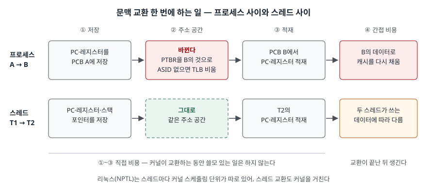

> **실행 검증 없음.** 표준·교재·논문의 정의와 설명을 정리한 개념 글이다.
> 측정값은 인용한 논문의 것이고 직접 잰 값이 아니다.

## 들어가며

프로세스와 스레드의 차이는 운영체제 문항에서 가장 자주 나오는 비교다. 답안이 "스레드는 가볍다"에서
멈추면 점수가 갈린다. 무엇이 가벼운지, 즉 **문맥 교환의 어느 단계가 빠지는지**를 써야 한다. 실무에서는
워커를 프로세스로 띄울지 스레드로 띄울지, 스레드 풀을 몇 개로 잡을지를 정할 때 이 비용이 기준이 된다.

## 정의

- **프로세스**: 하나의 주소 공간과, 그 안에서 실행되는 하나 이상의 스레드, 그리고 그 스레드들에 필요한
  시스템 자원의 묶음이다 (POSIX.1-2024의 Live Process 정의(§3.189)). 교재는 "실행 중인 프로그램"으로 정의한다.
- **스레드**: 프로세스 안의 단일 제어 흐름이다 (POSIX.1-2024의 Live Thread 정의(§3.190)).
- **문맥 교환(context switch)**: CPU를 다른 프로세스에 넘길 때 이전 프로세스의 상태를 저장하고
  새 프로세스의 저장된 상태를 적재하는 일이다 (Silberschatz 3장).

POSIX는 프로세스를 "주소 공간"으로, 교재는 "실행 중인 프로그램"으로 정의한다. 답안에는 POSIX 쪽이
비교에 쓰기 좋다. 스레드와의 차이가 주소 공간을 가졌느냐로 바로 드러나기 때문이다.

## 등장 배경

한 응용 안의 여러 작업(화면 갱신, DB 조회, 네트워크 응답)을 프로세스로 나누면 두 가지가 비싸다. 교재는
**프로세스 생성이 비싸고 느리다**고 적고, 프로세스끼리 데이터를 나누려면 **공유 메모리나 메시지 전달**을
따로 써야 한다고 적는다. 스레드는 같은 주소 공간을 공유하므로 이 둘을 덜어 낸다. 교재가 드는 스레드의
이점은 **4가지** — 응답성, 자원 공유, 비용(생성이 싸고 교환 부담이 작다), 확장성(다중 코어 활용)이다.

## 구성요소

### PCB — 7항목

문맥 교환 때 저장·적재되는 "문맥"은 PCB(프로세스 제어 블록)에 담긴다. 교재의 항목은 7가지다.

| 항목 | 내용 |
|---|---|
| 프로세스 상태 | 실행·대기 등 |
| 프로그램 카운터 | 다음에 실행할 명령어 위치 |
| CPU 레지스터 | 프로세스가 쓰던 레지스터 값 전부 |
| CPU 스케줄링 정보 | 우선순위, 스케줄링 큐 포인터 |
| 메모리 관리 정보 | 프로세스에 할당된 메모리 |
| 계정 정보 | 사용한 CPU 시간, 경과 시간, 시간 제한 |
| 입출력 상태 정보 | 할당된 입출력 장치, 열린 파일 목록 |

### 스레드가 따로 갖는 것과 공유하는 것

| 구분 | POSIX 기준 | 교재 기준 |
|---|---|---|
| 스레드마다 | 스레드 ID, 스케줄링 우선순위·정책, `errno`, 부동소수점 환경, 스레드별 키·값, 제어 흐름에 필요한 자원 | 스레드 ID, 프로그램 카운터, 레지스터 집합, 스택 |
| 프로세스 공유 | 프로세스 ID, 사용자·그룹 ID, 열린 파일 기술자, 시그널 처리 방식, 현재 디렉터리, 자원 한도 등 | 코드, 데이터, 열린 파일·시그널 같은 운영체제 자원 |

POSIX는 정적 변수, `malloc()`으로 얻은 영역, 자동 변수까지 **주소를 알 수 있는 것은 같은 프로세스의 모든 스레드가
접근할 수 있다**고 정한다. 스레드마다 스택이 따로 있어도 서로의 스택을 읽을 수 있다는 뜻이다.

### 문맥 교환 비용 — 2종류

Li·Ding·Shen(2007)은 비용을 둘로 나눠 잰다. 메모리 접근이 없는 두 프로세스를 번갈아 돌려 **직접 비용**을 재고,
배열을 읽게 해 늘어난 몫을 **간접 비용**으로 본다.

1. **직접 비용** — 교환 자체. 교재는 교환 시간 동안 시스템이 쓸모 있는 일을 하지 않는 부담이라 적고,
   운영체제와 PCB가 복잡할수록 길어지며 하드웨어 지원(CPU당 레지스터 집합 여러 벌 등)에 달려 있다고 적는다.
   프로세스 사이라면 여기에 **주소 공간 교체**가 붙는다. 페이지 테이블을 가리키는 레지스터(PTBR)를 바꾸고,
   TLB 항목에 주소 공간 식별자(ASID)가 없으면 교환 때마다 TLB를 비워야 한다
2. **간접 비용** — 교환 뒤 새로 들어온 쪽이 자기 데이터로 캐시를 다시 채우는 비용. 같은 논문은 이것이 접근
   간격에 따라 크게 달라진다고 보고한다. 2007년 실험 장비에서 수 µs부터 수백 µs까지였다

## 도식

> **출처**: 저장·적재와 교환 부담은 [Silberschatz et al., *Operating System Concepts* 10th ed., Ch.3 Context Switch 슬라이드](https://www.cs.hunter.cuny.edu/~sweiss/course_materials/csci340/slides/chapter03.pdf), PTBR·ASID·TLB 비움은 [같은 교재 Ch.9 Implementation of Page Table · Translation Look-Aside Buffer 슬라이드](https://www.cs.hunter.cuny.edu/~sweiss/course_materials/csci340/slides/chapter09.pdf), 직접·간접 비용의 구분은 [Li, Ding, Shen, "Quantifying the Cost of Context Switch", ExpCS 2007 §1](https://www.cs.huji.ac.il/w~feit/exp/expcs07/papers/161.pdf), 스레드가 같은 주소 공간을 쓴다는 것은 [POSIX.1-2024 §3.189 Live Process](https://pubs.opengroup.org/onlinepubs/9799919799/basedefs/V1_chap03.html#tag_03_189), NPTL의 1:1 대응은 [pthreads(7)](https://man7.org/linux/man-pages/man7/pthreads.7.html)을 따랐다.

답안지에는 두 줄에 네 칸씩 그리고, **②열만** 위는 "바뀐다", 아래는 "그대로"로 적는다. 스레드 교환이 싼
이유가 이 한 칸이다.

## 비교

| 구분 | 프로세스 | 스레드 (같은 프로세스) |
|---|---|---|
| 주소 공간 | 각자 | 공유 |
| 생성 | 비싸고 느리다 | 가볍다 |
| 교환 시 주소 공간 | PTBR 교체, ASID 없으면 TLB 비움 | 교체 없음 |
| 데이터 공유 | 공유 메모리·메시지 전달이 필요 | 주소만 알면 접근 |
| 고장 영향 | 그 프로세스에 그친다 | 시그널 처리 방식을 공유하므로 기본 동작이 종료인 시그널은 프로세스 전체를 끝낸다 |
| 동기화 | 필요한 곳만 | 공유 데이터마다 필요 |

리눅스 NPTL은 스레드마다 커널 스케줄링 단위가 하나씩 대응하는 1:1 구현이다. 그래서 스레드 교환도 커널을
거친다. 사용자 수준 스레드와 구분할 때 이 사실을 붙여 쓴다.

## 적용 시 고려사항

- **교환 빈도를 먼저 본다.** 리눅스는 `/proc/[pid]/status`의 `voluntary_ctxt_switches`와
  `nonvoluntary_ctxt_switches`로 자발적·비자발적 교환 횟수를 보여 준다(2.6.23부터). 자발적 교환은 입출력이나
  잠금을 기다리며 스스로 CPU를 내놓은 횟수이고, 비자발적 교환은 실행 중에 밀려난 횟수다. 어느 쪽이 느는지에 따라
  볼 곳(대기 원인인가, CPU 경쟁인가)이 갈린다.
- **스레드가 싸다고 무한정 늘리지 않는다.** 스레드가 줄이는 것은 주소 공간 교체다. 간접 비용은 각 스레드가
  쓰는 데이터에 따라 그대로 남고, 코어보다 많은 스레드는 교환 횟수만 늘린다.
- **격리가 필요한 작업은 프로세스로 나눈다.** 같은 프로세스의 스레드는 서로의 메모리에 접근할 수 있고,
  한 스레드가 받은 치명적 시그널이 프로세스 전체를 끝낼 수 있다. 신뢰 수준이 다른 코드를 한 프로세스에 두지 않는다.
- **하드웨어 지원을 확인한다.** TLB가 ASID를 지원하면 프로세스 교환 때도 TLB를 비우지 않는다. 같은 설계라도
  교환 비용은 플랫폼마다 다르므로 수치를 옮겨 쓰지 않고 그 환경에서 잰다.

## 정리

- 프로세스 = **주소 공간 + 스레드 + 자원**, 스레드 = **프로세스 안의 단일 제어 흐름** (POSIX).
- PCB는 **7항목** — 상태·PC·레지스터·스케줄링·메모리·계정·입출력 (**상·피·레·스·메·계·입**).
- 문맥 교환 비용은 **2종류** — 직접(저장·주소 공간·적재)과 간접(캐시 재적재).
- 같은 프로세스의 스레드 교환에서는 **주소 공간 교체(PTBR·TLB)가 빠진다.** 간접 비용은 남는다.
- 스레드의 이점 **4가지** — 응답성·자원 공유·비용·확장성.

> 관련 개념: [프로세스 상태 전이 모델 — 5상태와 대기 큐](../2026-09-23-process-state-transition-model/index.md)

## 참고 자료

- [The Open Group Base Specifications Issue 8 / IEEE Std 1003.1-2024, §3.189 Live Process · §3.190 Live Thread](https://pubs.opengroup.org/onlinepubs/9799919799/basedefs/V1_chap03.html#tag_03_189)
- [Silberschatz, Galvin, Gagne, *Operating System Concepts* 10th ed. (2018), 공식 사이트](https://www.os-book.com/OS10/) — §4.1 스레드의 구성
- [같은 교재 Ch.3 Processes 슬라이드 (Hunter College S. Weiss 2020 개정판) — Process Control Block, Context Switch](https://www.cs.hunter.cuny.edu/~sweiss/course_materials/csci340/slides/chapter03.pdf)
- [같은 교재 Ch.4 Threads 슬라이드 — Motivation, Benefits of Threads, Linux Threads](https://www.cs.hunter.cuny.edu/~sweiss/course_materials/csci340/slides/chapter04.pdf)
- [같은 교재 Ch.9 Main Memory 슬라이드 — Implementation of Page Table, Translation Look-Aside Buffer](https://www.cs.hunter.cuny.edu/~sweiss/course_materials/csci340/slides/chapter09.pdf)
- [Chuanpeng Li, Chen Ding, Kai Shen, "Quantifying the Cost of Context Switch", ExpCS 2007](https://dl.acm.org/doi/10.1145/1281700.1281702) — [본문 PDF](https://www.cs.huji.ac.il/w~feit/exp/expcs07/papers/161.pdf)
- [Linux man-pages, `pthreads(7)`](https://man7.org/linux/man-pages/man7/pthreads.7.html) — 스레드 공유·개별 속성, NPTL
- [Linux man-pages, `proc_pid_status(5)`](https://man7.org/linux/man-pages/man5/proc_pid_status.5.html) — `voluntary_ctxt_switches`·`nonvoluntary_ctxt_switches`
