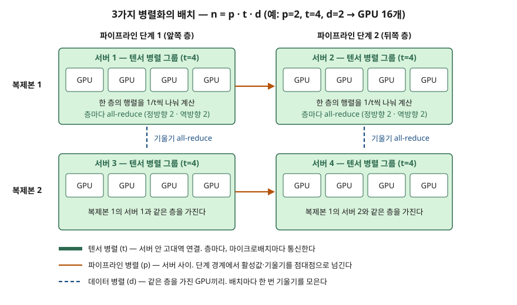

> **실행 검증 없음.** 두 논문의 정의·통신량 식·설계 지침을 정리한 개념 글이다. 본문의 버블 비율 계산은 논문 식에 값을 넣어 손으로 검산한 것이며 측정값이 아니다.

## 들어가며

AI 인프라 문제에서 "GPU를 많이 모으면 빨라진다"는 답은 절반만 맞다. 모델 하나를 수천 GPU에 어떻게 나눌지에 따라 GPU끼리 주고받는 통신량이 크게 달라지고,
그 통신이 어느 연결을 타는지가 확장을 막는다. 점수는 **세 가지 병렬화가 각각 무엇을 쪼개는지**와 **왜 텐서 병렬은 서버 안에 두는지**를 통신량으로 설명하는 데서 갈린다.
실무에서는 클러스터의 서버당 GPU 수와 서버 간 네트워크가 곧 모델 분할 방식을 정하는 설계 입력이 된다.

## 정의

Megatron-LM 논문의 배경 절(§2)이 세 방식을 다음처럼 정의한다.

- **데이터 병렬**: 각 워커가 **모델 전체의 사본**을 갖고 입력 데이터를 나눠 받으며, 주기적으로 기울기를 모아 모든 워커가 같은 가중치를 보게 한다.
- **파이프라인(모델) 병렬**: 모델의 **층을 여러 장치에 나눠** 싣는다. 배치를 마이크로배치로 쪼개 단계 사이에 흘려 보낸다.
- **텐서(모델) 병렬**: **층 하나의 연산을 여러 장치에 나눈다.** 트랜스포머 층의 행렬 곱을 열·행 방향으로 쪼갠다.

답안 첫 줄에는 "LLM 분산 학습 병렬화는 데이터(배치)·층·층 내부 행렬을 각각 GPU에 나누는 데이터·파이프라인·텐서 병렬을 조합해,
단일 GPU 메모리에 들어가지 않는 모델을 수천 GPU로 학습하는 기법이다"로 쓸 수 있다. 논문은 세 방식을 조합한 것을 **PTD-P**라 부른다.

## 등장 배경

논문 초록은 두 가지 제약을 든다. GPU 메모리가 모자라 **다중 GPU 서버 한 대에도** 큰 모델이 들어가지 않고, 연산량이 많아 한 곳에서 돌리면 학습 시간이 비현실적으로 길어진다.

데이터 병렬만으로는 첫째 제약을 풀 수 없다. ZeRO 논문은 혼합 정밀도 Adam으로 학습할 때 파라미터 하나당 모델 상태가 **16바이트**(fp16 파라미터 2 + fp16 기울기 2 + fp32 옵티마이저 상태 12)라고 계산한다.
15억 파라미터 모델이면 모델 상태만 24GB이고, 사본을 통째로 드는 데이터 병렬은 이 값이 GPU 수와 무관하게 그대로다.

텐서 병렬만 쓰면 서버를 넘어가는 순간 막힌다. Megatron-LM 서론은 텐서 병렬이 서버 한 대(DGX A100, GPU 8개) 안에서는 잘 되지만,
더 큰 모델에서는 all-reduce가 **서버 안 NVLink보다 느린 서버 간 링크**를 타야 하고 행렬이 잘게 쪼개져 GPU 활용률이 떨어진다고 적는다.
세 방식을 **각자 맞는 연결 위에** 배치하는 조합이 필요해진 이유다.

## 구성요소 / 절차

### 병렬화 3가지 — 무엇을 나누고 무엇을 주고받는가

| 방식 | 나누는 것 | GPU 하나가 드는 것 | 통신 | 빈도 |
|---|---|---|---|---|
| ① 데이터 병렬 (d) | 배치 | 모델 전체 사본 | 기울기 **all-reduce** | **배치마다 1번** |
| ② 텐서 병렬 (t) | 층 안의 행렬 | 모든 층의 1/t 조각 | 활성값·기울기 **all-reduce** 정방향 2 + 역방향 2 | **층마다, 마이크로배치마다** |
| ③ 파이프라인 병렬 (p) | 층의 묶음 | 연속한 층 L/p개 | 단계 경계의 **점대점** 송수신 | 마이크로배치마다, 경계에서만 |

GPU 수는 세 차원의 곱이다: **n = p · t · d.**

### 텐서 병렬의 분할 방식 — 블록 2가지

트랜스포머 층은 셀프 어텐션 블록과 2층 MLP 블록으로 이뤄진다.

1. **MLP**: 첫 번째 가중치 A를 **열 방향**으로 나누면 GeLU를 조각마다 따로 적용할 수 있어 동기화가 필요 없다. 두 번째 가중치 B를 **행 방향**으로 나누면 두 곱셈 사이에 통신이 없다. 마지막에 한 번 결과를 모은다.
2. **셀프 어텐션**: 여러 헤드로 이미 나뉘어 있는 구조를 이용해 Q·K·V를 헤드 단위로 나누고, 출력 선형층을 행 방향으로 나눈다.

그래서 층 하나에 정방향 all-reduce 2번, 역방향 2번이 생긴다.

### 파이프라인 스케줄 — 3가지

| 스케줄 | 동작 | 메모리 | 버블 비율 |
|---|---|---|---|
| ① GPipe (전부 정방향 → 전부 역방향) | 마이크로배치 m개를 모두 정방향으로 흘린 뒤 역방향 | 마이크로배치 **m개**의 활성값 보관 | (p−1)/m |
| ② 1F1B (PipeDream-Flush) | 워밍업 후 정방향 1번·역방향 1번을 번갈아 수행 | 최대 **p개**로 줄어든다 | (p−1)/m — 같다 |
| ③ 인터리브 1F1B | 장치 하나가 떨어진 층 묶음 **v개**를 맡는다 | ②와 비슷 | (1/v)·(p−1)/m — 1/v로 준다 |

버블은 배치의 시작과 끝에 장치가 노는 시간이다. 논문은 최적화기 갱신을 정확히 맞추려고 배치마다 파이프라인을 비우는 방식을 택했기 때문에 버블이 생긴다.
③은 버블을 줄이는 대신 **통신량도 v배로 는다.**

## 도식

> **출처**: [Narayanan et al., Megatron-LM, SC21 — §2 Modes of Parallelism, §3.2 Tensor and Pipeline Model Parallelism, §5.4.1 Tensor versus Pipeline Parallelism](https://arxiv.org/abs/2104.04473) — p·t·d 값은 설명용으로 고른 예다

답안지에는 격자를 그려 **가로축을 파이프라인 단계**, **세로축을 데이터 병렬 복제본**으로 두고, 칸 하나를 서버로 그린 뒤 그 안에 "텐서 병렬"을 적는다.
가로 화살표는 점대점, 세로 점선은 기울기 all-reduce다.

## 비교

### 왜 텐서 병렬을 서버 안에 두는가 — 통신량 식 (논문 §3.2)

s를 시퀀스 길이, h를 은닉 차원, b를 마이크로배치 크기라 하면 마이크로배치 하나에 대해

- **파이프라인**: 인접한 두 단계 사이에 **bsh** 만큼을 한 번 넘긴다.
- **텐서**: 층마다 GPU 하나가 **8bsh·(t−1)/t** 만큼을 주고받는다. 단계 하나에 층이 여럿이면 그 층 수만큼 곱해진다.

t=8이면 층 하나에 7bsh로, 파이프라인이 **단계 경계 한 곳**에서 넘기는 양의 7배를 **층마다** 주고받는다.
그래서 논문의 첫 번째 지침은 "GPU g개짜리 서버에서는 텐서 병렬을 g까지 쓰고, 그보다 큰 모델은 서버를 넘어 파이프라인 병렬로 키운다"이다.
실험(§5.4.1)에서도 텐서 병렬 크기가 서버당 GPU 수(8)와 같을 때 성능이 가장 높았고, 어느 한쪽만 쓴 구성은 둘을 조합한 구성에 못 미쳤다.

### 버블 비율 검산

p=8, 배치당 마이크로배치 m=32라 하면 1F1B의 버블 비율은 (8−1)/32 = 7/32 ≈ **21.9%**다.
인터리브로 v=2를 주면 7/64 ≈ **10.9%**로 절반이 되지만 통신량은 2배다.
버블을 줄이려면 m ≫ p여야 하므로 **파이프라인 단계 수를 늘리는 데는 배치 크기라는 상한**이 있다.

### 데이터 병렬과 ZeRO(분할 데이터 병렬)

| 구분 | 데이터 병렬 | ZeRO 1·2단계 | ZeRO 3단계 | 텐서·파이프라인 병렬 |
|---|---|---|---|---|
| 나누는 것 | 없음 (전부 복제) | 옵티마이저 상태 (1) + 기울기 (2) | + 파라미터 | 층 안 행렬 / 층 묶음 |
| GPU당 모델 상태 (Ψ 파라미터) | 16Ψ 바이트 | 1단계 약 4Ψ, 2단계 약 2Ψ (d가 클 때) | 16Ψ/d | 1/(t·p)로 준다 |
| 통신량 (학습 스텝당) | 2Ψ | 2Ψ — 데이터 병렬과 같다 | 3Ψ — **1.5배** | 활성값 (위 식) |

> 모델 상태·통신량 행은 ZeRO 논문의 메모리 분석(§5)과 통신량 분석(§7)을 따랐다. Ψ는 파라미터 수, d는 데이터 병렬 크기다.

ZeRO는 **데이터 병렬의 중복 저장을 없애는** 방식이고, 텐서·파이프라인은 **연산 자체를 나누는** 방식이다. 둘은 대체 관계가 아니라 함께 쓰인다.
Megatron-LM의 두 번째 지침도 같은 방향이다 — 모델 병렬 크기 M = t·p는 **메모리에 들어갈 만큼만** 잡고, 그 이상 규모는 데이터 병렬로 늘린다.

## 적용 시 고려사항

- **텐서 병렬 크기는 서버당 GPU 수를 넘기지 않는다.** 서버 간 링크로 층마다 all-reduce를 하면 통신이 연산을 압도한다. 클러스터를 설계할 때 서버당 GPU 수와 서버 내부 연결이 곧 t의 상한이다.
- **파이프라인 단계 수는 배치 크기로 제약된다.** m ≫ p여야 버블이 작고, 인터리브 스케줄은 마이크로배치 수가 p의 배수여야 한다. 전역 배치 크기를 바꾸면 병렬 구성도 다시 봐야 한다.
- **활성값 재계산을 함께 쓴다.** 논문(§3.5)은 파이프라인 병렬로 큰 모델을 학습하려면 활성값 재계산이 필요하다고 적는다. 역방향 직전에 정방향을 한 번 더 돌려 메모리를 줄이는 대신 연산이 는다.
- **서버의 네트워크 카드 수를 활용한다.** DGX A100은 IB 카드가 8개인데 점대점 송신은 GPU 한 쌍 사이에서만 일어난다. 논문은 텐서 병렬 랭크마다 같은 텐서를 보내는 점을 이용해 **1/t씩 나눠 보내고 받는 쪽에서 NVLink로 모으는** 최적화로 단계 간 통신을 bsh/t로 줄였다.
- **마이크로배치 크기에 정답이 없다.** 세 번째 지침은 최적 마이크로배치 크기가 모델의 처리량·메모리 특성과 p·d·배치 크기에 따라 달라진다는 것이다. 구성마다 재 봐야 한다.

## 정리

- 병렬화 **3가지**: **데**이터(배치를 나눈다)·**텐**서(층 안 행렬)·**파**이프라인(층 묶음) → "**데·텐·파**". GPU 수 n = p·t·d.
- 통신 **3종**: 데이터 = 배치마다 기울기 all-reduce / 텐서 = 층마다 all-reduce 정2·역2 / 파이프라인 = 경계에서 점대점.
- 배치 규칙: **텐서는 서버 안, 파이프라인은 서버 사이, 데이터는 그 바깥.**
- 파이프라인 버블 = **(p−1)/m**, 인터리브는 **1/v**배 (통신 v배).
- 논문 규모: 3,072 GPU로 1조 파라미터 모델을 **502 petaFLOP/s**, GPU당 이론 최대의 **52%**로 학습했다.

> 기출 답안: [기출문제 — AI 슈퍼컴퓨팅 플랫폼](../../exam/2026-09-30-ai-supercomputing-platform/index.md)

## 참고 자료

- [Narayanan et al., Efficient Large-Scale Language Model Training on GPU Clusters Using Megatron-LM, SC21 (arXiv 2104.04473)](https://arxiv.org/abs/2104.04473) — §2 병렬화 정의와 파이프라인 스케줄, §2.3 텐서 병렬 분할, §3 통신량·버블 분석과 지침 3가지, §3.5 활성값 재계산, §4.1 scatter/gather 최적화, §5.4 실험
- [Rajbhandari et al., ZeRO: Memory Optimizations Toward Training Trillion Parameter Models, SC20 (arXiv 1910.02054)](https://arxiv.org/abs/1910.02054) — §3.1 모델 상태 16Ψ, §5 ZeRO-DP 3단계, §7 통신량
- [Shoeybi et al., Megatron-LM: Training Multi-Billion Parameter Language Models Using Model Parallelism (arXiv 1909.08053)](https://arxiv.org/abs/1909.08053) — 텐서 병렬 분할의 원 논문
