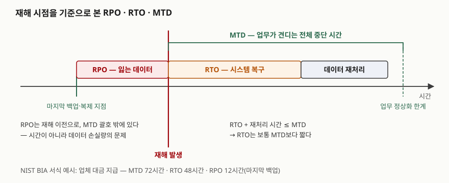
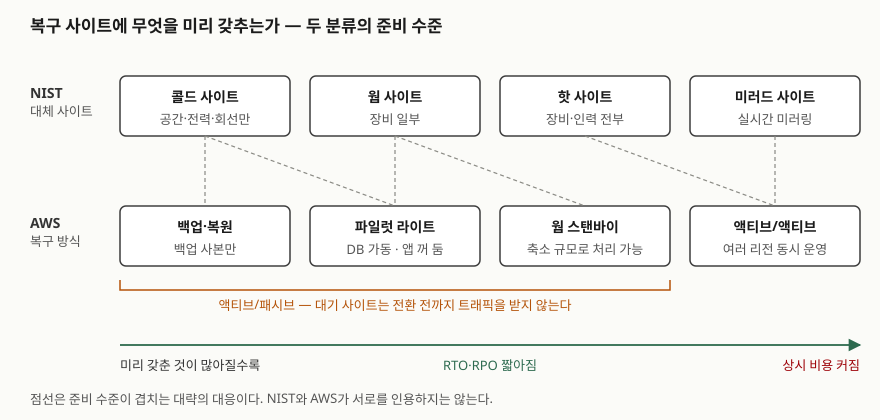

> 실행 검증 없음. NIST SP 800-34 Rev.1 원문, AWS 재해복구 백서, Azure Well-Architected Framework
> 공식 문서만 근거로 정리했다. 클라우드 제품별 복제 지연·전환 시간은 제품과 시점마다 달라 싣지 않았다.

## 들어가며

재해복구는 정보시스템 운영 과목의 단골이고, 클라우드 문항에서도 "무중단 설계와 무엇이 다른가"로
다시 나온다. 답안에서 RTO와 RPO를 정의만 하고 넘어가면 평범해진다. 점수는 **세 값이 누가, 어떤
순서로 정하는 값인지**와 **복구 방식이 그 값을 어떻게 만족시키는지**를 한 줄로 잇는 데서 갈린다.
실무에서는 업무 부서가 "몇 시간 안에 돌아와야 한다"고 말할 때 그것을 백업 주기, 복제 방식, 대기
사이트 구성으로 옮기는 일이 된다.

## 정의

**재해복구(Disaster Recovery, DR)**: 업무에 심각한 영향을 주는 재해로 정보시스템이 중단됐을 때, 업무
영향 분석으로 정한 **목표 복구 시간(RTO)과 목표 복구 시점(RPO) 안에** 시스템과 데이터를 대체 시설에서
되살리는 계획과 기술 체계다.

세 값은 NIST SP 800-34 Rev.1의 업무 영향 분석 절(§3.2.1)이 다음처럼 정의한다.

| 값 | NIST SP 800-34 Rev.1의 정의 | 한 줄로 |
|---|---|---|
| **MTD** (Maximum Tolerable Downtime, 최대 허용 중단 시간) | 업무 프로세스의 중단을 시스템 소유자가 받아들일 수 있는 **전체 시간**. 모든 영향을 고려한다 | 업무가 견디는 한계 |
| **RTO** (Recovery Time Objective, 목표 복구 시간) | 시스템 자원이 다른 자원·업무 프로세스·MTD에 감내할 수 없는 영향을 주기 전까지 **사용 불가로 있을 수 있는 최대 시간** | 시스템이 멈춰도 되는 한계 |
| **RPO** (Recovery Point Objective, 목표 복구 시점) | 중단 뒤 데이터를 되살릴 수 있는 **중단 이전의 시점**. 가장 최근 백업을 기준으로 한다 | 잃어도 되는 데이터의 양(시간으로) |

AWS 재해복구 백서는 RPO를 **마지막 복구 지점 이후 허용할 수 있는 최대 시간**으로, Azure Well-Architected
Framework는 **시간으로 잰 허용 가능한 최대 데이터 손실**로 적는다. 표현은 달라도 뜻은 같다.

## 등장 배경

NIST SP 800-34 초판은 중단 한계를 **MAO(Maximum Allowable Outage)** 한 가지로 표현했다. Rev.1은 이것을
업무 쪽 한계인 MTD와 시스템 쪽 한계인 RTO로 나눴다. 업무가 견디는 시간과 시스템이 복구돼야 하는 시간이
같지 않기 때문이다. 시스템이 돌아와도 중단 동안 처리하지 못한 데이터를 다시 처리하는 시간이 더 든다.

복구 방식이 여럿으로 갈린 이유는 비용이다. NIST는 중단 비용과 복구 비용을 한 그래프에 그린 **비용 균형
그림**(Figure 3-3)을 든다. 중단이 길수록 업무 손실이 커지고, RTO가 짧을수록 복구 수단이 비싸진다.
테이프 백업과 시스템 미러는 이 두 곡선 위의 서로 다른 점이고, 두 곡선이 만나는 **균형점**은 조직과
시스템마다 다르다. 그래서 하나의 정답 방식이 아니라 준비 수준이 다른 여러 방식이 생겼다.

## 구성요소 / 절차

### 세 값을 정하는 업무 영향 분석(BIA) — 3단계

| 단계 | NIST SP 800-34 Rev.1 | 결과 |
|---|---|---|
| ① 업무 프로세스와 복구 중요도 결정 (§3.2.1) | 시스템이 지원하는 업무 프로세스별로 중단 영향을 따진다 | **MTD·RTO·RPO** |
| ② 자원 요구사항 식별 (§3.2.2) | 업무를 되살리는 데 필요한 장비·인력·설비를 찾는다 | 복구에 필요한 자원 목록 |
| ③ 시스템 자원의 복구 우선순위 식별 (§3.2.3) | ①②를 근거로 무엇을 먼저 되살릴지 정한다 | 복구 순서 |

NIST 부록의 BIA 서식은 예시로 "업체 대금 지급" 프로세스에 MTD 72시간, RTO 48시간, RPO 12시간(마지막
백업)을 적는다. RTO가 MTD보다 24시간 짧다. 그 24시간이 데이터 재처리에 쓸 여유다.

### 세 값의 관계 — 3가지

1. **RTO는 MTD 안에 들어야 하므로 보통 MTD보다 짧다.** 재처리 시간을 RTO 뒤에 더해도 MTD를 넘지 않아야 한다
2. **RPO는 MTD에 들지 않는다.** 시간 한계가 아니라 복구 과정에서 견딜 수 있는 **데이터 손실량**의 문제다
3. **RTO를 즉시 맞출 수 없고 MTD도 바꿀 수 없으면** 조치 계획(Plan of Action and Milestones)을 세워 문서로 관리한다

### 대체 사이트 — 기본 3가지 + 변형 2가지

NIST는 대체 시설을 운영 준비 수준에 따라 **콜드·웜·핫 3가지**로 나누고, 변형의 예로 **모바일·미러드
2가지**를 든다(§3.4.3).

| 유형 | NIST의 설명 | 하드웨어 | 통신 | 준비 시간 | 비용 |
|---|---|---|---|---|---|
| 콜드 사이트 | 공간과 전력·통신 회선·환경 제어 같은 기반만 갖춘 시설 | 없음 | 없음 | 길다 | 낮다 |
| 웜 사이트 | 시스템 하드웨어·소프트웨어·통신·전원의 일부 또는 전부를 갖춘 시설 | 일부 | 일부~전부 | 중간 | 중간 |
| 핫 사이트 | 시스템 요구에 맞는 크기로 하드웨어·기반·지원 인력까지 갖춘 시설 | 전부 | 전부 | 짧다 | 중간~높다 |
| 모바일 사이트 | 통신·시스템 장비를 갖춘 이동식 설비. 많은 경우 24시간 안에 도착하지만 설치 시간이 더 든다 | — | — | — | — |
| 미러드 사이트 | 실시간 자동 미러링을 하는 완전 이중화 시설. 기술적으로 주 사이트와 같다 | — | — | — | 가장 높다 |

하드웨어~비용 열은 NIST 표 3-3(대체 사이트 선정 기준 예시)의 값이다. 모바일·미러드 사이트는 그 표에
없어 본문 설명만 옮겼다.

### 클라우드의 복구 방식 — 4가지

AWS 백서는 클라우드 재해복구를 **4가지**로 나눈다. 앞의 셋은 대기 사이트가 평시 트래픽을 받지 않는
액티브/패시브 방식이다.

| 방식 | 복구 사이트에 미리 갖춘 것 | 전환 때 할 일 |
|---|---|---|
| ① 백업·복원 | 백업 사본뿐 | 인프라·설정·코드를 다시 배포하고 데이터를 복원한다 |
| ② 파일럿 라이트 | 데이터 복제를 받는 DB·저장소는 상시 가동, 앱 서버는 꺼 둠 | 앱 서버를 켜고 전체 규모로 늘린다 |
| ③ 웜 스탠바이 | 축소 규모지만 **바로 요청을 처리할 수 있는** 전체 환경 | 전체 규모로 늘린다 |
| ④ 멀티사이트 액티브/액티브 | 여러 리전에서 동시에 운영 | 전환 단계가 없다. 장애 리전으로 가는 트래픽을 뺀다 |

백서는 파일럿 라이트와 웜 스탠바이의 차이를 **추가 조치 없이 요청을 처리할 수 있는가**로 가른다.
웜 스탠바이를 전체 규모로 올려 오토스케일링에 기대지 않는 구성은 **핫 스탠바이**라 부른다.

## 도식

> **출처**: [NIST SP 800-34 Rev.1 §3.2.1 Determine Business Processes and Recovery Criticality](https://nvlpubs.nist.gov/nistpubs/Legacy/SP/nistspecialpublication800-34r1.pdf)

답안지에는 재해 시점을 세로선으로 긋고, 왼쪽에 RPO, 오른쪽에 RTO와 재처리 시간을 이어 붙인 뒤 그
전체를 MTD 괄호로 묶는다. **RPO가 MTD 괄호 밖에 있다**는 것이 이 그림의 요점이다.

> **출처**: [NIST SP 800-34 Rev.1 §3.4.3 Alternate Sites, Table 3-3](https://nvlpubs.nist.gov/nistpubs/Legacy/SP/nistspecialpublication800-34r1.pdf) · [AWS, Disaster Recovery of Workloads on AWS — Disaster recovery options in the cloud](https://docs.aws.amazon.com/whitepapers/latest/disaster-recovery-workloads-on-aws/disaster-recovery-options-in-the-cloud.html)

두 분류를 나란히 놓은 것은 이 글의 대조다. NIST와 AWS가 서로를 인용하지는 않으며, 일대일 대응이
아니라 **준비 수준의 순서가 같다**는 뜻으로 읽는다.

## 비교

### RTO · RPO · MTD

| 비교 항목 | MTD | RTO | RPO |
|---|---|---|---|
| 관점 | 업무 | 시스템 | 데이터 |
| 시간 축 방향 | 재해 이후 | 재해 이후 | 재해 **이전** |
| MTD와의 관계 | — | MTD 안에 들어야 한다 | MTD와 별개 |
| 정하는 곳 | BIA — 업무 프로세스 소유자·관리자와 함께 | BIA — 같은 자리 | BIA — 같은 자리 |
| 맞추는 기술 | — | 대체 사이트 준비 수준, 배포 자동화, 전환 절차 | 백업 주기, 복제 방식, 시점 복구 |

### 동기 복제와 비동기 복제

RPO를 정하는 것은 데이터를 복구 위치로 옮기는 방식이다.

| 비교 항목 | 동기 복제 | 비동기 복제 |
|---|---|---|
| 쓰기 순서 | 여러 위치에 **동시에** 쓴다 | 주 위치에 먼저 쓰고 **나중에** 복사한다 |
| 데이터 손실 | 없다 (RPO 0) | 복제 지연만큼 잃을 수 있다 |
| 쓰기 지연 | 커진다 | 작다 |
| Azure WAF의 권고 | 가용 영역 사이의 우선순위 높은 데이터 | 리전 사이의 우선순위 낮은 데이터 |

동기 복제는 쓰기마다 원격 위치의 확인을 기다려야 하므로 거리가 멀수록 쓰기 지연이 커진다. 그래서 먼
리전 사이는 비동기로 복제하고, 그만큼의 데이터 손실을 RPO로 받아들인다. AWS 백서도 리전 간 연속
복제 서비스들을 비동기 복제로 소개한다.

## 적용 시 고려사항

- **복제는 백업을 대신하지 못한다.** AWS 백서는 연속 복제가 백업 시간을 0에 가깝게 줄이지만, 데이터
  손상이나 무단 삭제는 시점 백업만큼 막지 못한다고 적는다. 손상도 그대로 복제되기 때문이다. 액티브/
  액티브라도 데이터 재해에서는 복구 시간이 0보다 크고 복구 시점은 **재해를 발견하기 전의 어느 시점**이
  된다. 버전 관리나 시점 복구를 함께 둔다.
- **목표는 업무 등급마다 다르게 잡는다.** Azure WAF는 업무를 중요도 등급으로 나누고 등급마다 RTO·RPO를
  따로 도출하라고 권한다. NIST도 FIPS 199 가용성 영향도가 낮은 시스템에는 대체 처리 시설을 요구하지 않는다.
  모든 시스템에 핫 사이트를 두면 비용 균형점을 무시하는 셈이다.
- **복구 순서는 의존성을 따른다.** Azure WAF는 DB를 그것에 기대는 애플리케이션보다 먼저 복원하라는
  예를 들고, 데이터 저장소끼리의 의존성을 고려하며 복구 중 무결성 점검을 자동화하라고 적는다. 저장소마다
  복제 지연이 다르면 복구 뒤 저장소끼리 시점이 어긋날 수 있다. BIA 3단계의 복구 우선순위가 이 일을 한다.
- **같은 재해를 함께 겪지 않을 곳에 둔다.** NIST는 고정 대체 사이트를 주 사이트와 같은 위험에 영향받을
  가능성이 낮은 지역에 두라고 적는다. 상용 대체 사이트는 여러 조직이 같은 시설을 계약할 수 있어, 광역
  재해 때 모두를 수용하지 못할 수 있다는 점도 계약에서 따진다.
- **목표는 훈련으로만 확인된다.** Azure WAF는 운영 수준 훈련만이 실제 조건에서 RTO·RPO 달성을 확인하는
  방법이라고 적되, 운영 환경 훈련은 예상치 못한 장애를 부를 수 있으므로 비운영 환경에서 먼저 검증하라고 한다.

## 정리

- **정의 1줄**: BIA로 정한 RTO·RPO 안에 시스템과 데이터를 대체 시설에서 되살리는 계획과 기술 체계.
- **세 값 = 업무·시스템·데이터**: MTD는 업무의 한계, RTO는 시스템의 한계, RPO는 데이터 손실의 한계.
  **RTO < MTD**, **RPO는 MTD 밖**.
- **BIA 3단계**: 복구 중요도(→ MTD·RTO·RPO) → 자원 요구사항 → 복구 우선순위.
- **사이트 3+2**: 콜드·웜·핫 + 모바일·미러드. **클라우드 4**: 백업·복원 → 파일럿 라이트 → 웜 스탠바이 →
  멀티사이트 액티브/액티브. 오른쪽으로 갈수록 RTO·RPO는 짧고 상시 비용은 크다.
- **RPO를 정하는 것은 복제 방식**: 동기는 손실 0·지연 큼, 비동기는 지연 작음·복제 지연만큼 손실.
  어느 쪽이든 손상 대비로 시점 백업을 함께 둔다.

> 기출 답안: [기출문제 — 클라우드 네이티브 환경의 재해복구 전략 (RTO·RPO, Active-Active·Active-Passive·Pilot Light)](../../exam/2026-10-02-disaster-recovery-rto-rpo-strategies/index.md)

## 참고 자료

- [NIST SP 800-34 Rev.1, Contingency Planning Guide for Federal Information Systems (2010-05)](https://nvlpubs.nist.gov/nistpubs/Legacy/SP/nistspecialpublication800-34r1.pdf) — §3.2 BIA 3단계, §3.2.1 MTD·RTO·RPO와 Figure 3-3 비용 균형, §3.4.3 대체 사이트와 Table 3-3, 부록 B BIA 서식
- [AWS, Disaster Recovery of Workloads on AWS: Recovery in the Cloud (2021-02-12)](https://docs.aws.amazon.com/whitepapers/latest/disaster-recovery-workloads-on-aws/disaster-recovery-workloads-on-aws.html)
  - [Business Continuity Plan (BCP) — Recovery objectives (RTO and RPO)](https://docs.aws.amazon.com/whitepapers/latest/disaster-recovery-workloads-on-aws/business-continuity-plan-bcp.html)
  - [Disaster recovery options in the cloud](https://docs.aws.amazon.com/whitepapers/latest/disaster-recovery-workloads-on-aws/disaster-recovery-options-in-the-cloud.html)
- [Microsoft, Azure Well-Architected Framework — Architecture strategies for disaster recovery (RE:09, 2026-08-20 갱신)](https://learn.microsoft.com/en-us/azure/well-architected/reliability/disaster-recovery)
