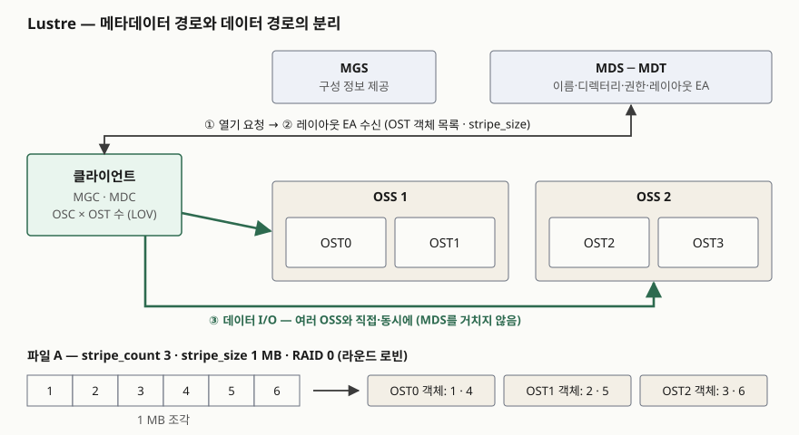

> 실행 검증 없음. Lustre 운영 매뉴얼, IETF RFC 8881·8434, NIST SP 800-209 원문만 근거로 정리했다.
> 처리량 수치는 구성마다 달라 싣지 않았고, 매뉴얼에 적힌 한계값만 옮겼다.

## 들어가며

AI 학습과 HPC 문항에서 스토리지를 물으면 병렬 파일 시스템이 거의 빠지지 않는다. GPU 수백 대가 같은
데이터셋을 에폭마다 다시 읽고, 학습 상태를 주기적으로 한꺼번에 기록하기 때문이다. NFS 서버 한 대를
두면 모든 읽기와 쓰기가 그 서버 하나를 통과하므로, 클라이언트를 늘릴수록 서버의 네트워크와 디스크가
먼저 찬다. 병렬 파일 시스템은 이 문제를 **메타데이터와 데이터를 서로 다른 서버에 맡기는 것**으로 푼다.
답안에서 점수가 갈리는 곳은 그 분리가 I/O 경로를 어떻게 바꾸는지를 그림 한 장으로 보이는 데다.

## 정의

**병렬 파일 시스템(Parallel File System)**: 파일 데이터를 여러 저장 서버에 나눠 두고(스트라이핑)
메타데이터 접근과 데이터 접근을 분리해, 여러 클라이언트가 하나의 이름공간을 보면서 **여러 데이터 서버에
직접·동시에** 읽고 쓰게 하는 분산 파일 시스템이다.

이 정의는 표준 용어집에서 가져온 것이 아니다. 병렬 파일 시스템을 한 문장으로 정의한 ISO·IEEE 표준을
찾지 못해, 두 1차 자료의 설명을 합쳤다.

- **pNFS 표준(RFC 8881, §12.1)**: NFSv4.1이 메타데이터 접근과 데이터 접근을 분리하고, 데이터 접근은
  **여러 서버에 병렬로** 수행하게 해 클러스터 서버 구현에 고성능 데이터 접근을 제공한다고 적는다
- **Lustre 운영 매뉴얼(§1.3)**: 클라이언트는 MDT에서 파일의 레이아웃을 먼저 받고, 그 정보로
  **객체가 저장된 OSS 노드와 직접** I/O를 수행한다고 적는다

## 등장 배경

NAS의 파일 서버는 이름공간 관리와 데이터 전송을 한 서버가 모두 맡는다. 파일 하나를 읽어도 그 데이터는
서버 한 대의 네트워크 포트와 디스크를 지나므로, 파일 하나에 낼 수 있는 대역폭의 상한이 서버 한 대의
대역폭이다. Lustre 매뉴얼은 스트라이핑이 필요한 경우로 **한 파일에 대한 총 대역폭 요구가 OST 하나의
대역폭을 넘을 때**와 **OST 하나의 빈 공간에 파일 전체가 들어가지 않을 때**를 든다. 예로는 수백 노드가
파일 하나에 동시에 쓰는 과학 계산과, 애플리케이션 시작 때 여러 노드가 같은 실행 파일을 읽는 경우를 든다.

NIST SP 800-209도 pNFS를 단일 NFS 서버 대신 **저장 서버 클러스터**가 데이터와 메타데이터를 나눠
갖고, 클라이언트 접속을 여러 서버로 분산하는 방식으로 설명한다. 같은 문제를 표준(pNFS)과 전용 파일
시스템(Lustre)이 각각 푼 것이다.

## 구성요소 / 절차

### Lustre의 구성요소 — 5가지

| 구성요소 | Lustre 운영 매뉴얼의 설명 (§1.2) |
|---|---|
| ① MGS (관리 서버) | 클러스터 안 모든 Lustre 파일 시스템의 구성 정보를 저장하고 다른 구성요소에 제공한다 |
| ② MDS + MDT (메타데이터 서버·타깃) | MDS는 이름과 디렉터리를 관리하고, MDT는 파일 이름·디렉터리·권한·**파일 레이아웃**을 저장한다 |
| ③ OSS + OST (객체 저장 서버·타깃) | OSS는 로컬 OST들에 대한 파일 I/O를 처리한다. 사용자 파일 데이터는 OST에 객체로 저장된다 |
| ④ 클라이언트 | 파일 시스템을 마운트하는 계산·시각화·데스크톱 노드. 리눅스 VFS와 Lustre 서버를 잇는다 |
| ⑤ LNet | 메타데이터와 파일 I/O 데이터를 실어 나르는 Lustre 전용 네트워킹 API |

클라이언트 안에는 관리 클라이언트(MGC), 메타데이터 클라이언트(MDC), 그리고 **OST마다 하나씩** 객체 저장
클라이언트(OSC)가 있다. 논리 객체 볼륨(LOV)이 OSC들을 묶어 모든 OST를 하나처럼 보이게 하고, 논리 메타데이터
볼륨(LMV)이 MDC들을 묶어 여러 MDT의 디렉터리 트리를 하나의 이름공간으로 보인다. 매뉴얼은 일반적인 구성으로
OSS 한 대가 OST 2~8개를 맡는다고 적는다.

### 파일 하나를 읽고 쓰는 절차 — 3단계

1. **레이아웃 조회**: 클라이언트가 파일의 FID로 식별되는 MDT 객체에서 **레이아웃 EA**(확장 속성)를 받는다.
   레이아웃 EA는 파일 데이터가 어느 OST의 어느 객체에 있는지를 가리킨다
2. **위치 계산**: 일반 파일의 MDT 객체는 OST 객체 1~N개를 가리킨다. 둘 이상이면 데이터가 RAID 0으로
   객체들에 나뉘어 있고 각 객체는 서로 다른 OST에 있다. 클라이언트는 읽을 오프셋이 몇 번째 객체에 있는지를
   레이아웃만으로 계산한다
3. **직접 I/O**: 클라이언트가 해당 OSS들과 **직접** 데이터를 주고받는다. MDS는 이 경로에 끼지 않는다

### 스트라이핑 매개변수 — 2가지

| 매개변수 | 뜻 | 매뉴얼의 기본값·한계 |
|---|---|---|
| `stripe_count` | 파일 하나를 나눠 담는 객체(OST) 수 | 기본 1. ldiskfs MDT에 `ea_inode`가 켜져 있으면(Lustre 2.13부터 기본) 최대 2000, 아니면 160 |
| `stripe_size` | 한 객체에 쓰고 다음 객체로 넘어가는 크기 | 기본 1 MB. 최소 64 KiB, 최대 4 GiB 미만 |

값은 파일 시스템·디렉터리·파일 단위로 정할 수 있다. 어느 OST에 객체를 둘지는 MDS가 정하는데, OST들의
빈 공간 차이가 기본 17% 미만이면 라운드 로빈으로, 그 이상이면 빈 공간이 많은 OST를 우선하는 가중 무작위로
고른다.

## 도식

> **출처**: [Lustre Software Release 2.x Operations Manual §1.2 Lustre Components · §1.3 Lustre File System Storage and I/O · §1.3.1 Lustre File System and Striping](https://doc.lustre.org/lustre_manual.xhtml)

답안지에는 클라이언트 하나, 위에 MDS, 아래에 OSS 두 대를 그리고 화살표를 **두 종류**로만 긋는다.
MDS로 가는 가는 화살표(①②, 레이아웃)와 OSS로 가는 굵은 화살표(③, 데이터)다. 아래에 조각 1~6이
OST 세 개에 돌아가며 들어가는 줄을 붙이면 스트라이핑까지 한 그림에 들어간다.

## 비교

### NAS(NFS) · pNFS · Lustre

| 비교 항목 | NAS (NFS 단일 서버) | pNFS (NFSv4.1) | Lustre |
|---|---|---|---|
| 성격 | 프로토콜 + 서버 1대 | IETF 표준 프로토콜의 확장 | 전용 병렬 파일 시스템 |
| 메타데이터 | 파일 서버 | 메타데이터 서버 | MDS·MDT |
| 데이터 | 파일 서버를 지난다 | 저장 장치에 직접 | OSS·OST에 직접 |
| 데이터 위치 정보 | — | 레이아웃 (회수 가능) | 레이아웃 EA |
| 데이터 접근 프로토콜 | NFS | 레이아웃 유형이 정한다 (파일·블록·객체·SCSI·플렉스 파일) | LNet 위의 Lustre 프로토콜 |
| 메타데이터 서버 확장 | — | 구현에 맡긴다 | DNE로 MDT 여러 개 |

pNFS에서 눈여겨볼 차이는 세 가지다.

- **저장 장치 프로토콜이 하나가 아니다.** RFC 8434는 레이아웃 유형이 저장 프로토콜과 데이터 배치 방식을
  정한다고 적고, 기존 유형으로 파일(RFC 8881 §13)·블록(RFC 5663)·객체(RFC 5664)·SCSI(RFC 8154)·
  플렉스 파일(RFC 8435)의 **5가지**를 든다. 블록 레이아웃이면 클라이언트는 메타데이터만 NFS로 받고
  데이터는 SAN 장치에 블록으로 직접 읽고 쓴다
- **메타데이터 서버가 I/O를 대신 받아야 한다.** RFC 8434는 클라이언트가 저장 장치 대신 메타데이터 서버로
  I/O를 보내기로 하면 메타데이터 서버가 그것을 처리해야 한다(MUST)고 적는다. 레이아웃을 쓸 수 없는
  클라이언트도 일반 NFS처럼 동작할 수 있다
- **메타데이터 서버와 저장 장치 사이의 제어 프로토콜은 표준 밖이다.** RFC 8881의 제어 프로토콜 정의(§12.2.6)는
  이것을 NFSv4.1이 정하지 않는다고 적는다. 대신 RFC 8434가 레이아웃 유형마다 지켜야 할 제어 통신 요구사항을
  두고, 레이아웃을 철회(revoke)했을 때 저장 장치가 그 클라이언트의 I/O를 막는 **펜싱**을 요구한다

### 병렬 파일 시스템과 오브젝트 스토리지

둘 다 메타데이터와 데이터를 나눠 확장하지만 클라이언트에 내놓는 모양이 다르다. 병렬 파일 시스템은 POSIX
파일 의미(디렉터리, 파일 일부 덮어쓰기, 잠금)를 유지한 채 대역폭을 늘리고, 오브젝트 스토리지는 디렉터리
트리와 부분 갱신을 버리고 평면 인덱스로 용량을 늘린다. 그래서 클라우드 AI 인프라에서는 둘을 이어 쓴다.
AWS FSx for Lustre는 S3 버킷과 연결하면 파일 경로와 S3 키를 1:1로 대응시켜 가져오기·내보내기를 자동으로
수행하고, Google Cloud의 AI 스토리지 가이드는 체크포인트와 가중치 전달의 1순위로 관리형 Lustre를 든다.

## 적용 시 고려사항

- **스트라이프는 필요한 만큼만 넓힌다.** Lustre 매뉴얼의 원칙은 요구를 만족하는 **가장 적은 객체 수**로
  나누라는 것이다. 매뉴얼은 넓게 나눌 이유를 4가지(단일 파일 고대역폭, OSS 대역폭 초과, I/O 패턴과 스트라이프
  맞추기, 아주 큰 파일의 공간), 피할 이유를 4가지(오버헤드, 위험, 작은 파일, O_APPEND)로 든다. 스트라이프가
  많으면 `stat`·`unlink` 같은 흔한 작업에도 잠금과 네트워크 요청이 그만큼 늘고, 클라이언트 100대가 객체
  100개짜리 파일을 각자 쓰면 모든 디스크가 100방향으로 탐색하는 경합이 생긴다.
- **작은 파일은 나누지 않는다.** 매뉴얼은 작은 파일이 스트라이핑의 이득을 보지 못하며 OST 객체 하나나
  Data on MDT(DoM, Lustre 2.11부터)로 두는 편이 효율적이라고 적는다. 수백만 개의 작은 샘플로 된 학습
  데이터셋은 대역폭보다 **메타데이터 요청 수**가 병목이 되므로, 큰 묶음 파일로 합치거나 메타데이터 서버를
  늘리는 쪽을 먼저 본다. DNE는 MDT를 여러 개 두고, Lustre 2.8부터는 한 디렉터리의 파일도 여러 MDT에
  나눠 담는다.
- **여러 노드가 한 파일에 쓸 때는 스트라이프 경계에 맞춘다.** 매뉴얼은 클라이언트 둘 이상이 한 스트라이프에
  쓰면 I/O가 겹치지 않아도 잠금을 주고받는 경합이 생기므로, 각 스트라이프를 한 클라이언트만 쓰도록 맞추라고
  적는다. 스레드 수가 OST 수보다 많으면 Lustre 2.13의 오버스트라이핑으로 OST 하나에 스트라이프를 여러 개 둔다.
- **넓게 나눌수록 OST 장애의 영향 범위가 넓어진다.** 매뉴얼은 모든 서버에 걸쳐 나눈 파일은 서버 하나가
  고장 나면 **모든 파일의 일부**를 잃고, 스트라이프가 하나인 파일은 **일부 파일을 통째로** 잃는다고 비교한다.
  OSS 사이에 저장 장치를 공유해 장애 조치(failover)를 구성하고, 중요한 데이터의 정본은 별도 계층에 둔다.
- **pNFS는 펜싱이 동작하는지 확인한다.** 레이아웃을 철회했는데 저장 장치가 그 클라이언트의 쓰기를 계속
  받으면 데이터가 깨진다. 특히 블록·SCSI 레이아웃은 저장 장치가 NFS를 모르므로, 펜싱을 어떤 수단으로
  하는지 레이아웃 유형 문서와 제품 문서에서 확인한다.

## 정리

- **정의 1줄**: 메타데이터와 데이터 접근을 분리하고 파일을 여러 서버에 나눠, 여러 클라이언트가 직접·동시에
  I/O하는 분산 파일 시스템.
- **Lustre 구성 5가지 — "관·메·객·클·넷"**: MGS, MDS·MDT, OSS·OST, 클라이언트, LNet.
- **I/O 3단계**: 레이아웃 조회(MDS) → 위치 계산(클라이언트) → 직접 I/O(OSS). MDS는 데이터 경로에 없다.
- **스트라이핑 2개 값**: `stripe_count`(기본 1), `stripe_size`(기본 1 MB). 넓힐 이유 4, 피할 이유 4.
  원칙은 "필요한 만큼만".
- **pNFS와의 차이 3가지**: 레이아웃 유형 5가지로 저장 프로토콜을 고른다, 메타데이터 서버가 I/O를 대신 받을 수
  있어야 한다(MUST), 제어 프로토콜은 표준 밖이고 펜싱이 요구된다.

> 기출 답안: [기출문제 — 블록·파일·오브젝트 스토리지 비교와 AI 학습 데이터·서비스 인프라 활용](../../exam/2026-10-04-block-file-object-storage-ai/index.md)

## 참고 자료

- [Lustre Software Release 2.x Operations Manual](https://doc.lustre.org/lustre_manual.xhtml) — §1.2 Lustre Components, §1.3 Storage and I/O(FID·레이아웃 EA), §1.3.1 Striping, Table 5.2 File and file system limits, §19.1 How Lustre File System Striping Works, §19.2 Striping Considerations, Chapter 20 Data on MDT
- [IETF RFC 8881, Network File System (NFS) Version 4 Minor Version 1 Protocol (2020-08)](https://www.rfc-editor.org/rfc/rfc8881.html) — §12 Parallel NFS (pNFS), §13 File Layout Type
- [IETF RFC 8434, Requirements for Parallel NFS (pNFS) Layout Types (2018-08)](https://www.rfc-editor.org/rfc/rfc8434.html) — §2 Definitions, §3 Requirements(메타데이터 서버 I/O 처리·펜싱)
- [NIST SP 800-209, Security Guidelines for Storage Infrastructure (2020-10)](https://nvlpubs.nist.gov/nistpubs/SpecialPublications/NIST.SP.800-209.pdf) — §2.2 File Storage Service(NAS with pNFS)
- [Amazon FSx for Lustre User Guide — Linking your file system to an Amazon S3 bucket](https://docs.aws.amazon.com/fsx/latest/LustreGuide/create-dra-linked-data-repo.html)
- [Google Cloud, About storage services for AI and ML workloads](https://docs.cloud.google.com/architecture/ai-ml/storage-for-ai-ml)
