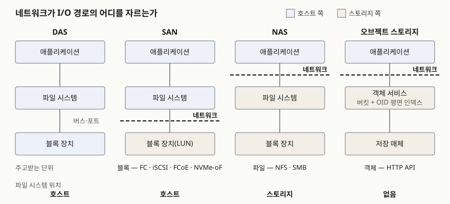

> 실행 검증 없음. NIST SP 800-209 원문과 AWS·Ceph 공식 문서만 근거로 정리했다.
> 제품별 처리량·지연 수치는 제품과 시점마다 달라 싣지 않았다.

## 들어가며

스토리지는 정보시스템 구축 과목에서 해마다 모습을 바꿔 나온다. 예전에는 "SAN과 NAS를 비교하라"였고,
클라우드와 AI 인프라가 들어오면서 "블록·파일·오브젝트를 비교하고 용도를 제시하라"가 됐다. 두 문항은
같은 표를 쓰는 것처럼 보이지만 **분류 축이 다르다.** SAN·NAS는 저장 장치가 어디에 있고 무엇으로
연결되는가의 분류이고, 블록·파일·오브젝트는 클라이언트가 무엇을 단위로 주고받는가의 분류다. 이 둘을
섞어 쓰면 "SAN은 블록 스토리지의 한 종류"라는 맞는 문장과 "NAS는 오브젝트보다 느리다"라는 뜻 없는
문장이 한 답안에 같이 들어간다.

## 정의

**블록·파일·오브젝트 스토리지**: 저장 시스템이 클라이언트 소프트웨어에 내놓는 **서비스 인터페이스(접근
유형)** 에 따른 분류로, 각각 고정 크기 블록, 볼륨 안 디렉터리에 담긴 파일, 평면 인덱스로 찾는 가변 크기
객체를 단위로 데이터를 주고받는다.

NIST SP 800-209(저장 인프라 보안 지침)는 데이터 저장 기술을 **2가지 분류 축**으로 본다.

| 축 | NIST SP 800-209의 기준 | 해당하는 것 |
|---|---|---|
| ① 위치 | 저장 장치가 호스트에 직접 붙었는가, 사이에 네트워크가 있는가 | DAS / 네트워크 스토리지(SAN·NAS) |
| ② 접근 유형 | 저장 시스템이 클라이언트에 내놓는 서비스 인터페이스 | 블록 / 파일 / 오브젝트 |

각 접근 유형의 정의는 같은 문서의 블록·파일·오브젝트 서비스 절(§2.1~§2.3)이 다음처럼 적는다.

- **블록 스토리지 서비스**: 고정 크기 블록을 읽고 쓰는 인터페이스. 보통 넓은 대역폭과 짧은 지연으로
  장치에 블록 수준 접근을 제공하고, **블록은 호스트 OS가 관리한다**
- **파일 스토리지 서비스**: 저장 자원을 **볼륨 안의 디렉터리에 담긴 파일**이라는 파일 시스템 모델로 내놓는다
- **오브젝트 스토리지 서비스**: 데이터를 버킷(컨테이너)에 담긴 **크기가 자유로운 객체**로 내놓는다. 객체마다
  고유 식별자(OID)가 붙고, OID들이 **평면 인덱스**로 모여 객체를 찾는 데 쓰이며, 검색을 위해 **동적
  메타데이터**를 붙일 수 있다

## 등장 배경

출발점은 DAS다. NIST는 DAS를 저장 장치가 컴퓨터의 일부(버스에 연결)이거나 컴퓨터 포트(직렬·USB)에 붙은
외장 장치인 형태로 설명한다. 장치가 한 호스트에 묶이므로 다른 호스트가 그 용량을 쓸 수 없고, 남는 용량도
옮길 수 없다. 저장 장치를 네트워크 너머로 빼서 여러 호스트가 나눠 쓰게 한 것이 네트워크 스토리지이고,
**무엇을 네트워크로 보내느냐**에 따라 두 갈래가 됐다.

- 블록을 보내면 **SAN**이다. NIST는 SAN을 블록 수준 접근을 위한 **전용 고속 네트워크**로 설명한다.
  호스트에게는 원격 장치가 로컬에 붙은 것처럼 보이므로, 기존 OS와 DB가 고칠 것 없이 그대로 올라간다
- 파일을 보내면 **NAS**다. 파일 시스템을 스토리지 쪽에 두고 여러 클라이언트가 같은 볼륨을 마운트해
  공유한다

오브젝트는 다른 문제에서 나왔다. 파일 시스템은 경로를 따라 디렉터리 트리를 여러 단계 걸어 내려가야
파일을 찾는다. 데이터가 아주 커지면 이 탐색과 메타데이터 처리가 짐이 된다. NIST는 오브젝트 스토리지가
OID와 객체 안의 오프셋만으로 찾으므로 **조회가 2단계로 끝나고**, 그만큼 저장 시스템의 메타데이터 처리가
줄어 규모가 커질수록 유리하다고 적는다. 그래서 주된 이점을 **확장성**으로 꼽고, 대표 용도로 대용량
비정형 데이터의 보관을 든다.

## 구성요소 / 절차

### 네트워크 스토리지의 구성 — SAN 3요소

NIST는 SAN 기반 시스템의 구성 단위를 **3가지**로 든다. ① 호스트 컴퓨터(클라이언트), ② 스위치 배치로
이루어진 토폴로지, ③ 저장 장치·어레이. 셋을 잇는 노드와 하드웨어의 배치 전체를 **SAN 패브릭**이라 부른다.

### SAN 프로토콜 — 4가지

| 프로토콜 | NIST SP 800-209의 설명 |
|---|---|
| ① FC SAN | 5계층(FC0~FC4) 파이버 채널 프로토콜 스택. 주소를 붙이는 논리 저장 자원을 LUN이라 부른다 |
| ② IP SAN | 네트워크 계층에 IP를 쓰는 스택. iSCSI가 예다 |
| ③ FCoE | 파이버 채널 프레임을 이더넷 패킷에 담는다 |
| ④ NVMe-oF | NVMe 명령을 네트워크로 보내는 규격. 전송으로 RDMA 계열·파이버 채널·TCP를 쓴다 |

### NAS의 형태 — 4가지

| 형태 | NIST SP 800-209의 설명 |
|---|---|
| ① NFS | NFS 클라이언트 드라이버가 볼륨을 마운트하고, 여러 클라이언트가 같은 볼륨을 공유한다 |
| ② SMB | 개인용 컴퓨터 OS의 네트워크 스택에 있는 SMB로 연결하는 LAN 파일 서버 |
| ③ 멀티 프로토콜 | 한 폴더를 NFS와 SMB로 동시에 내보낸다. 프로토콜마다 접근 제어 구조가 달라 충돌을 풀어야 할 수 있다 |
| ④ pNFS | 단일 NFS 서버 대신 저장 서버 클러스터가 데이터와 메타데이터를 나눠 갖고, 클라이언트 접속을 여러 서버로 분산한다 |

### 접근 유형 — 기본 3가지 + 확장 2가지

NIST는 블록·파일·오브젝트 다음에 **2가지**를 더 든다. 콘텐츠 주소 저장(CAS)은 문서를 암호 해시 값(예:
SHA-256)으로 찾는 오브젝트 스토리지의 특수형이고, 상위 수준 데이터 접근 서비스는 SQL·NoSQL DB나 메시지
큐처럼 전용 클라이언트로만 접근하는 서비스다. 답안에서 "기본 3가지"로 쓰되, 이 둘을 알면 분류의 경계를
물을 때 쓸 수 있다.

## 도식

> **출처**: [NIST SP 800-209 §2 Data Storage Technologies: Background, §2.1 Block · §2.2 File · §2.3 Object Storage Service](https://nvlpubs.nist.gov/nistpubs/SpecialPublications/NIST.SP.800-209.pdf)

답안지에는 애플리케이션·파일 시스템·블록 장치 3층을 네 번 나란히 그리고, 네트워크 점선의 위치만 바꾼다.
**SAN은 파일 시스템 아래를, NAS는 파일 시스템 위를 자른다.** 오브젝트는 파일 시스템 자리에 평면
인덱스를 가진 객체 서비스가 들어간다. 이 한 장으로 "파일 시스템을 누가 관리하는가"가 같이 설명된다.

## 비교

### 블록 · 파일 · 오브젝트

| 비교 항목 | 블록 | 파일 | 오브젝트 |
|---|---|---|---|
| 단위 | 고정 크기 블록 | 디렉터리 안의 파일 | 크기가 자유로운 객체 |
| 주소 | 블록 주소 | 디렉터리 트리 경로 | 버킷 + OID, 평면 인덱스 |
| 파일 시스템 | 호스트 OS가 블록 위에 얹는다 | 스토리지가 관리한다 | 없다 |
| 메타데이터 | 거의 없다 | 이름·크기·시각·권한으로 정해져 있다 | 동적으로 붙인다 |
| 갱신 | 블록 단위 덮어쓰기 | 파일 일부 덮어쓰기 | 키 단위 통째 교체 |
| 공유 | 보통 호스트 1대 | 여러 호스트가 같은 볼륨 | HTTP가 닿는 어디서나 |
| 주된 이점 | 짧은 지연, 기존 OS·DB가 그대로 | 기존 애플리케이션 그대로 공유 | 확장성 |

### DAS · SAN · NAS

| 비교 항목 | DAS | SAN | NAS |
|---|---|---|---|
| 분류 축 | 위치 | 위치 + 블록 접근 | 위치 + 파일 접근 |
| 연결 | 버스·직렬·USB 포트 | 전용 고속 네트워크(FC) 또는 IP 위 저장 프로토콜 | LAN |
| 네트워크로 보내는 것 | — | 블록 | 파일 |
| 파일 시스템 위치 | 호스트 | 호스트 | NAS 장치 |
| 공유 | 안 된다 | 볼륨 단위로 나눠 준다 | 같은 볼륨을 여럿이 마운트 |

두 표를 잇는 문장이 답안의 핵심이다. **SAN과 DAS는 둘 다 블록 접근이고, 차이는 네트워크의 유무다.
SAN과 NAS는 둘 다 네트워크 스토리지이고, 차이는 네트워크로 보내는 단위다.** 오브젝트 스토리지는
위치 축에서는 네트워크 스토리지에 속하지만 NIST의 위치 축 설명에는 SAN·NAS 두 갈래만 나온다.

같은 디스크 위에서도 내놓는 인터페이스에 따라 종류가 갈린다. Ceph는 분산 오브젝트 저장소 RADOS 하나
위에 블록(RBD)·파일(CephFS)·오브젝트(RGW) 인터페이스를 함께 얹는다. 세 가지가 매체가 아니라
인터페이스의 차이라는 것을 보여 주는 예다.

## 적용 시 고려사항

- **블록 볼륨을 여러 호스트가 함께 쓰면 파일 시스템이 깨진다.** 블록은 메타데이터를 호스트 OS가
  관리하므로, 두 호스트가 같은 볼륨에 각자의 파일 시스템 구조를 쓰면 서로의 기록을 덮어쓴다. AWS는 EBS
  다중 연결 볼륨에 ext4·XFS 같은 일반 파일 시스템을 쓰지 말고 클러스터 인식 파일 시스템을 쓰라고 적는다.
  여러 호스트의 공유가 요구사항이면 처음부터 파일 스토리지를 고른다.
- **오브젝트는 일부만 고칠 수 없다.** 객체는 키 단위로 통째 교체된다. Amazon S3는 한 키에 대한 갱신이
  원자적이지만 여러 키에 걸친 원자적 갱신은 없고, 잠금도 제공하지 않는다고 적는다. 작은 부분을 자주 고치는
  DB 데이터 파일을 오브젝트에 두지 않는 이유다. 반대로 한 번 쓰고 여러 번 읽는 데이터에는 이 제약이 거의
  문제가 되지 않는다.
- **NAS 멀티 프로토콜은 권한 모델이 둘이다.** NIST는 NFS와 SMB로 같은 폴더를 내보낼 때 프로토콜마다 ACL·권한
  구조가 달라 접근 요청 시 충돌을 해소해야 할 수 있다고 적는다. 리눅스 서버와 윈도 사용자가 같은 공유를 쓰는
  설계라면 어느 쪽 권한을 기준으로 할지 먼저 정한다.
- **저장 네트워크를 업무 네트워크와 나눈다.** NIST는 SAN 스위치에서 존닝(zoning)으로 접근 범위를 나누고,
  IP 저장 네트워크는 데이터 접근·관리·복제·백업 트래픽 유형별로 최대한 분리하라고 권고한다. IP SAN과 NAS는
  업무망과 같은 이더넷 위에 올라가므로 이 분리가 저절로 생기지 않는다.
- **서버 기반 SAN(하이퍼컨버지드)은 연산 자원을 나눠 쓴다.** NIST는 하이퍼컨버지드 구조에서 각 호스트의
  저장 장치를 가상화해 공용 풀로 묶고, 연산에 쓰던 CPU 일부가 저장 접근·관리 기능에 쓰일 수 있다고 적는다.
  전용 SAN 어레이가 하던 일을 서버가 떠안는 셈이므로 용량 계획에 그 몫을 넣는다.

## 정리

- **정의 1줄**: 저장 시스템이 클라이언트에 내놓는 인터페이스에 따른 분류. 블록·파일·객체를 단위로 주고받는다.
- **분류 축 2가지 (NIST)**: 위치(DAS / SAN·NAS)와 접근 유형(블록·파일·오브젝트). 축을 섞지 않는다.
- **네트워크 자리 하나로 외운다**: DAS는 없음, SAN은 파일 시스템 아래, NAS는 파일 시스템 위, 오브젝트는
  파일 시스템 대신 평면 인덱스.
- **숫자 묶음**: SAN 3요소(호스트·토폴로지·어레이), SAN 프로토콜 4(FC·IP·FCoE·NVMe-oF), NAS 형태 4(NFS·SMB·
  멀티 프로토콜·pNFS), 접근 유형 3+2(블록·파일·오브젝트 + CAS·상위 수준).
- **고르는 기준은 사용 사례**: NIST는 데이터 양, 데이터 통제 요구, 성능, 데이터 표현 방식이 선택을 정한다고 적는다.

> 기출 답안: [기출문제 — 블록·파일·오브젝트 스토리지 비교와 AI 학습 데이터·서비스 인프라 활용](../../exam/2026-10-04-block-file-object-storage-ai/index.md)

## 참고 자료

- [NIST SP 800-209, Security Guidelines for Storage Infrastructure (2020-10)](https://nvlpubs.nist.gov/nistpubs/SpecialPublications/NIST.SP.800-209.pdf) — §2 두 분류 축, §2.1 Block Storage Service와 §2.1.1 SAN, §2.2 File Storage Service, §2.3 Object Storage Service, §2.4 CAS, §2.5 Higher-Level Data Access Service, §2.9 Converged and Hyper-Converged Storage, §4.6 SAN 존닝·IP 저장 네트워크 분리 권고
- [Amazon S3 User Guide — What is Amazon S3? (Amazon S3 data consistency model)](https://docs.aws.amazon.com/AmazonS3/latest/userguide/Welcome.html)
- [Amazon EBS User Guide — Attach an EBS volume to multiple EC2 instances using Multi-Attach](https://docs.aws.amazon.com/ebs/latest/userguide/ebs-volumes-multi.html)
- [Ceph Documentation — Architecture](https://docs.ceph.com/en/latest/architecture/)
