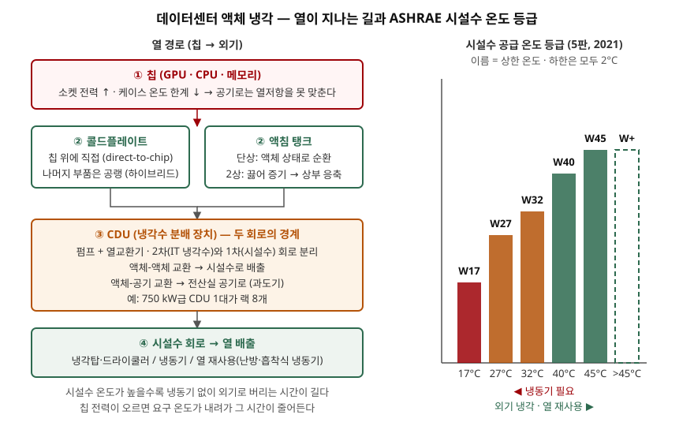

> 실행 검증 없음. 설비 개념이므로 ASHRAE TC 9.9의 공개 백서(1차)와 Uptime Institute
> 설문(1차 집계), NVIDIA 참조 아키텍처(1차)를 근거로 정리했다. Thermal Guidelines 5판은
> 유료 서적이라 등급 명칭·하한 온도·H1 등급 범위는 백서 본문에서, 그 외 개정 요지는
> Upsite Technologies 해설(2차)로 확인했다. 수치는 전부 출처가 있는 것만 썼다.

## 들어가며

AI 데이터센터 기출에서 기존 데이터센터와의 차이를 쓰면 "액체 냉각을 쓴다"는 한 줄이
빠지지 않는다. 채점자는 그 다음을 본다. 왜 공기로는 안 되는지, 액체가 칩에서 어디까지
흘러가는지, 설비 쪽에 무슨 숫자를 넘겨야 하는지다. 실무에서는 GPU 랙을 들이기로 한
뒤에야 시설수 온도가 맞지 않아 냉동기를 추가하거나 랙을 비워 두는 일이 생긴다. 정보시스템
설계자가 장비 사양서의 냉각 요구를 설비 입력 조건으로 바꿔 넘기는 것이 이 개념의 쓸모다.

## 정의

**데이터센터 액체 냉각**은 IT 장비가 내는 열을 공기 대신 **액체가 칩 표면 또는 장비
전체에서 직접 받아** 냉각수 분배 장치(CDU)를 거쳐 시설의 냉각수 회로로 넘기는 냉각
방식이다. ASHRAE TC 9.9는 공랭의 환경 등급(A1~A4, H1)과 별도로 액체 냉각을 **시설수
공급 온도 등급(W 등급)** 으로 분류하며, 2021년 5판에서 등급 이름을 상한 온도로 바꿨다.

같은 백서는 액체 냉각이 "선택"에서 "일부 경우 요구사항"으로 바뀌었다고 적는다. 그 근거가
아래 등장 배경이다.

## 등장 배경 — 공랭의 한계 3가지

ASHRAE 백서는 2018년 무렵까지는 세대마다 성능이 오르면서도 서버 전력은 완만하게
늘었고, 그 뒤로 CPU·GPU·메모리의 전력이 크게 오르기 시작했다고 본다. 멀티코어로
전력을 나눠 쓰던 시기가 끝나고, 성능을 올리려면 소켓 전력을 올려야 하는 시기가 됐다.
동시에 칩 제조사는 허용 케이스 온도를 낮춘다. 전력은 오르고 온도 여유는 줄어드니
냉각 매체가 가져가야 할 열저항이 작아지고, 공기로는 그 값을 못 맞춘다.

| 한계 | 백서의 수치 | 뜻 |
|---|---|---|
| ① 풍량 | 최고 수준 센터가 바닥 타일 한 장으로 낼 수 있는 풍량은 1,900 cfm. 요즘 고밀도 서버는 1U당 100 cfm 이상 | 타일 한 장이 받치는 서버는 랙의 19U뿐이다 |
| ② 팬 전력 | 한때 서버 전력의 20%였던 팬 전력을 2%까지 줄였는데, 고밀도 서버에서 다시 10~20%로 올라간다. 50 kW 랙이면 팬에만 5 kW 이상 | 팬도 UPS를 쓰므로 2%→10%는 UPS 용량 8%를 잃는 것과 같다 |
| ③ 흡기 온도 | 고밀도 서버는 A2(최고 35°C)도 못 맞춰 5판이 H1 등급을 새로 만들었다. 허용 15~25°C, 권장 18~22°C | 데이터센터의 "더운 운전" 추세를 거꾸로 돌린다 |

세 한계는 서로를 악화시킨다. 풍량을 올리면 팬 전력과 소음이 오르고, 흡기 온도를 내리면
외기 냉각 시간이 줄어든다. 백서가 "앞으로 짓는 데이터센터는 액체 냉각을 추가할 수
있는 설계를 포함하라"고 권고하는 이유다.

## 구성요소

### 열 포집 방식 — 2계열 4종

| 계열 | 방식 | 어떻게 | 주의점 (백서) |
|---|---|---|---|
| 콜드플레이트 | ① 직접 칩 냉각 (direct-to-chip) | 칩 위에 냉각판을 올리고 그 안으로 액체를 흘린다. GPU·CPU만 액체로, 나머지는 공기로 식히는 **하이브리드**가 흔하다 | 메모리를 공랭으로 남기면 팬 전력이 여전히 높고 액체로 가져가는 열 비율이 낮아져 TCO 이점이 줄어든다 |
| 콜드플레이트 | ② 메모리 냉각판 | DIMM 양면 또는 한 면에 냉각판 | 양면이면 20 W/DIMM 이상도 식히지만 제조·정비가 복잡하다 |
| 액침 | ③ 단상 액침 | 유전성 액체 탱크에 서버를 담그고 액체 상태 그대로 순환시켜 열교환기로 보낸다 | 탱크형은 정비 시 크레인이나 2인 리프트가 필요하고, 액체와 부품의 재료 적합성·보증을 먼저 확인해야 한다 |
| 액침 | ④ 2상 액침 | 액체가 칩에서 끓어 증기가 되고 상부 응축 코일에서 다시 액체가 된다 | 자연 대류 한계를 넘는 발열에서 단상의 대안이 된다 |

Uptime Institute의 2024년 냉각 설문(응답 964명)에서 직접 액체 냉각을 쓰는 운영자는
22%이고, 쓰는 곳에서는 수랭 콜드플레이트가 64%로 가장 많다. 유전성 콜드플레이트 30%,
단상 액침 26%가 뒤따른다. 쓰는 곳의 절반 가까이는 전체 랙의 10% 미만에만 적용하고 있다.
NVIDIA의 GB200 참조 아키텍처도 GPU·CPU는 액체로, 나머지는 공기로 식히는 하이브리드다.

### CDU — 두 회로의 경계

냉각수 분배 장치(CDU)는 펌프와 열교환기를 갖고 **IT 쪽 냉각수 회로(2차)와 시설수
회로(1차)를 분리**한다. 칩을 지나는 액체와 냉각탑을 지나는 물이 섞이지 않으므로 수질·압력을
따로 관리할 수 있다. 백서의 사례 구성은 750 kW급 CDU 한 대가 랙 8개를 받는다.

시설수 배관이 아직 랙 근처까지 오지 않은 센터는 CDU 대신 **액체-공기 열교환기**를 랙이나
열(row)에 두고 열을 전산실 공기로 되돌릴 수 있다. 백서는 이를 과도기 해법으로 보되,
공기의 열용량이 작아 접근 온도차가 크므로 **필요한 시설수 온도가 더 빨리 내려간다**고
경고한다.

### 시설수 온도 등급 — 6개

| 등급 (5판) | 구 명칭 (4판) | 시설수 공급 온도 | 비고 |
|---|---|---|---|
| W17 | W1 | 2~17°C | 냉동기 필요 |
| W27 | W2 | 2~27°C | |
| W32 | W3 | 2~32°C | 현재 대부분의 콜드플레이트가 "쉽게" 운전 (백서) |
| W40 | 신설 | 2~40°C | 열 재사용 수요로 신설 (2차) |
| W45 | W4 | 2~45°C | 온수 냉각. 냉동기 최소화 |
| W+ | W5 | 45°C 초과 | |

5판은 등급 이름에 상한을 넣고 하한을 모두 2°C로 통일했다. 더 중요한 변경은 적합성
정의다. **어떤 W 등급을 지원한다는 것은 그 등급의 전 온도 범위에서 성능 저하 없이
운전된다는 뜻**이어야 한다. 이전에는 "W4 지원"이라 적힌 장비가 실제로는 상한 근처에서
성능을 낮추는 경우가 있어 설비 설계가 어긋났다.

## 도식

> **출처**: [ASHRAE TC 9.9, Emergence and Expansion of Liquid Cooling in Mainstream Data Centers (2021-05-07)](https://www.ashrae.org/File%20Library/Technical%20Resources/Bookstore/Emergence-and-Expansion-of-Liquid-Cooling-in-Mainstream-Data-Centers_WP.pdf) — "Change to ASHRAE Water Classifications", "No Water to the Rack, What to Do?", Appendix Table 2 (CDU 구성), "Immersion" · [NVIDIA DGX SuperPOD GB200 Reference Architecture — Key Components (2025-11)](https://docs.nvidia.com/dgx-superpod/reference-architecture-scalable-infrastructure-gb200/latest/dgx-superpod-components.html) — GPU·CPU 액체, 나머지 공랭

답안지에는 왼쪽에 상자 네 개(칩 → 포집 → CDU → 시설수)를 세로로, 오른쪽에 막대 여섯 개를
그리면 된다. CDU 상자 안에 "1차/2차 분리"를 쓰는 것이 점수다.

## 동작 — 칩 전력이 오르면 등급이 내려온다

백서가 가장 강조하는 것은 **등급이 고정되지 않는다**는 점이다. 열저항은 (케이스 온도 −
냉각수 온도) ÷ 전력이다. 전력이 오르고 케이스 온도 한계가 내려오면 같은 열저항을 맞추기
위해 냉각수 온도를 내려야 한다. 백서의 전망은 이렇다. 오늘의 직접 칩 냉각 제품은 W45에서
돌 수 있지만, 다음 세대는 W32만 가능할 수 있고, 결국 W27 범위까지 내려올 수 있다. 메모리를
같은 회로에 넣으면 CPU 500 W와 DIMM 12 W의 조합만으로 시설수를 W27로 끌어내릴 수 있다.

이것이 설비에 미치는 영향은 둘이다. 첫째, 시설수 온도가 내려가면 냉각탑만으로 버티던
시간이 줄고 냉동기가 다시 필요해진다. 둘째, 액체 냉각으로 고밀도화하면 같은 전력을 더 적은
랙에 넣으므로 배선·배관·면적은 줄지만, 랙당 전력이 커져 급전 전압을 208 V에서 480 V로
올리는 변곡점이 온다. 냉각 결정이 전기 설계를 바꾼다.

## 비교 — 공랭 · 콜드플레이트 · 액침

| 구분 | 공랭 | 콜드플레이트 (직접 칩) | 액침 |
|---|---|---|---|
| 열 포집 위치 | 서버 흡기 공기 | 칩 표면 | 장비 전체 |
| 관리 등급 | A1~A4, H1 (흡기 온도) | W17~W+ (시설수 온도) | W 등급 + 액체 사양 |
| 랙 안 공기 흐름 | 필요 | 일부 필요 (하이브리드) | 불필요 |
| 기존 랙·서버 호환 | 그대로 | 서버 개조 또는 전용 모델 | 전용 탱크·개조 |
| 정비 | 쉬움 | 퀵 커넥터, 누수 절차 | 크레인·리프트, 액체 취급 |
| 적합한 상황 | 범용 업무 서버 | GPU·고전력 CPU 랙 | 초고밀도, 공기 배관을 없애고 싶은 경우 |

어느 쪽이 낫다는 문제가 아니다. 백서도 범용 업무 서버의 전력 증가율은 연 1~2%라 당분간
공랭이 남는다고 본다. 과학·분석·GPU 워크로드만 4% 이상으로 오르며, 액체 냉각은 그
워크로드를 어디에 둘지의 문제다.

## 적용 시 고려사항

- **장비 사양의 W 등급을 설비 입력 조건으로 넘긴다.** 들일 장비가 요구하는 시설수 온도
  등급과 설비가 낼 수 있는 등급을 맞춘다. 5판 정의대로 "전 범위 성능 보장"인지 벤더에
  확인한다. 상한 근처에서 성능을 낮추는 장비면 등급 표기만 믿고 설계하면 안 된다.
- **다음 세대를 위한 온도 여유를 둔다.** 지금 W45로 되는 장비를 기준으로 냉동기 없이
  설계하면 두 세대 뒤 W32·W27 장비에서 냉동기를 추가해야 한다. 백서는 경제화 운전
  위주로 짓더라도 기계식 냉각을 더할 수 있게 하라고 적는다.
- **하이브리드의 공랭 몫을 계산에 넣는다.** GPU·CPU만 액체로 받으면 나머지 열은 여전히
  전산실 공기로 나온다. 액체로 가져가는 열 비율을 모르면 CRAH 용량과 팬 전력을 잘못 잡는다.
- **액침은 재료 적합성과 보증부터 본다.** 백서는 배치 전에 재료 적합성 평가와 보증 영향
  평가를 권고한다. 유전성 액체가 케이블·커넥터·저장장치에 미치는 영향은 벤더마다 다르다.
- **열 재사용은 등급과 함께 설계한다.** 시설수를 높게 가져갈수록 난방이나 흡착식 냉동기에
  쓸 수 있다. 백서의 LRZ 사례는 40~45°C 온수 냉각으로 폐열을 사무 공간 난방과 흡착식
  냉동기 구동에 쓰고, 냉각 부분 PUE를 0.07 미만으로 낮췄다.

> 기출 답안: [기출문제 — AI 데이터센터, 기존 데이터센터와 무엇이 다른가](../../exam/2026-10-08-ai-data-center-vs-traditional/index.md)

## 정리

- 액체 냉각 = **칩 표면이나 장비 전체에서 액체가 열을 직접 받아 CDU를 거쳐 시설수로 넘기는 방식.** 공랭 한계 **3가지**: 풍량(타일 1,900 cfm 대 1U당 100 cfm) · 팬 전력(10~20%) · 흡기 온도(H1 신설).
- 열 포집 **2계열 4종**: 콜드플레이트(직접 칩·메모리) / 액침(단상·2상). CDU는 **1차(시설수)·2차(IT) 회로의 경계**.
- 시설수 등급 **6개**: W17·W27·W32·W40·W45·W+. 이름 = 상한, 하한 = 2°C, 적합 = **전 범위 성능 보장**. 암기 단서는 **"17-27-32-40-45-플러스"**.
- 칩 전력이 오르면 등급이 **W45 → W32 → W27**로 내려온다. 설비 입력 조건은 **등급·여유·공랭 몫·급전 전압** 넷이다.

## 참고 자료

- [ASHRAE TC 9.9, Emergence and Expansion of Liquid Cooling in Mainstream Data Centers, White Paper (2021-05-07)](https://www.ashrae.org/File%20Library/Technical%20Resources/Bookstore/Emergence-and-Expansion-of-Liquid-Cooling-in-Mainstream-Data-Centers_WP.pdf) — 등급 개명, 풍량·팬 전력, H1 범위, 등급 하강 전망, CDU 사례, 액침, 480 V, LRZ 사례 (1차)
- [ASHRAE, Thermal Guidelines for Data Processing Environments, 5th ed. (2021-03)](https://www.ashrae.org/technical-resources/bookstore/datacom-series) — 공랭 A1~A4·H1, 액체 W17~W+ (1차, 유료 서적)
- [Upsite Technologies, Major Changes to ASHRAE's Fifth Edition of Thermal Guidelines Part 3: Liquid Cooling Chapter Updates (2024-07-31)](https://www.upsite.com/blog/major-changes-to-ashraes-fifth-edition-of-thermal-guidelines-part-3-liquid-cooling-chapter-updates/) — W40 신설 배경(열 재사용), 적합성 정의 (2차)
- [Upsite Technologies, What You Need to Know About ASHRAE's Fifth Edition of Thermal Guidelines (2021-05-19)](https://www.upsite.com/blog/what-you-need-to-know-about-ashraes-fifth-edition-of-thermal-guidelines/) — 5판 발행 시점, H1 범위 (2차)
- [Uptime Institute, 2024 Cooling Systems Survey: Direct Liquid Cooling Results (2024-05)](https://datacenter.uptimeinstitute.com/rs/711-RIA-145/images/2024.Cooling.Survey.Report.pdf) — 응답 964명, DLC 사용 22%, 유형별 비율, 적용 랙 비율
- [Uptime Institute Journal, Water cold plates lead in the small but growing world of DLC (2024-10-30)](https://journal.uptimeinstitute.com/water-cold-plates-lead-in-the-small-but-growing-world-of-dlc/) — 수랭 콜드플레이트 64% 확인
- [NVIDIA DGX SuperPOD GB200 Reference Architecture — Key Components (2025-11-19 갱신)](https://docs.nvidia.com/dgx-superpod/reference-architecture-scalable-infrastructure-gb200/latest/dgx-superpod-components.html) — GPU·CPU 액체 냉각, 나머지 공랭 (1차)
- [HPAC Engineering, ASHRAE Introduces Thermal Guidelines for Liquid-Cooled Data-Processing Environments (2011-10-11)](https://www.hpac.com/archive/article/20925053/ashrae-introduces-thermal-guidelines-for-liquid-cooled-data-processing-environments) — 2011년 백서의 W1~W5 온도 범위 (2차)
