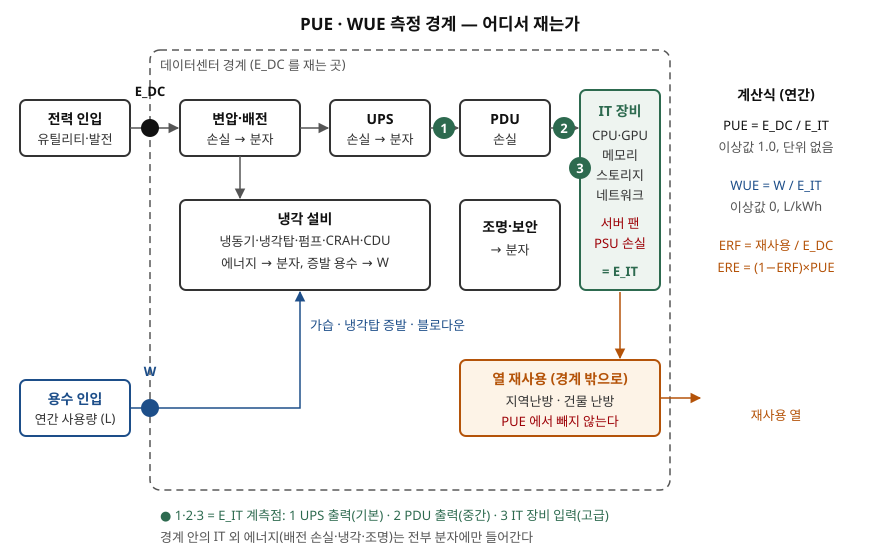

> 실행 검증 없음. 지표 정의와 계산 예시는 공개 자료만으로 정리했다. ISO/IEC 30134-2·
> 30134-9는 유료 표준이라 발행처 미리보기(목차·머리말·적용 범위)까지만 확인했다. 측정
> 범주의 계측 위치와 계산 규칙은 ISO 2판이 참고문헌으로 드는 The Green Grid 백서
> WP#49(1차)에서, WUE 정의는 같은 단체의 WP#35(1차)에서 가져왔다. 업계 평균값은
> Uptime Institute 설문(1차 집계)만 썼다.

## 들어가며

AI 데이터센터 기출에서 효율을 묻으면 답안에 PUE가 빠지지 않는다. 채점자가 보는 것은
"1에 가까울수록 좋다" 다음이다. 분모의 IT 에너지를 어디서 쟀는지, 왜 IT 장비를 효율적인
것으로 바꿨는데 PUE가 나빠지는지, 열을 이웃 건물에 팔면 PUE가 1 아래로 내려가는지다.
실무에서는 액체 냉각을 도입하거나 증발식 냉각탑을 쓸지 정할 때 PUE와 WUE가 서로 반대로
움직이므로, 두 지표의 경계와 한계를 알고 있어야 설계 판단을 숫자로 설명할 수 있다.

## 정의

**PUE(Power Usage Effectiveness, 전력 사용 효율)** 는 데이터센터 총에너지 소비(E_DC)를 IT
장비 에너지 소비(E_IT)로 나눈 연간 값이다. ISO/IEC 30134-2:2026은 PUE를 에너지의 효율적
사용을 정량화하는 핵심 성과 지표(KPI)로 규정하고, 이 지표가 원래 The Green Grid가 만든
것임을 밝힌다. 단위가 없고 이상값은 1.0이다.

**WUE(Water Usage Effectiveness, 용수 사용 효율)** 는 데이터센터 현장의 연간 용수 사용량을
같은 E_IT로 나눈 값으로, 단위는 L/kWh이고 이상값은 0이다(The Green Grid WP#35).
ISO/IEC 30134-9:2022는 WUE를 데이터센터 **운영 단계**의 용수 소비를 정량화하는 KPI로
규정한다.

두 지표의 분모가 같다는 점이 중요하다. WP#35는 PUE를 구할 때 쓴 E_IT 값을 WUE에도 그대로
쓰라고 적는다. 그래야 두 지표가 같은 기준선 위에서 비교된다.

## 등장 배경

전력 단가가 운영비의 큰 몫이 되면서 "설비가 IT를 받치는 데 에너지를 얼마나 더 쓰는가"를
한 숫자로 비교할 필요가 생겼다. Uptime Institute 설문에 따르면 PUE는 The Green Grid가
2007년에 도입했고, 응답 시설의 가중 평균은 2007년 2.50에서 2014년 1.65로 빠르게 내려갔다.
배전 설비 교체, 기류 관리, 냉각 제어 같은 쉬운 개선이 먼저 반영된 결과다. 2025년 평균은
1.54(응답 681곳)로, **6년째 사실상 제자리**다.

PUE만으로는 물을 볼 수 없다. 증발식 냉각은 전력을 아끼는 대신 물을 쓰므로, PUE를 낮추려는
설계가 물 사용을 늘릴 수 있다. WP#35는 용수가 데이터센터의 설계·입지·운영에서 매우 중요해지고
있다는 이유로 2011년에 WUE를 내놓았고, ISO는 PUE를 2016년(30134-2 초판), WUE를 2022년
(30134-9)에 표준으로 만들었다.

## 구성요소

### ISO/IEC 30134 시리즈 — 9개 부

| 부 | 지표 | 무엇을 보는가 |
|---|---|---|
| 1 | 개요·공통 요구사항 | 시리즈 전체의 용어와 규칙 |
| 2 | PUE | 설비 에너지 효율 |
| 3 | REF | 재생에너지 비율 |
| 4 | ITEEsv | 서버 에너지 효율 |
| 5 | ITEUsv | 서버 활용률 |
| 6 | ERF | 에너지(열) 재사용 비율 |
| 7 | CER | 냉각 효율 |
| 8 | CUE | 탄소 배출 |
| 9 | WUE | 용수 사용 |

ISO는 이 시리즈가 **목표치나 한계값을 정하지 않고**, 지표들을 하나로 합치지도 않는다고
명시한다. 지표마다 따로 재고 따로 보고한다.

### PUE 측정 범주 — 3가지

ISO 2판은 측정 범주를 기본(PUE1)·중간(PUE2)·고급(PUE3) 해상도로 나눈다(6.2절). 계측 위치와
주기는 WP#49의 측정 수준 표를 따랐다.

| 범주 | E_IT 계측 위치 | E_DC 계측 위치 | 최소 주기 (WP#49) |
|---|---|---|---|
| PUE1 기본 | UPS 출력 | 유틸리티 인입 | 월 1회 |
| PUE2 중간 | PDU 출력 | 유틸리티 인입 | 일 1회 |
| PUE3 고급 | IT 장비 입력 (랙 PDU·장비 자체) | 유틸리티 인입 | 15분 이하 |

범주가 올라갈수록 E_IT를 소비 지점 가까이에서 재므로 UPS 뒤의 배전 손실이 분자 쪽으로
제대로 분류된다. 같은 시설이라도 PUE1이 PUE3보다 낮게 나오는 이유다.

### PUE 파생 지표 — 4가지 (ISO 2판 9절)

iPUE(중간 기간 PUE), pPUE(구역별 부분 PUE), mPUE(혼합 용도 건물 PUE, 2판 신설),
dPUE(설계 PUE)다. 연간 실측이 아닌 값은 파생 지표 이름으로 따로 부르게 해서, "설계상
1.2"가 "운영 실적 1.2"로 읽히지 않게 한다.

### WUE — 범위 2가지, 파생 지표 5가지

WP#35는 현장 용수만 세는 **WUE**와, 발전소가 전기를 만드는 데 쓴 물까지 더하는
**WUEsource**를 나눈다. 현장 용수에는 가습, 냉각탑 증발·블로다운·비산, 현장 발전 설비 냉각이
들어간다. ISO 30134-9는 여기에 측정 범주(6.2.2절)와 파생 지표 5가지(중간·부분·설계·품질·
최대 WUE), 물 재사용 비율(WRF)을 둔다.

## 도식

> **출처**: [The Green Grid, WP#49 PUE: A Comprehensive Examination of the Metric §4.2 PUE Measurement Levels, Table 1 (2012)](https://datacenters.lbl.gov/sites/default/files/WP49-PUE%20A%20Comprehensive%20Examination%20of%20the%20Metric_v6.pdf) · [The Green Grid, WP#35 Water Usage Effectiveness §III (2011-03)](https://www.thegreengrid.org/system/files/store/WUE_v1.pdf) · [ISO/IEC 30134-2:2026 미리보기, 6.2절 범주 이름 (VDE Verlag)](https://www.vde-verlag.de/iec-normen/preview-pdf/info_isoiec30134-2{ed2.0}en.pdf) · ERF·ERE 식은 [P. P. Ray, The Green Grid Saga, IJCSE Vol.1 No.4 (2010)](https://arxiv.org/abs/1208.0593)가 옮긴 The Green Grid WP#29

답안지에는 가로로 상자 넷(인입 → 배전·UPS → PDU → IT)과 그 아래 냉각 상자 하나를 그리고,
화살표 위에 ①②③ 계측점을 찍으면 된다. **서버 팬과 PSU 손실이 IT 상자 안에 있다**는 표시가
아래 함정들을 설명하는 열쇠다.

## 동작 — 지표가 거꾸로 움직이는 4가지 경우

**① 부분 PUE는 전체 PUE가 아니다.** WP#49의 예에서 컨테이너형 구역은 UPS 손실 25MWh,
IT 475MWh로 pPUE가 1.05다. 그런데 바깥의 변압기 손실 25MWh와 냉동기 75MWh를 더하면 전체
PUE는 600/475 = 1.26이다. 백서는 1.05 같은 숫자를 들으면 이 예를 떠올리라고 적는다.

**② IT를 효율화하면 PUE가 오른다.** Patterson 등(2013)의 예에서 같은 설비에 서버만 고효율
제품(330W → 266W, PSU 손실 58W → 18W, 팬 18W → 12W)으로 바꾸면 사이트 전력은 5.3MW에서
4.66MW로 줄지만 PUE는 1.6에서 1.74로 **오른다.** 설비 에너지 1.99MW가 그대로인데 분모만
줄었기 때문이다. 저자들은 서버 내부의 팬·PSU·전압 변환 손실까지 떼어 낸 ITUE와,
TUE = ITUE × PUE를 제안했다. 이 예에서 TUE는 2.67에서 2.33으로 내려가 실제 개선을 보여 준다.

**③ 냉각을 IT 경계 안팎으로 옮기면 PUE가 바뀐다.** 같은 논문은 건물 팬만 쓰는 시설,
서버 팬만 쓰는 시설, 둘 다 쓰는 시설을 비교한다. 서버 팬은 E_IT에 들어가므로 **서버 팬에
기대는 시설의 PUE가 가장 낮게** 나오지만 그것이 가장 효율적이라는 뜻은 아니다. 액체 냉각으로
서버 팬을 줄이면 같은 이유로 E_IT가 줄어 PUE 개선 폭이 실제 절감보다 작게 보인다.

**④ 열 재사용은 PUE를 1 아래로 내리지 못한다.** WP#49는 배전 손실과 냉각 에너지가 항상
양수이므로 PUE는 1.0 아래가 될 수 없고, 폐열 재사용은 PUE에서 빼 주지 않는다고 적는다.
재사용은 별도 지표로 본다. ERF = 재사용 에너지 / 총에너지, ERE = (1 − ERF) × PUE다.
PUE 1.2인 시설이 총에너지의 17%를 재사용하면 ERE는 1.0이 된다.

**WUE와 PUE의 상충.** WP#35는 물이 필요 없는 직접팽창식(DX) 냉각기가 현장 용수를 줄이지만
증발식보다 전력을 더 쓸 수 있고, 그 전력을 만드는 발전소가 물을 쓰면 **물 사용이 다른 곳으로
옮겨 갈 뿐**이라고 경고한다. 그래서 WUEsource = EWIF × PUE + WUE로 두 효과를 함께 본다.
EWIF는 전력 1kWh 생산에 드는 물로, 백서가 든 미국 평균은 1.8L/kWh(2011년 기준)다.

## 비교

| 구분 | PUE | WUE | ERE / ERF | TUE |
|---|---|---|---|---|
| 분자 | 데이터센터 총에너지 | 연간 현장 용수 | ERE: 총에너지 − 재사용 · ERF: 재사용 | 데이터센터 총에너지 |
| 분모 | IT 장비 에너지 | IT 장비 에너지 | ERE: IT 에너지 · ERF: 총에너지 | 연산 부품 에너지 |
| 값의 범위 | 1.0 이상 | 0 이상 | ERE 0 이상, ERF 0~1 | 1.0 이상 |
| 단위 | 없음 | L/kWh | 없음 | 없음 |
| 보는 범위 | 설비 오버헤드 | 냉각·가습의 물 | 폐열의 외부 활용 | 설비 + 서버 내부 오버헤드 |
| 표준 | ISO/IEC 30134-2 | ISO/IEC 30134-9 | ISO/IEC 30134-6 (ERF) | 논문 제안 (표준 아님) |

## 적용 시 고려사항

- **보고할 때 범주와 기간을 함께 적는다.** PUE1과 PUE3, 여름 한 달과 연간은 비교할 수 없다.
  WP#49도 충분한 분석 없이 서로 다른 데이터센터의 PUE를 비교하지 말라고 권고한다.
- **PUE는 시설 하나의 추세를 보는 지표다.** IT 장비를 바꾸면 기준선이 바뀐다. 서버 교체나
  가상화 통합 뒤에 PUE가 오르면 설비가 IT 부하에 맞춰 줄어들지 못했다는 신호로 읽는다.
- **액체 냉각 효과는 총에너지나 TUE로 평가한다.** 서버 팬 전력이 줄어든 만큼 분모가 줄어
  PUE만으로는 개선이 작게 보인다.
- **냉각 방식을 고를 때 PUE와 WUE를 같이 본다.** 물이 부족한 지역은 전력을 더 쓰더라도
  현장 용수를 줄이는 쪽이 맞을 수 있다. 어느 쪽이 정답인지는 입지가 정한다.
- **규제 보고를 염두에 둔다.** EU는 위임규정 2024/1364로 IT 전력 500kW 이상 시설에 매년
  5월 15일까지 에너지·용수·재사용 열 등을 보고하게 했고, 이를 바탕으로 PUE·WUE·ERF·REF를
  산출한다(법률사무소 해설, 2차). 계측 설계를 처음부터 ISO 범주에 맞춰 두면 보고가 쉬워진다.

> 기출 답안: [기출문제 — AI 데이터센터, 기존 데이터센터와 무엇이 다른가](../../exam/2026-10-08-ai-data-center-vs-traditional/index.md)
>
> 함께 볼 개념: [데이터센터 액체 냉각 — 콜드플레이트·액침과 ASHRAE 시설수 온도 등급](../2026-10-08-data-center-liquid-cooling-ashrae-w-classes/index.md)

## 정리

- **PUE = E_DC ÷ E_IT (연간, 이상값 1.0)**, **WUE = 연간 현장 용수 ÷ E_IT (L/kWh, 이상값 0)**. 분모는 같은 E_IT를 쓴다.
- 측정 범주 **3가지**: 기본(UPS 출력)·중간(PDU 출력)·고급(IT 장비 입력). 암기 단서는 "**U·P·I**".
- PUE 파생 **4가지**: i·p·m·d PUE. WUE 파생 **5가지**: 중간·부분·설계·품질·최대 + WRF.
- 지표가 거꾸로 움직이는 **4가지**: 부분 PUE 착시 · IT 효율화 시 상승 · 팬 위치 · 재사용 불인정(ERE로 본다). 여기에 PUE↔WUE 상충을 더한다.

## 참고 자료

- [ISO/IEC 30134-2:2026, Information technology — Data centres key performance indicators — Part 2: Power usage effectiveness (PUE), 2nd ed. (2026-01)](https://www.iso.org/standard/85172.html) — 적용 범위, 범주 3가지, 파생 지표 4가지, 2판 주요 변경. 본문은 [VDE Verlag 미리보기](https://www.vde-verlag.de/iec-normen/preview-pdf/info_isoiec30134-2{ed2.0}en.pdf)로 목차·머리말만 확인 (1차)
- [ISO/IEC 30134-9:2022, Part 9: Water usage effectiveness (WUE) (2022-03)](https://www.iso.org/standard/77692.html) — 적용 범위, WUE 파생 지표, WRF. 목차는 [VDE Verlag 미리보기](https://www.vde-verlag.de/iec-normen/preview-pdf/info_isoiec30134-9{ed1.0}en.pdf)로 확인 (1차)
- [The Green Grid, WP#49 PUE: A Comprehensive Examination of the Metric (2012)](https://datacenters.lbl.gov/sites/default/files/WP49-PUE%20A%20Comprehensive%20Examination%20of%20the%20Metric_v6.pdf) — 측정 수준 3단계(§4.2), pPUE 예(§7), PUE 1.0 미만 불가와 재사용 미반영(§6.6.3), 데이터센터 간 비교 주의 (1차, LBNL 게시본)
- [The Green Grid, WP#35 Water Usage Effectiveness (WUE): A Green Grid Data Center Sustainability Metric (2011-03)](https://www.thegreengrid.org/system/files/store/WUE_v1.pdf) — WUE·WUEsource 식, 용수 범위, DX 냉각과 증발식의 상충, EWIF (1차)
- [M. K. Patterson et al., TUE, a New Energy-Efficiency Metric Applied at ORNL's Jaguar, ISC 2013](https://eta.lbl.gov/sites/default/files/awards/isc13_tuepaper_2.pdf) — ITUE·TUE 정의, IT 효율화 시 PUE 상승 예, 팬 위치에 따른 PUE 왜곡 (1차, 논문)
- [P. P. Ray, The Green Grid Saga — A Green Initiative to Data Centers: A Review, IJCSE Vol.1 No.4 (2010)](https://arxiv.org/abs/1208.0593) — The Green Grid WP#29의 ERE·ERF 식과 예시 인용 (원 백서는 회원 전용이라 이 논문으로 확인)
- [Uptime Institute, Global Data Center Survey 2025 (2025-07)](https://datacenter.uptimeinstitute.com/rs/711-RIA-145/images/2025.Annual.Survey.Report.pdf) — 연간 PUE 가중 평균 추이 2.50(2007)→1.65(2014)→1.54(2025, n=681)
- [Beveridge & Diamond, European Commission Advances Data Center Sustainability Ratings… (2026-09-30)](https://www.bdlaw.com/publications/european-commission-advances-data-center-sustainability-ratings-and-consults-on-minimum-performance-standards/) · [Arthur Cox (2026-09-21)](https://www.arthurcox.com/insights/data-centres-new-regulation-on-rating-scheme-and-consultation-on-minimum-performance-standards/) — EU 위임규정 2024/1364의 대상·기한·4개 지표 (2차, EUR-Lex 원문은 자동 수집이 막혀 확인하지 못했다)
