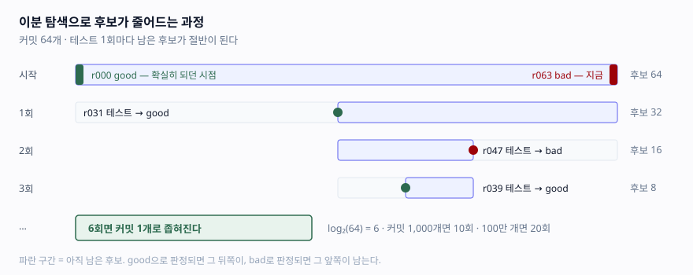
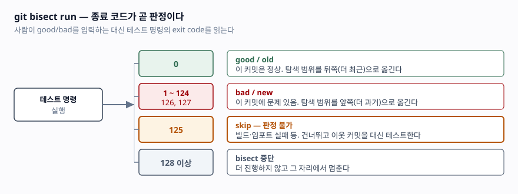

## 들어가며

개인 취미로든 업무로든 git을 쓰다 보면 커밋이 쌓이다가, 어느 순간 분명 되던 기능이 안 된다는 걸 확인할 때가 있다. 그 사이 커밋은 60개가 넘고, 배포 로그를 봐도 범인이 특정되지 않는다. 이때 대부분은 최근 커밋부터 눈으로 훑기 시작하는데, 이건 최악의 경우 60번을 봐야 하는 선형 탐색이다.

`git bisect`는 이 문제를 이분 탐색으로 바꾼다. 60번이 6번이 된다. 여기에 `git bisect run`까지 쓰면 사람이 한 번도 개입하지 않고 끝난다.

이 글은 커밋 64개짜리 저장소를 실제로 만들어 돌려보고, 대부분의 설명이 건너뛰는 부분 — **빌드조차 안 되는 커밋을 만났을 때** — 까지 확인한다.

## 개념

`git bisect`는 커밋 히스토리를 대상으로 하는 이분 탐색이다. 전제는 하나뿐이다.

> 어떤 시점을 기준으로 **이전은 전부 good, 이후는 전부 bad**다.

이 전제가 성립하면 커밋 N개에서 범인을 찾는 데 `log2(N)`번의 테스트면 충분하다. 커밋 64개면 6번, 1,000개면 10번, 100만 개면 20번이다.

`git bisect run <명령>`은 여기서 한 걸음 더 나아간다. 매 후보마다 사람이 `git bisect good`/`bad`를 입력하는 대신, **명령의 종료 코드로 판정을 대신한다.**

## 구조



> **출처**: [git-bisect-lk2009 — 이분 탐색 알고리즘 설명](https://git-scm.com/docs/git-bisect-lk2009).
> 후보 수는 커밋이 일직선으로 이어진 경우의 값이다. 머지가 섞이면 실제 후보 수는 달라진다.

종료 코드와 git의 판정은 이렇게 대응한다.



> **출처**: [git-bisect 매뉴얼](https://git-scm.com/docs/git-bisect)의 "Bisect run" 절.
> 문서는 테스트 명령이 good/old이면 0으로, bad/new이면 125를 제외한 1~127로 끝나야 한다고 명시한다.
> 126과 127은 POSIX 셸이 "실행 불가"와 "명령 없음"에 쓰는 값이라, 그보다 낮으면서 가장 큰 값인
> 125가 skip 용도로 선택됐다.

**125가 핵심이다.** 실제 히스토리에는 의존성이 깨져 빌드가 안 되거나, 마이그레이션이 덜 돼 실행이 안 되는 커밋이 섞여 있다. 그 커밋을 `bad`로 판정해 버리면 탐색 범위가 엉뚱하게 좁혀져 **잘못된 범인을 지목한다.** 125를 돌려주면 git이 그 커밋을 건너뛰고 이웃을 대신 테스트한다.

## 동작 원리

판정 스크립트는 이 규약만 지키면 된다.

```python
"""git bisect run이 호출하는 판정 스크립트.

종료 코드 규약:
    0   = good  (버그 없음)
    1   = bad   (버그 있음)
    125 = skip  (판정 불가 — 빌드/임포트 실패)
"""

import sys

sys.path.insert(0, ".")

try:
    import stats
except SyntaxError:
    sys.exit(125)          # 이 커밋은 애초에 테스트할 수 없다

try:
    assert stats.percentile([1, 2, 3, 4, 5, 6, 7, 8, 9, 10], 50) == 5
    assert stats.percentile([1, 2, 3, 4, 5, 6, 7, 8, 9, 10], 100) == 10
except (AssertionError, IndexError):
    sys.exit(1)            # bad

sys.exit(0)                # good
```

**이 스크립트는 저장소 밖에 둬야 한다.** bisect는 커밋을 옮겨 다니며 작업 트리를 통째로 교체한다. 스크립트가 저장소 안에 있으면 과거 커밋으로 이동한 순간 사라지거나 옛 버전으로 되돌아간다.

실행은 세 줄이다.

```bash
git bisect start
git bisect bad HEAD
git bisect good <확실히 정상이던 커밋>
git bisect run python /경로/밖에_있는/check_commit.py
```

## 실습 예제

전체 소스: [`code/bisect_demo.py`](code/bisect_demo.py) (표준 라이브러리 + git만 있으면 된다)

임시 저장소에 커밋 64개를 만들고, `r041`에서 퍼센타일 구현을 잘못된 버전으로 바꾼다.

```python
# good (r000 ~ r040)
rank = math.ceil(len(sorted_values) * q / 100)
return sorted_values[max(rank - 1, 0)]

# bad (r041 ~ r063) — p50이 한 칸 밀리고 p100에서 IndexError가 난다
rank = int(len(sorted_values) * q / 100)
return sorted_values[rank]
```

그리고 `r039`, `r043`, `r047` 세 커밋은 `stats.py`에 콜론을 빠뜨려 import 자체가 실패하게 만든다. 판정 불가 상황을 일부러 탐색 경로 위에 심은 것이다.

### 실행 결과

```text
커밋 64개 생성 · 버그 유입 지점 r041 (65403702)
판정 불가 커밋: r039, r043, r047
이론상 필요한 테스트 횟수: 약 log2(64) = 6회

----------------------------------------------------------------------
Bisecting: 15 revisions left to test after this (roughly 4 steps)
[9717c148] r047: 일상적인 수정          ← import 실패 → 125 → skip
Bisecting: 15 revisions left to test after this (roughly 4 steps)
[236b5847] r033: 일상적인 수정
Bisecting: 14 revisions left to test after this (roughly 4 steps)
[6b50c49a] r048: 일상적인 수정
Bisecting: 6 revisions left to test after this (roughly 3 steps)
[65403702] r041: 일상적인 수정
Bisecting: 3 revisions left to test after this (roughly 2 steps)
[9e080176] r037: 일상적인 수정
Bisecting: 1 revision left to test after this (roughly 1 step)
[d346b838] r039: 일상적인 수정          ← import 실패 → 125 → skip
Bisecting: 1 revision left to test after this (roughly 1 step)
[45ab73b2] r038: 일상적인 수정
Bisecting: 0 revisions left to test after this (roughly 1 step)
[d02d58b4] r040: 일상적인 수정
65403702906a5168bc39c1cc591a12a799a740e5 is the first bad commit
bisect found first bad commit
----------------------------------------------------------------------
찾은 커밋   : 65403702
실제 버그   : 65403702
일치 여부   : 일치
테스트 횟수 : 9회 (전수 조사라면 64회)
```

(가독성을 위해 매 단계 출력되는 `running ...` 줄과 커밋 해시 일부를 줄였다.)

읽어야 할 것은 두 가지다.

**첫째, 9회로 끝났다.** 전수 조사 64회 대비 7분의 1이다. 이론값 6회보다 3회 많은데, 그 3회가 정확히 skip 처리된 커밋 수와 일치한다. `r047`을 만나 125를 받자 git은 같은 `15 revisions left` 상태를 유지한 채 다른 후보 `r033`을 골랐다. 탐색 범위가 줄지 않은 것이다. **skip은 공짜가 아니라 한 단계를 소모한다.**

**둘째, skip이 세 번 있었는데도 답이 정확하다.** 그럼 125 대신 1(bad)을 돌려주면 어떻게 될까. 판정 스크립트에서 `sys.exit(125)`를 `sys.exit(1)`로만 바꿔 같은 실험을 다시 돌렸다.

```text
실제 버그 커밋 : r041 8a3be7a0
지목한 커밋    : r039 fc3ceca2
판정           : 오답
```

import조차 안 되는 `r039`가 bad로 확정되면서 탐색 범위가 그 앞쪽으로 잘렸고, 실제 버그 커밋보다 두 칸 앞을 범인으로 지목했다. 더 나쁜 건 이 과정에서 **에러도 경고도 나지 않는다**는 점이다. bisect는 성공적으로 끝났다고 보고하고, 무고한 커밋의 diff를 들여다보며 시간을 쓰게 된다.

판정 불가와 실패를 구분하는 것이 정확도를 지킨다.

## 실무에서 주의할 점

- **판정 스크립트를 저장소 밖에 둔다.** 저장소 안에 두면 체크아웃마다 사라지거나 옛 버전으로 덮인다. `git bisect run bash /abs/path/check.sh`처럼 절대 경로를 쓴다.
- **빌드 실패와 테스트 실패를 반드시 구분한다.** 대부분의 오탐은 여기서 나온다. 컴파일·의존성 설치·마이그레이션 실패는 전부 125다. 셸 스크립트라면 `make build || exit 125`가 첫 줄이 된다.
- **스크립트가 부작용을 남기지 않게 한다.** bisect는 같은 코드를 여러 번 오간다. DB에 데이터를 남기거나 전역 캐시를 오염시키면 뒤 단계 판정이 흔들린다. 매번 초기화하거나 격리된 환경에서 돌린다.
- **생성물이 남아 판정을 오염시키는 걸 막는다.** 체크아웃해도 `.pyc`, `node_modules`, 빌드 산출물은 그대로 남는다. 필요하면 스크립트 첫머리에 `git clean -xdf`를 넣되, 지워지면 안 되는 파일이 있는지 먼저 확인한다.
- **버그가 아닌 것도 찾을 수 있다.** "언제 느려졌나", "언제 고쳐졌나"처럼 good/bad가 어색한 경우 `git bisect start --term-old=fast --term-new=slow`로 용어를 바꿔 쓴다. 성능 회귀는 스크립트에서 임계값을 재고 초과 시 1을 돌려주면 된다.
- **머지가 많은 히스토리에서는 `--first-parent`를 고려한다.** 토픽 브랜치 내부 커밋까지 파고들면 후보가 불필요하게 늘어난다. 메인라인만 따라가면 "어느 PR이 범인인가"가 먼저 나온다.
- **중간에 틀렸으면 되돌릴 수 있다.** `git bisect log`로 진행 기록을 남기고, 판정을 잘못 입력했다면 로그를 고쳐 `git bisect replay`로 다시 돌린다. 처음부터 하지 않아도 된다.

## 정리

- `git bisect`는 커밋 히스토리 이분 탐색이다. 커밋 N개에서 `log2(N)`번이면 범인을 찾는다.
- `git bisect run`은 종료 코드로 판정을 자동화한다. 0=good, 1~124/126/127=bad, **125=skip**, 128 이상=중단.
- 빌드 불가 커밋에 125를 돌려주는 것이 정확도의 핵심이다. 1을 돌려주면 엉뚱한 커밋을 범인으로 지목한다.
- 실측: 커밋 64개 + skip 3회 → 테스트 9회로 정확한 커밋 특정. 전수 조사 대비 7분의 1이다.
- 판정 스크립트는 저장소 밖에 두고, 부작용을 남기지 않게 만든다.

## 참고 자료

- [git-bisect 매뉴얼](https://git-scm.com/docs/git-bisect)
- [git-bisect-lk2009 — 이분 탐색 알고리즘 설명](https://git-scm.com/docs/git-bisect-lk2009)
- [Pro Git — 7.10 Debugging with Git](https://git-scm.com/book/en/v2/Git-Tools-Debugging-with-Git)
